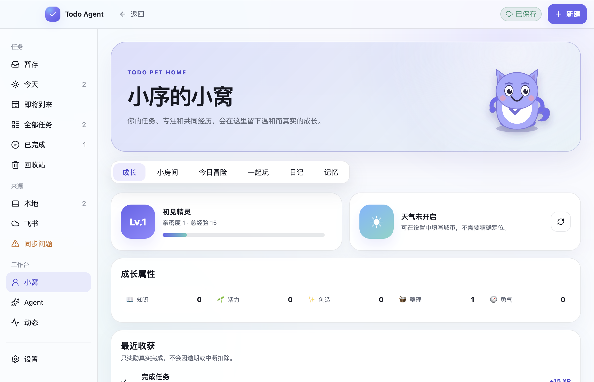
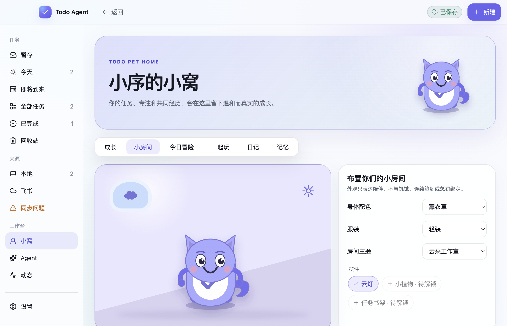
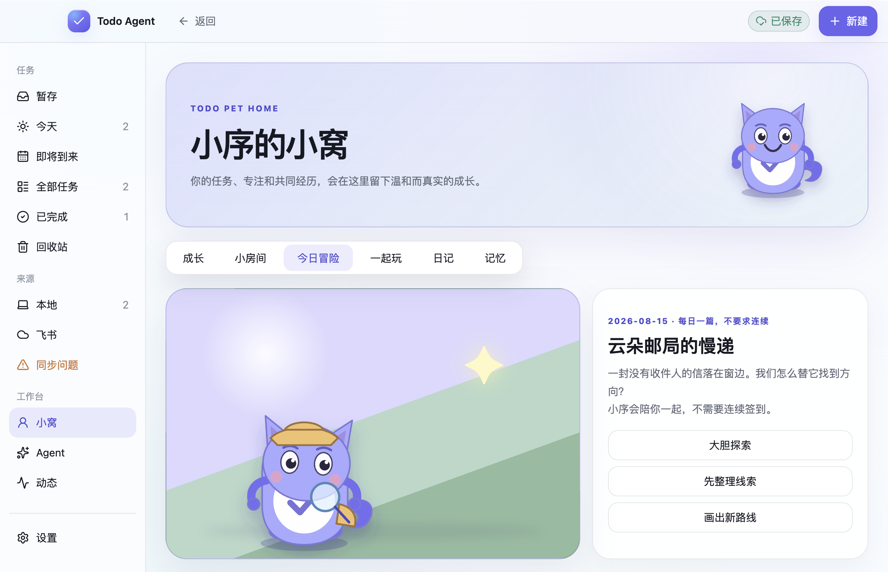
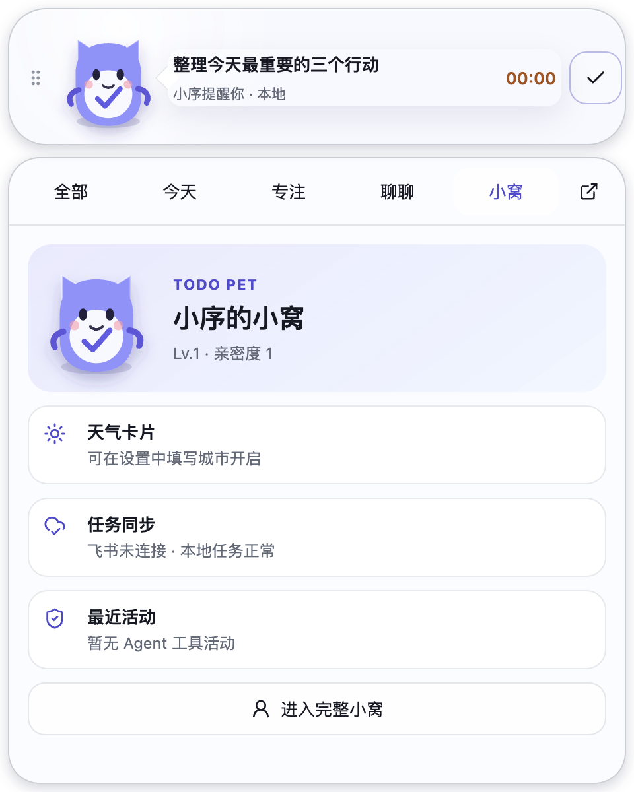
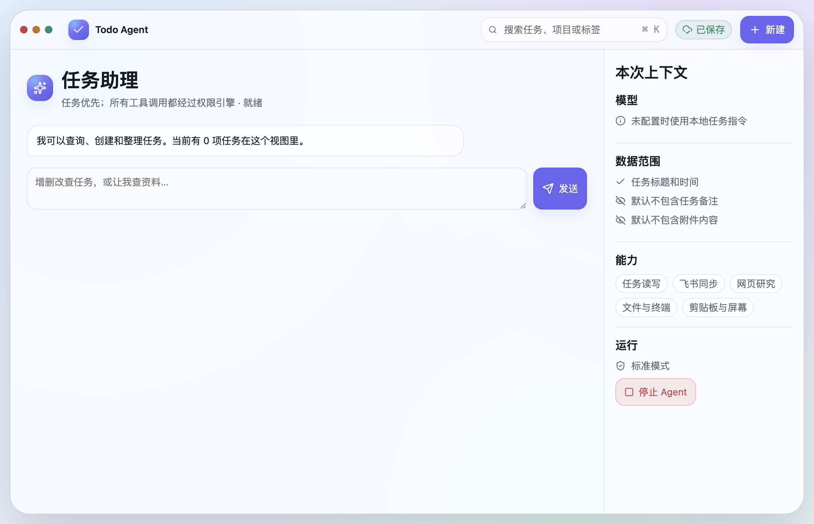
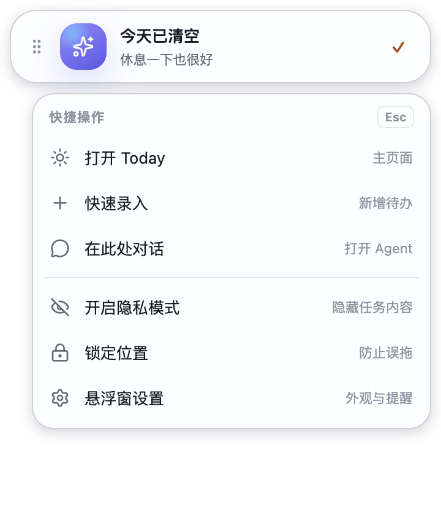

# Todo Agent

> 住在桌面上的本地优先任务伙伴，适用于 macOS 和 Windows。

Todo Agent 用一只原创的 Todo Pet 替代传统悬浮球和胶囊：它常驻桌面、轮播今天的任务，也能展开为任务面板、番茄钟、流式 Agent 对话和小窝。没有账号、网络或模型时，本地任务、专注、提醒、成长与日记依然可用。



## 为什么是 Todo Pet

- **随时看见下一步**：宠物与任务气泡始终置顶，今日任务自动上下轮播，鼠标停留时暂停；天气开启后，紧凑桌面形态还会显示可点击的温度/状况/降水胶囊（隐私模式隐藏城市，严重或缓存天气会明确标记）；主动提醒会从真实任务中挑出一项可执行下一步，解释截止、Today、优先级或短任务原因，并提供“开始专注 / 查看任务”；小窝回顾可主动进入逐项处理会话，设置可调整四项本地权重。
- **宠物真的活着**：头、眼、耳、尾巴和四肢独立运动，持续呼吸、随机眨眼并跟随鼠标；点击不同身体部位会歪头、惊讶、击掌或笑着躲开；小窝可选择温柔、元气、冷静、活泼、轻微淘气或安静六种陪伴性格，动作节奏会随性格变化；还可邀请最多 3 个只存在于小窝的纸飞机、云团、苔苔或月蛾伙伴，分别调整节奏并随宠物档案迁移，点击伙伴会触发问候动作和本地短句；完成任务后，小窝会从真实完成事实投影“共同完成印章”，今天的印章突出显示，点击可回到原任务；小房间的云灯、植物和任务书架可以直接拖动或用方向键微调位置、用滑杆调整大小，旧宠物档案会自动使用平衡的默认布局；小窝还提供明亮日光、柔和灯光和月光夜色三种纯本地氛围，开启季节小事件后房间会出现春花、微风、落叶或雪花的轻量装饰，以及四颜色值和可选本地图片组成的安全主题包编辑器（图片限 512 KB 的 PNG/JPEG/WebP），主题可以导出为可读 JSON、从本地 JSON 导入并在安装前预览，不改变任务或提醒规则。
- **不离开当前工作**：默认只保留宠物本体；点击宠物旁箭头可收回或恢复“全部、今天、专注、聊聊、小窝”任务栏，悬停展开和离开收起仍可用，最后入口与仅宠物模式都会被记住；“全部”任务面板还可选择主窗口已保存的智能视图，快速查看某个项目、标签、情境或日期范围；右键菜单和托盘都提供可恢复的 Boss Mode，演示或会议时一键隐藏宠物并暂停宠物主动消息；主窗口支持 `⌘/Ctrl+K` 命令面板，把搜索、快速捕获、规划、Agent、同步和设置集中在一个键盘入口。
- **温和推动执行**：支持 25/5、50/10、90/20、正计时、暂停恢复、休息与重启恢复；完成任务和专注会形成正向成长，不因逾期或中断惩罚；可选“专注守护”只读取前台应用名，匹配后温和提醒或暂停本次专注，不读取窗口内容、不关闭或阻挡其他应用；小窝的“今晚回顾”可在仍有待处理事项时一键打开“安排明天”，仍需确认后才写入私人计划；提醒设置支持按住 Cmd/Ctrl 多选项目，一次应用项目级提醒策略，未选项目不受影响。
- **一起排今天**：无需配置模型，按截止风险、优先级、依赖关系和可用时间生成可解释建议；可设置可用起止时段、任务间缓冲和最小连续工作块，自动建议会避开无效窗口和过短任务但允许手动加入；时间线可导入本地 `.ics`，当天议程只读显示会议，半小时日时间线会直接标出会议忙碌区，并在今天的工作时段显示“现在”指示线和一键回到当前位置，规划会扣除并避开这些时段，不写回外部日历；每张会议卡可打开预填的“会后跟进”本地任务编辑器，也可从会议备注提取“行动项 / 待办 / 下一步”并在批量创建前逐项勾选、改名和预览，用户确认后才保存为本地任务；确认前会显示只读时间块预览，保留已有时间块并标出冲突/放不下的任务；今天装不下时还会预览未来 5 个工作日的顺延候选，明确周末、截止日和无容量原因，不自动改期；晨间简报还提供“只剩 2 小时？”替代方案、对较早日期未完成的私人 Today 计划提供最多 3 项“安排今天”建议，以及可跳过的“三步开始今天”（选最多 3 项、设定容量、选择先专注或先看计划），确认后原子更新私人 Today 计划，可一次撤销，再直接开始第一项；侧栏时间线支持半小时日视图、周概览、工作周期与容量预测、每周回顾和“预计 vs 实际”的估时复盘，任务拖动只写本地时间块。
- **一处管理任务**：本地任务与可选飞书任务统一展示，保留清晰来源；支持按优先级、项目、来源、标签、手动情境、日期范围和排序方式保存筛选视图，筛选面板还支持一句话解析并先预览“将筛选”摘要；任务讨论、可折叠研究卡、子任务进度和任务列表批量选择也在同一工作台完成，批量动作先预览再原子执行并可一次撤销；父任务显示“已完成/总数”但不会因子任务完成而被隐式完成；任务行解释“为什么值得先做”，并可直接点击“让 Agent 处理”把当前任务带入 Agent 草稿，批量选择工具栏也可将所选任务交给 Agent 先做只读方案；暂存支持逐项整理为今天、明天、稍后、完成或打开详情，并提供 1/2/S/C/O 快捷键；快速捕获确认后可选择保存为任务、真正的暂存任务或 Todo Pet 日记；菜单栏/系统托盘还提供最多 3 项今日待办的只读预览，隐私模式自动脱敏；飞书写入本地落盘后立即启动同步。
- **可选任务 Agent**：支持 OpenAI-compatible 模型、流式 Markdown、自然语言单条或批量增删改查、从任务行一键带入上下文、把大任务拆成 2–7 个可执行本地子任务，以及经确认的网页、文件和本机工具能力；Agent 页面会在本机恢复最近 50 条短期对话，最多保留 8 个本机历史会话，支持切换、按标题/正文搜索、重命名、置顶、删除、新对话、清除当前会话、Markdown 导出和基于当前任务的快捷回答建议，恢复历史只有在打开“聊天历史”数据范围时才发送给模型；可分别填写主/备用模型输入输出单价，按本地 token 用量核算费用并设置每日硬上限，缺少可计费用量时不会继续运行；设置可选择让 Agent 跟随 Todo Pet 的六种陪伴性格，宠物切换性格后下一轮对话和晨间简报即时采用对应语气，也可以关闭联动让 Agent 保持独立风格。
- **用户保持控制**：天气只需手工城市；长期记忆只保存用户明确批准的内容；敏感操作经过权限预览、确认与审计。

## 功能一览

| 模块 | 已包含能力 |
| --- | --- |
| Todo Pet | 20 种待机动作、8 种情绪、六种陪伴性格（温柔/元气/冷静/活泼/轻微淘气/安静）、最多 3 个小窝伙伴（纸飞机/云团/苔苔/月蛾）、阅读/写作/开发/调研/沟通/运动/整理主题姿态、身体分区点击、九项径向互动、任务卡拖放（专注/完成/稍后目标区）、始终置顶、自由拖动、多显示器位置记忆、缩放、仅宠物模式、任务栏收回/恢复、悬停展开、双击主应用、右键快捷菜单、可恢复 Boss Mode、隐私与免打扰；小窝提供共同收藏图鉴、共同完成印章和共同旅程章节，按真实库存与任务事实显示解锁物品、完成数量、最近印章和下一步；点击印章可回到原任务，未完成奖励对账时会明确显示同步中；房间摆件支持直接拖动、本地位置微调与大小调整，旧档案自动套用默认布局；小窝可切换明亮日光、柔和灯光或月光夜色，氛围只影响房间视觉；支持安全的声明式 JSON 动作包安装/启用/卸载，并在设置提供可视化动作包编辑器（加载、组合内置待机动作、安装并启用）；小窝设置还支持四个十六进制颜色和一张 512 KB 以内 PNG/JPEG/WebP 本地背景组成的安全主题包（最多 12 个，可应用/移除、导出为可读 JSON、从本地 JSON 导入预览，拒绝 SVG、脚本、路径和网络）；有伙伴时还可以让小队按固定角色准备一项真实任务、选择一位临时领队并直接开始专注；主窗口 `⌘/Ctrl+K` 命令面板支持键盘筛选与执行；晨间简报提供可跳过的三步启动卡 |
| 任务 | 暂存、Today、即将到来、全部、项目总览、项目与清单实体（新建/重命名/归档/恢复/删除）、日/周时间线、工作周期与容量预测、项目三列看板、每周回顾、估时复盘（预计/实际偏差与任务回看）、会议备注行动项提取（逐项编辑/勾选后批量创建本地任务）、项目健康（阻塞/逾期/容量解释）、已完成、回收站、项目、清单、标签、手动情境、优先级、预计时长、子任务与完成进度、前置依赖编辑与循环防护、依赖链解释卡（前置/当前/后续节点、缺失/循环提示）、命名上下文链接、自定义字段（文本/数字/日期/链接/勾选）、任务本地讨论（添加/编辑/删除/撤销）、可折叠研究卡（来源/摘要/行动项，Agent 可添加）、任务列表批量选择与预览确认（完成/恢复/安排到今天/回收站，单次撤销）、任务行“让 Agent 处理”草稿入口、批量“让 Agent 处理所选”草稿入口（都不自动发送/写入）、一句话筛选预览（日期/优先级/来源/项目/标签/情境/排序，未知或冲突条件拒绝套用）、保存视图标签/情境/日期范围/排序条件（逾期、今天、未来 7 天、无日期、优先级、截止、标题、创建时间）、附件/链接/自定义字段元数据搜索、本地文件附件（选择/复制/受限预览/打开/移除）、外部附件引用、任务详情脱敏历史时间线、任务写入宠物日记并保留原任务链接、循环与快速循环语法、开始/截止时间、提醒、快速录入（支持预计 45 分钟 / 30m、每天 / 每周一 / 每月15日），快速捕获与 Todo Pet 输入共用自然语言解析（日期/标签/情境/时长/循环/P1–P4），可在预览后选择任务 / 暂存 / 日记、语音/剪贴板/当前窗口/选中文本安全预览、会议/研究/发布工作流模板、保守/平衡/冲刺每日规划与可解释建议、Todo Pet 下一步四项权重 |
| 日历与排程 | 时间线可导入本地 `.ics`，日视图显示只读议程、半小时时间格直接标出会议忙碌区，周视图按日期显示会议数量与占用时长；会议卡可打开预填的会后跟进任务，或从 `DESCRIPTION` 中提取明确的行动项/待办/下一步，在本地预览中逐项编辑、勾选后批量创建；保存前仍由用户确认，且只创建本地任务；今日规划会扣除会议占用并避开忙碌区，支持全天/跨午夜事件、清空与撤销；不会写回外部日历或飞书 |
| 晨间摘要 | Today 早报在有本地日历事件时显示当天议程、占用时长和时间线入口；对较早日期的未完成私人 Today 计划最多给出 3 项“安排今天”建议；无候选时不增加空白卡片，不进入 AI 或外部写入 |
| 陪伴 | 小窝成长、等级与亲密度、可配置弹性习惯（默认喝水/伸展/收尾，最多 12 项，可编辑、暂停、完成、稍后或移除）、最多 3 项可选本周同行目标（完成任务 / 专注分钟 / 习惯照顾，进度来自真实事实）、今日进展/今晚回顾、每周 Check-in（能量与节奏）、宠物回顾与逐项处理会话（逾期/阻塞/待排时间）、天气、可关闭的季节装饰事件、日记（可点击回看关联任务）、记忆、小游戏、装扮/摆件、每日冒险、专注联动、环境音与外部内容拖入预览；设置提供温和陪伴 / 自然平衡 / 深度专注 / 活泼互动策略模板 |
| 专注 | 番茄钟预设、自定义节奏、正计时、任务绑定、暂停/恢复、休息轮次、重启恢复、可选本地环境音、专注守护、系统通知和幂等奖励；时间线周视图专注节奏分析（7 日柱状图、总投入、专注段、平均时长、投入最多任务） |
| 飞书 | 可选零服务器连接、已有应用接入、自动/手动/交互后立即同步、离线队列、冲突入口和私人计划层 |
| Agent | 小窗与主应用流式对话、Markdown、任务 CRUD、任务拆分预览与本地子任务、研究卡写入、网页研究/本机工具、权限确认、审计、停止与临时全权限模式；主 Agent / 小窗上下文快捷回答；本机最多 8 个短期会话归档、切换、按标题/正文搜索、重命名、置顶、删除、新对话、清除当前会话与 Markdown 导出；主/备用模型价格与每日费用硬预算；可选跟随 Todo Pet 六种陪伴性格或保持独立人格，权限和任务事实不受影响 |
| 数据与安全 | 本地原子持久化、系统安全存储保存凭据、安全 JSON 备份、可读 Markdown 任务清单（可选任务事件摘要）、独立 `.todo-pet.json` 宠物档案备份与导入预览（含习惯与本周同行目标）、可恢复删除、模型数据范围、提醒每日预算 / 来源策略 / 项目例外（含最多 100 个项目批量编辑）/ 同类间隔 / 连续忽略降频、宠物主动消息预算、安静时段与减少动态效果 |

## 打开可读的任务清单

在 Todo Agent 的“设置 → 数据与安全”中点击“可读 Markdown”，保存后会得到一个 `.md` 文件。macOS 或 Windows 上直接双击即可用系统默认应用打开；如果默认应用只显示原始标记，可右键选择 VS Code、Typora、Obsidian，或把文件拖到浏览器 / GitHub 中查看排版后的内容。需要查看任务创建、修改、完成和撤销轨迹时，先打开“包含事件摘要”再导出；它只写入时间、操作类型、任务标识和字段名，不包含任务快照、私人路径或凭据。这个文件用于阅读与分享，恢复数据请使用旁边的“安全 JSON”备份。

如果要迁移宠物本身，请在同一页点击“导出宠物档案”，得到可读的 `.todo-pet.json` 文件。它可以用 VS Code、任意文本编辑器或浏览器打开查看（JSON 会显示原始结构）；要恢复时选择“导入并预览”，确认数量后选择“保留本机”或“用备份覆盖本机”。活动专注、凭据和本地文件路径不会被导出。

## 悬浮桌面模式

Todo Pet 有三种连续的桌面形态：

1. **仅宠物**：只保留可拖动、可点击互动的宠物本体，窗口会同步缩小，不会用透明区域挡住桌面。
2. **宠物 + 任务栏**：显示当前任务、专注计时和宠物消息气泡；任务栏支持全部、今天、专注、聊聊和小窝五个入口。
3. **完整小窗口**：展开任务列表、Agent 对话、专注控制和小窝内容。

点击宠物旁的箭头可以在“仅宠物”和“宠物 + 任务栏”之间切换；互动轮盘和小游戏会临时展开所需空间，结束后自动回到原来的模式。仅宠物模式与最后选中的任务入口会在本地记忆，重启应用后继续使用。

## 界面预览

<table>
  <tr>
    <td width="50%"></td>
    <td width="50%"></td>
  </tr>
  <tr>
    <td align="center">小房间：配色、服装、主题与摆件</td>
    <td align="center">每日冒险：选择、故事结果与无压力成长</td>
  </tr>
  <tr>
    <td width="50%"></td>
    <td width="50%"></td>
  </tr>
  <tr>
    <td align="center">专注：番茄钟、正计时与任务绑定</td>
    <td align="center">小窝：成长、天气、同步和最近活动</td>
  </tr>
  <tr>
    <td width="50%"></td>
    <td width="50%"></td>
  </tr>
  <tr>
    <td align="center">Agent：流式任务对话和权限确认</td>
    <td align="center">右键：快速新增、聊天、隐私、锁定与安静</td>
  </tr>
</table>

## 下载与安装

当前预览版本：[v0.0.1](https://github.com/BrotherHappy/TodoAgent/releases/tag/v0.0.1)。

- **macOS（Apple Silicon）**：[DMG](https://github.com/BrotherHappy/TodoAgent/releases/download/v0.0.1/Todo.Agent-0.0.1-arm64.dmg) · [ZIP](https://github.com/BrotherHappy/TodoAgent/releases/download/v0.0.1/Todo.Agent-0.0.1-arm64-mac.zip)
- **Windows x64**：[ZIP](https://github.com/BrotherHappy/TodoAgent/releases/download/v0.0.1/Todo.Agent-0.0.1-win.zip)

这是 Early Preview。macOS 产物尚未进行 Developer ID 签名和公证；Windows 包仍建议在目标设备完成安装、系统通知和多显示器实机验收。

## 从源码启动

前置条件：Node.js 20+，npm。

```bash
npm install
npm run dev
```

常用命令：

```bash
npm run verify
npm run test:e2e
npm run capture:screenshots
npm run package:mac:current
npm run package:win:zip
```

## 隐私与安全

- 默认没有云端账号或模型依赖；本地任务不会自动上传。
- 飞书与模型均为可选项。Token、App Secret 和模型密钥由系统安全存储保护，普通设置只保存凭据引用；模型支持主模型、本地备用和只用本地三种路由。
- 天气只使用用户填写的城市并在本机缓存，不申请精确定位。
- 任务、天气、专注和同步是确定性事实；模型不能伪造这些状态。
- 长期记忆必须由用户明确保存或批准，并支持查看、暂停、编辑和删除。
- Agent 只能通过类型化工具提出操作；批量、外部和高风险操作在标准模式下请求确认。

详细设计与边界：

- [统一 PRD](./docs/PRD.md)
- [竞品研究与可借鉴设计](./docs/COMPETITIVE_PRODUCT_RESEARCH.md)
- [Todo Pet 产品设计](./docs/TODO_PET_PRODUCT_DESIGN.md)
- [Todo Pet 实现规范](./docs/TODO_PET_IMPLEMENTATION_SPEC.md)
- [页面信息架构与交互](./docs/UX_INFORMATION_ARCHITECTURE.md)
- [飞书连接说明](./docs/FEISHU_CONNECTION.md)
- [技术架构与测试门禁](./docs/TECHNICAL_ARCHITECTURE.md)

## 当前边界

- 飞书 Task V2 首次全量同步会合并“我负责”与授权身份可读取的任务清单；若应用尚未获得 `task:tasklist:read`，会安全降级为“我负责”并明确提示重新授权，不会把缺失任务误删。
- 每个授权用户与 OAuth 应用组合使用独立的本地凭据、同步队列和映射空间；仅修改显示用的账号标签不会混用数据。
- 天气使用结构化公共服务，供应商不可用时保留并标明最后缓存结果。
- 真实飞书租户、Windows 设备、全屏应用和多显示器组合仍需要持续实机验收。
- 当前仓库尚未声明开源许可证；除非另有明确书面许可，保留全部权利。

## 设计研究

我们把 Todo Pet 放在“任务管理 × 桌面宠物 × AI Agent”的交叉点上，持续对照 50+ 个商用和开源产品，包括 Todoist、TickTick、Things、OmniFocus、Sunsama、Motion、Notion AI、Taskade、Vikunja、Super Productivity、AppFlowy、Finch、Forest、Habitica、Weyrdlets、Shimeji 等。

详细的逐产品 UI / 交互 / 功能矩阵、优势差异、可迁移模式、风险取舍和 P0/P1/P2 实现清单见：[竞品研究与可借鉴设计](./docs/COMPETITIVE_PRODUCT_RESEARCH.md)。这份研究也明确了 Todo Pet 的边界：真实任务和飞书同步是事实层，宠物是陪伴层，Agent 必须经过权限预览；不使用宠物死亡、饥饿、扣资产或强制连续签到制造压力。
