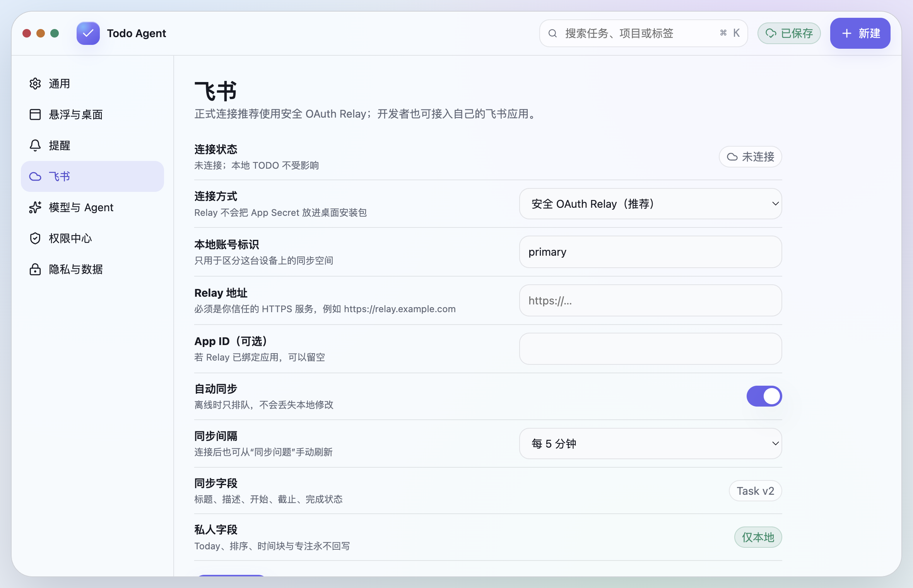
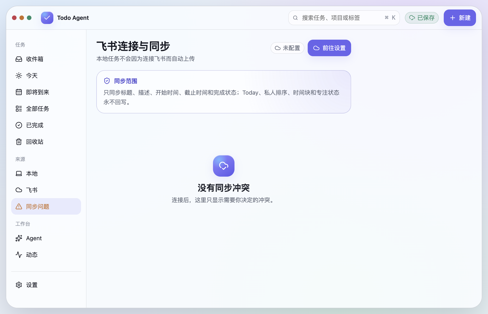

# Todo Agent

> 本地优先的桌面待办与个人执行助手，适用于 macOS 和 Windows。

Todo Agent 把本地任务、可选的飞书任务同步，以及可选的 AI 对话式任务管理放在一个轻盈的桌面应用里。没有账号、网络或模型时，本地任务和提醒依然完整可用。


## 为什么是 Todo Agent

- **本地优先**：任务、Today、提醒、搜索、回收站与快速录入默认只在当前设备工作。
- **一处管理**：可以选择接入飞书任务；本地修改先安全落盘，再进入可恢复的同步队列。
- **任务型 AI**：支持 OpenAI-compatible 模型、流式 Markdown 回复和自然语言任务增删改查；外部、批量或高风险动作需要确认并留下审计记录。
- **随时可用**：置顶、可拖动的悬浮球/胶囊；单击展开，双击回到 Today；悬停展开后离开自动收起。

## 功能一览

| 模块 | 已包含能力 |
| --- | --- |
| 任务 | Today、全部任务、即将到来、已完成、回收站、项目、标签、优先级、循环、开始/截止时间与提醒 |
| 桌面体验 | 全局快速录入、系统托盘、开机启动、置顶悬浮球/胶囊、拖动定位、位置锁定、深浅色与减少透明度 |
| 悬浮入口 | 悬停或单击展开、双击打开 Today、右键快捷菜单、浮窗内 Today/对话/动态与 Markdown 滚动阅读 |
| 飞书 | 可选连接、自动/手动同步、离线队列、冲突入口；私人计划、排序、时间块和专注状态不会回写 |
| Agent | 流式对话、Markdown、任务 CRUD、可选网页研究/本机工具、权限确认、审计与停止入口 |
| 数据与安全 | 系统安全存储保存凭据引用、本地原子持久化、可恢复删除、最小化的模型数据范围 |

## 界面预览

<table>
  <tr>
    <td width="50%"></td>
    <td width="50%"></td>
  </tr>
  <tr>
    <td align="center">任务助理：自然语言整理任务，动作经过权限引擎</td>
    <td align="center">飞书：按需连接，凭据不进入普通设置</td>
  </tr>
  <tr>
    <td width="50%"></td>
    <td width="50%"></td>
  </tr>
  <tr>
    <td align="center">同步范围和冲突入口</td>
    <td align="center">悬浮入口：不离开当前工作即可完成常用操作</td>
  </tr>
</table>

## 下载与安装

当前首发版本：[v0.0.1](https://github.com/BrotherHappy/TodoAgent/releases/tag/v0.0.1)。

- **macOS（Apple Silicon）**：[DMG](https://github.com/BrotherHappy/TodoAgent/releases/download/v0.0.1/Todo%20Agent-0.0.1-arm64.dmg) · [ZIP](https://github.com/BrotherHappy/TodoAgent/releases/download/v0.0.1/Todo%20Agent-0.0.1-arm64-mac.zip)
- **Windows x64**：[ZIP](https://github.com/BrotherHappy/TodoAgent/releases/download/v0.0.1/Todo%20Agent-0.0.1-win.zip)

这是一个 Early Preview。macOS 产物尚未进行 Developer ID 签名和公证；Windows 已生成 x64 包，但仍建议在目标设备完成最终安装与多显示器验收。

## 从源码启动

前置条件：Node.js 20+，npm。

```bash
npm install
npm run dev
```

常用命令：

```bash
npm run verify
npm run test:e2e
npm run package:mac:current
npm run package:win:zip
```

## 隐私与安全

- 默认没有云端账号或模型依赖；本地任务不会自动上传。
- 飞书与模型接入均为可选项。Token、App Secret 和模型密钥由系统安全存储保护，普通设置只保存凭据引用。
- 飞书写入采用本地优先和持久队列策略；网络异常时不丢失本地修改。
- Agent 只能通过类型化工具提出操作；批量、外部和高风险操作在标准模式下会请求确认。

详细设计与边界：

- [PRD](./docs/PRD.md)
- [页面信息架构与交互](./docs/UX_INFORMATION_ARCHITECTURE.md)
- [飞书连接说明](./docs/FEISHU_CONNECTION.md)
- [技术架构与测试门禁](./docs/TECHNICAL_ARCHITECTURE.md)
- [当前验收记录](./docs/QA_REAL_USER_AUDIT.md)

## 当前边界

- 飞书 Task V2 的列表接口目前以“我负责”的任务范围为主；可访问但不在该范围内的任务不会被误删。
- 真实飞书租户、多显示器、全屏应用和 Windows 设备仍需要持续做实机验收。
- 当前仓库尚未声明开源许可证；除非另有明确书面许可，保留全部权利。
