<h1 align="center">ToDoAgent</h1>

<p align="center">
  <a href="https://todoagent-showcase.brotherhappy.chatgpt.site/">
    
  </a>
</p>

<p align="center">
  <strong>它不是催你打勾的清单，而是把“我该做什么”翻译成“下一步现在就能做”的桌面伙伴。</strong>
</p>

<p align="center">
  本地优先的个人执行工作台，把任务、时间、飞书、可控 Agent 和一只有生命力的 Todo Pet 放进同一条工作流。<br />
  <sub>Local-first execution workspace with planning, Feishu sync, a permissioned AI agent and a living desktop companion.</sub>
</p>

<p align="center">
  <a href="https://github.com/BrotherHappy/TodoAgent/releases/tag/v0.0.1"></a>
  
  
  
  
</p>

<p align="center">
  <a href="https://todoagent-showcase.brotherhappy.chatgpt.site/"><strong>在线体验</strong></a>
  ·
  <a href="https://todoagent-showcase.brotherhappy.chatgpt.site/#film"><strong>观看宣传片</strong></a>
  ·
  <a href="https://github.com/BrotherHappy/TodoAgent/releases/tag/v0.0.1"><strong>下载预览版</strong></a>
  ·
  <a href="./docs/PRODUCT_GUIDE.md"><strong>完整功能手册</strong></a>
</p>

> [!NOTE]
> 没有账号、网络或模型，ToDoAgent 的本地任务、规划、专注、提醒、成长和日记仍然可用。飞书与模型都是可选增强，不是启动门槛。

## 先看它怎样工作

<p align="center">
  <a href="https://todoagent-showcase.brotherhappy.chatgpt.site/#film">
    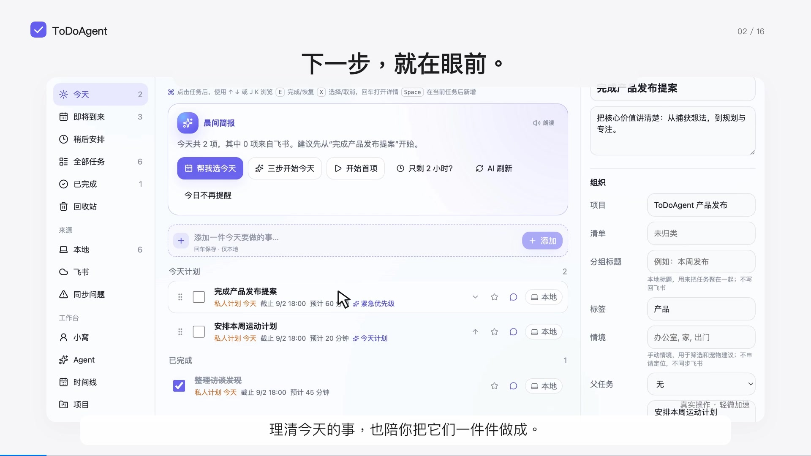
  </a>
</p>

<p align="center">
  <a href="https://todoagent-showcase.brotherhappy.chatgpt.site/#film">▶ 打开 1080p 中文宣传片：真实客户端画面、真实模型运行、默认中文字幕</a>
</p>

## 一条完整的执行回路

<table>
  <tr>
    <td width="25%" align="center"><strong>01 · 捕获</strong><br /><sub>一句话、剪贴板、选中文本、窗口与语音，先预览再保存</sub></td>
    <td width="25%" align="center"><strong>02 · 看清</strong><br /><sub>列表、表格、筛选、项目、依赖和全局搜索，共用同一份事实</sub></td>
    <td width="25%" align="center"><strong>03 · 排进时间</strong><br /><sub>Today、日历、容量、时间线、周视图、看板和甘特路线</sub></td>
    <td width="25%" align="center"><strong>04 · 开始行动</strong><br /><sub>专注计时、温和提醒、自动化、Agent 与 Todo Pet 一起推进</sub></td>
  </tr>
</table>

<p align="center">
  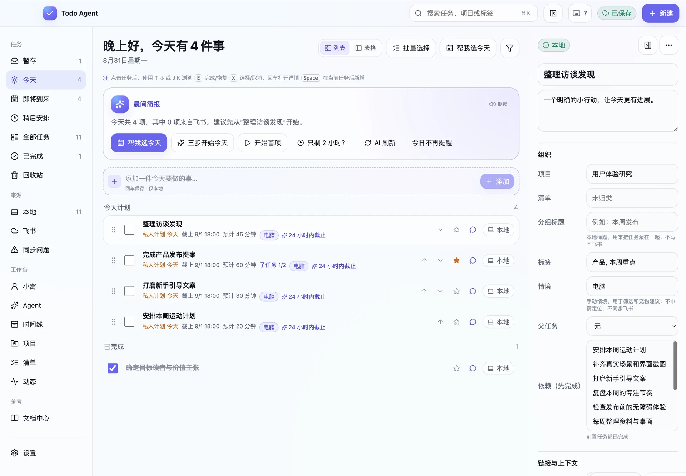
</p>

<p align="center"><sub>今日工作台不是“另一张清单”：它把今天值得做什么、为什么值得做、预计多久和下一步放到同一屏。</sub></p>

## 从零散想法，到清楚的任务系统

先捕获，再决定它是任务、暂存还是日记。任务进入工作台后，可以用列表快速推进，也可以用表格横向比较字段；项目、清单、标签、情境、分组、依赖、讨论、研究卡、附件和自定义字段都不会被压扁成一行标题。

<table>
  <tr>
    <td width="50%">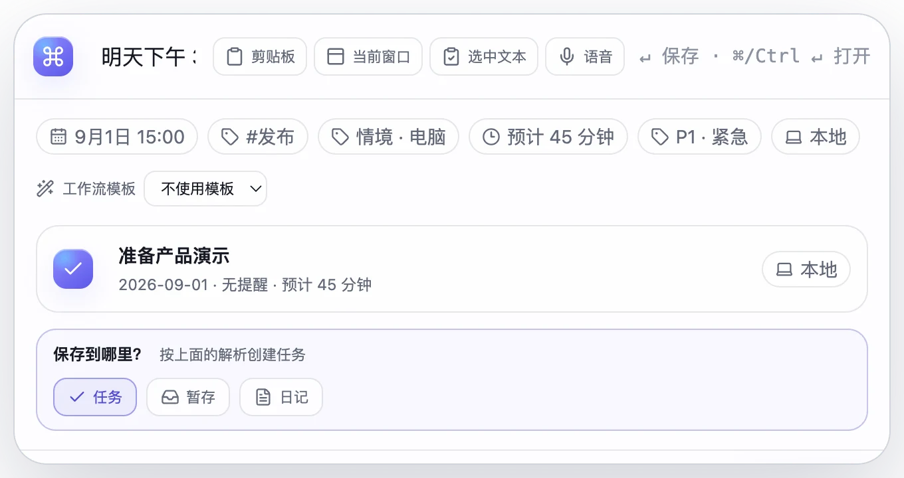</td>
    <td width="50%">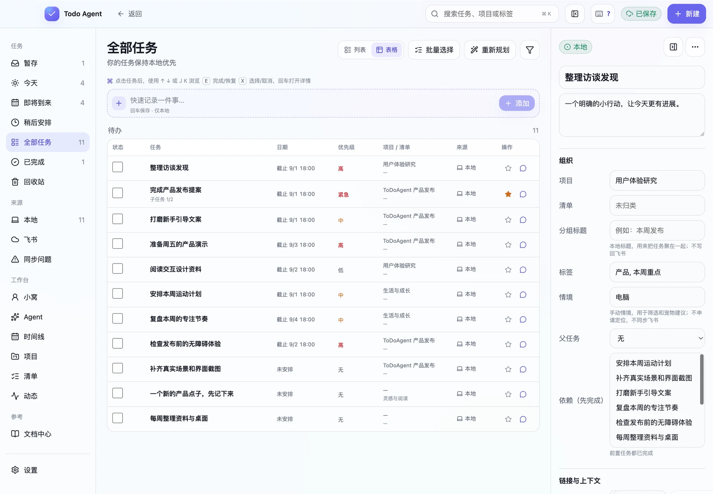</td>
  </tr>
  <tr>
    <td align="center"><sub><strong>快速捕获</strong> · 自然语言解析，任何上下文都先预览</sub></td>
    <td align="center"><sub><strong>表格工作台</strong> · 状态、日期、优先级、项目与来源横向对齐</sub></td>
  </tr>
  <tr>
    <td width="50%">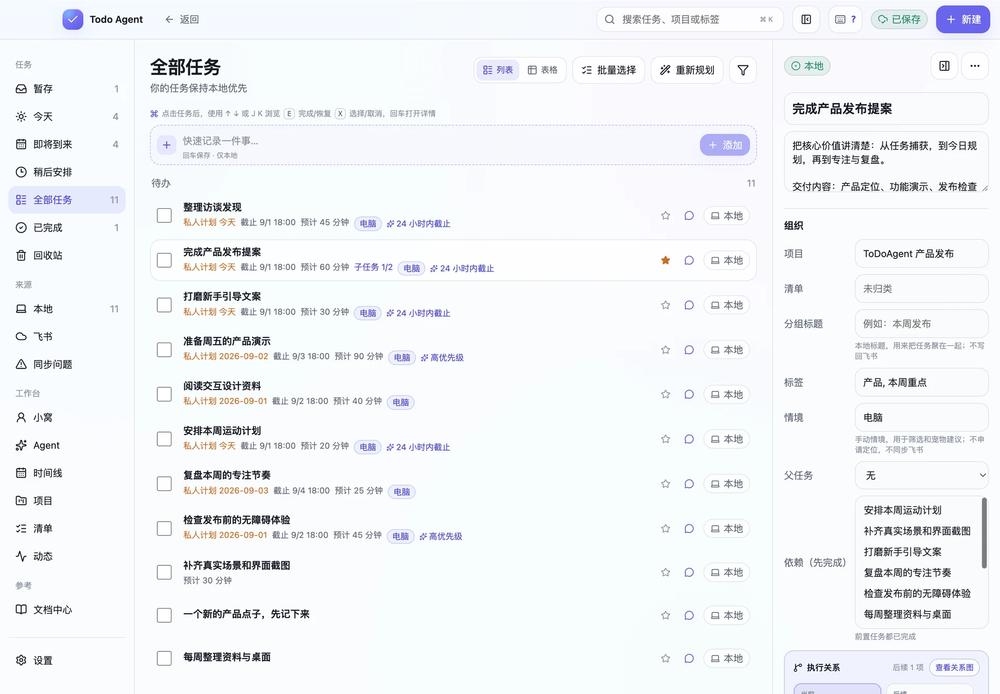</td>
    <td width="50%">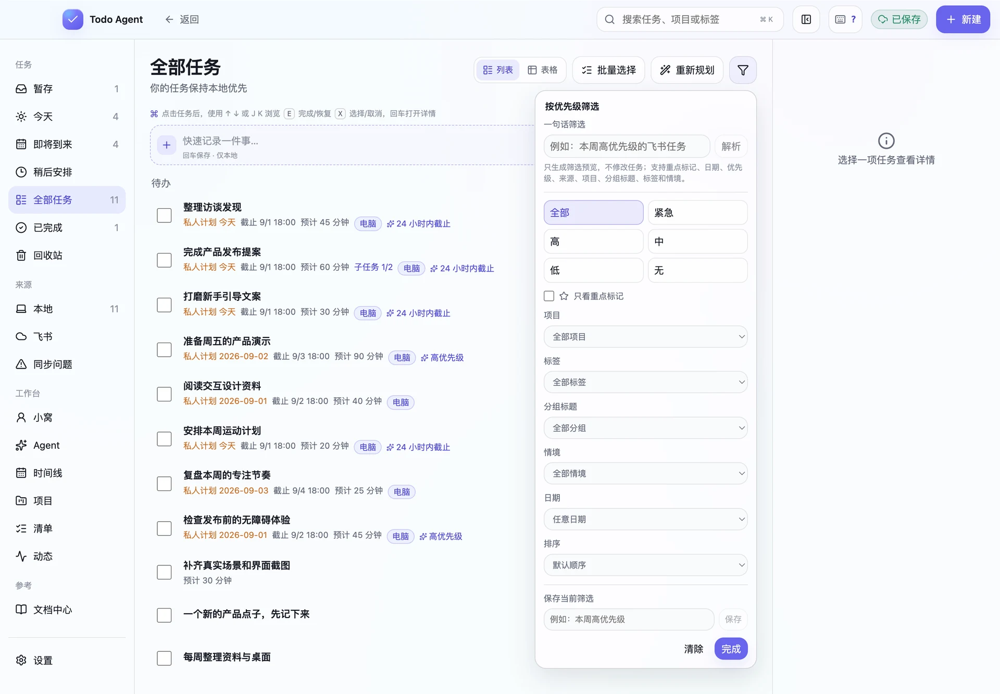</td>
  </tr>
  <tr>
    <td align="center"><sub><strong>任务详情</strong> · 子任务、依赖、评论、研究卡与附件</sub></td>
    <td align="center"><sub><strong>保存视图</strong> · 项目、标签、情境、日期、来源与排序自由组合</sub></td>
  </tr>
</table>

## 不只写截止日期，而是把任务放进真实时间

ToDoAgent 会先读你真正可用的时间：工作时段、任务时长、缓冲、依赖，以及只读导入的 `.ics` 日历忙碌区。排程先给出可解释预览，确认后只写私人计划；它不会擅自修改飞书截止时间或外部日历。

<table>
  <tr>
    <td width="50%">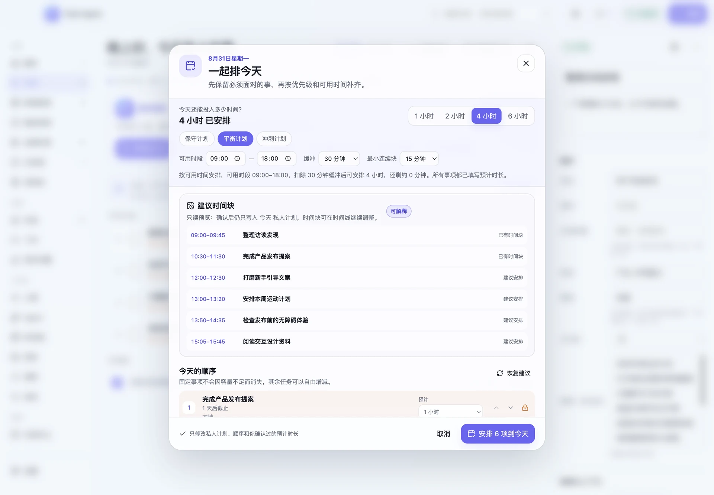</td>
    <td width="50%"></td>
  </tr>
  <tr>
    <td align="center"><sub><strong>一起排今天</strong> · 风险、容量、冲突和顺延都说清楚</sub></td>
    <td align="center"><sub><strong>日时间线</strong> · 会议占用、任务时间块与“现在”同屏</sub></td>
  </tr>
  <tr>
    <td width="50%">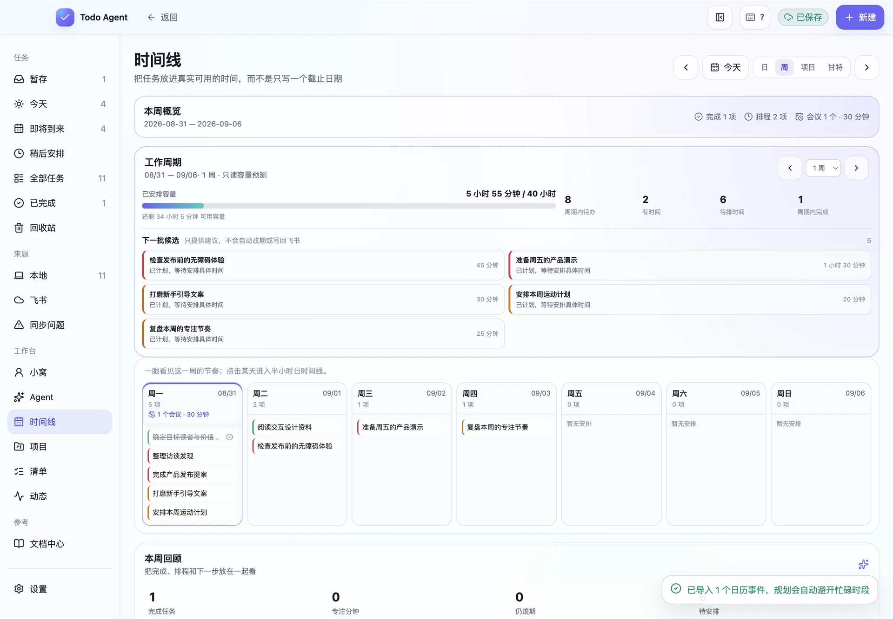</td>
    <td width="50%">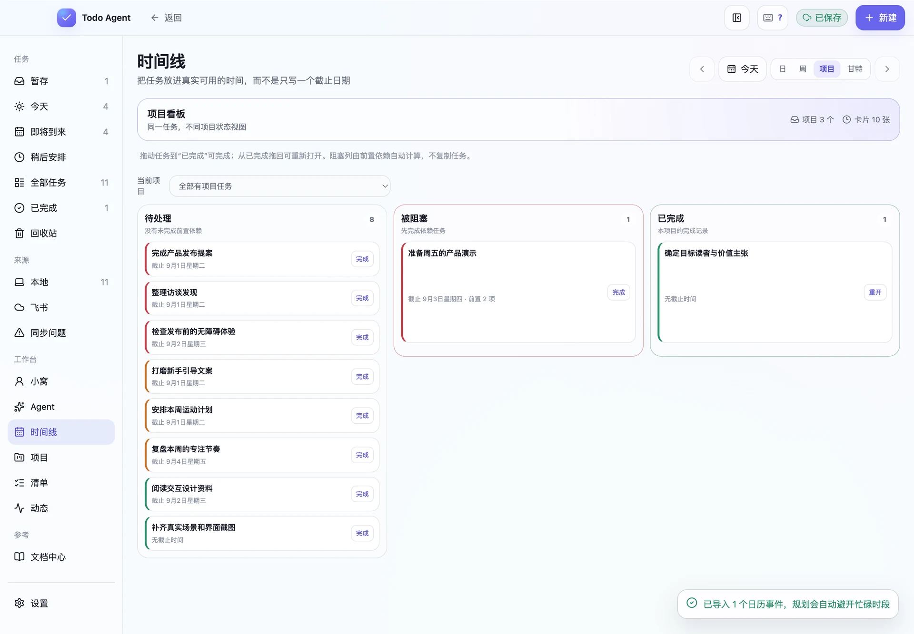</td>
  </tr>
  <tr>
    <td align="center"><sub><strong>周概览</strong> · 看见会议、容量、专注投入和未来节奏</sub></td>
    <td align="center"><sub><strong>项目看板</strong> · 下一步、进行中、已完成一眼可见</sub></td>
  </tr>
</table>

<p align="center">
  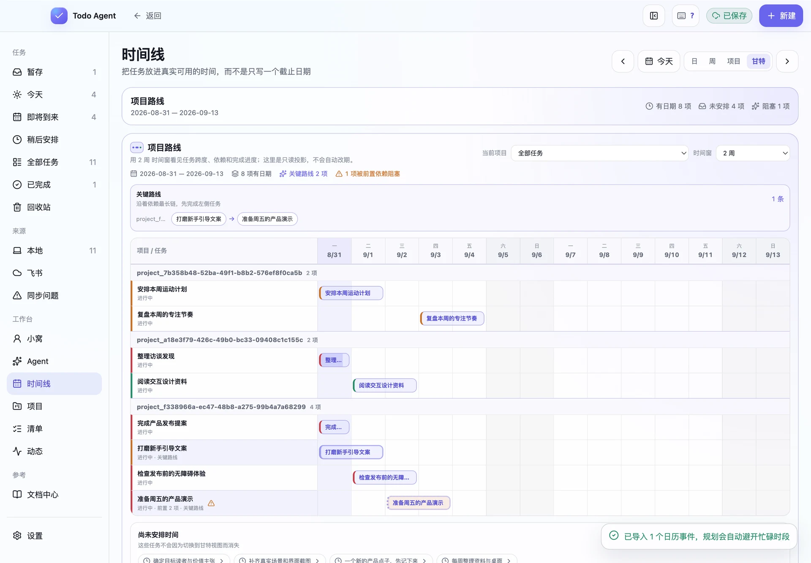
</p>

<p align="center"><sub>甘特路线支持 2 / 4 / 12 周时间窗、未安排托盘、依赖阻塞与关键路线；拖动只修改本地时间块。</sub></p>

## Agent 可以做事，但不能越权

Agent 不是藏在输入框后的黑盒。每次运行都明确显示使用的模型、数据范围、可用能力、工具执行过程和影响预览；任务读写、飞书同步、网页研究、文件与终端、剪贴板与屏幕五层权限可以独立关闭，并在真正执行时再次校验。

<p align="center">
  
</p>

<table>
  <tr>
    <td width="50%">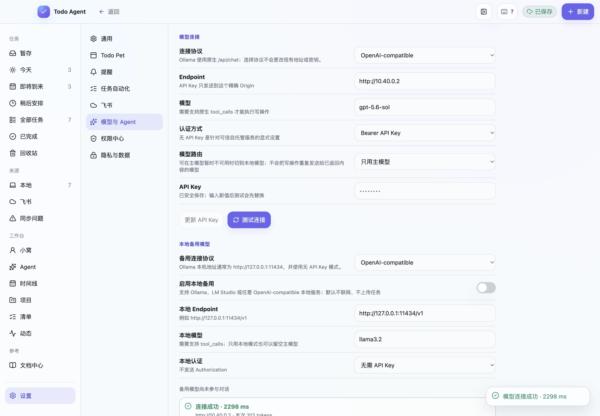</td>
    <td width="50%">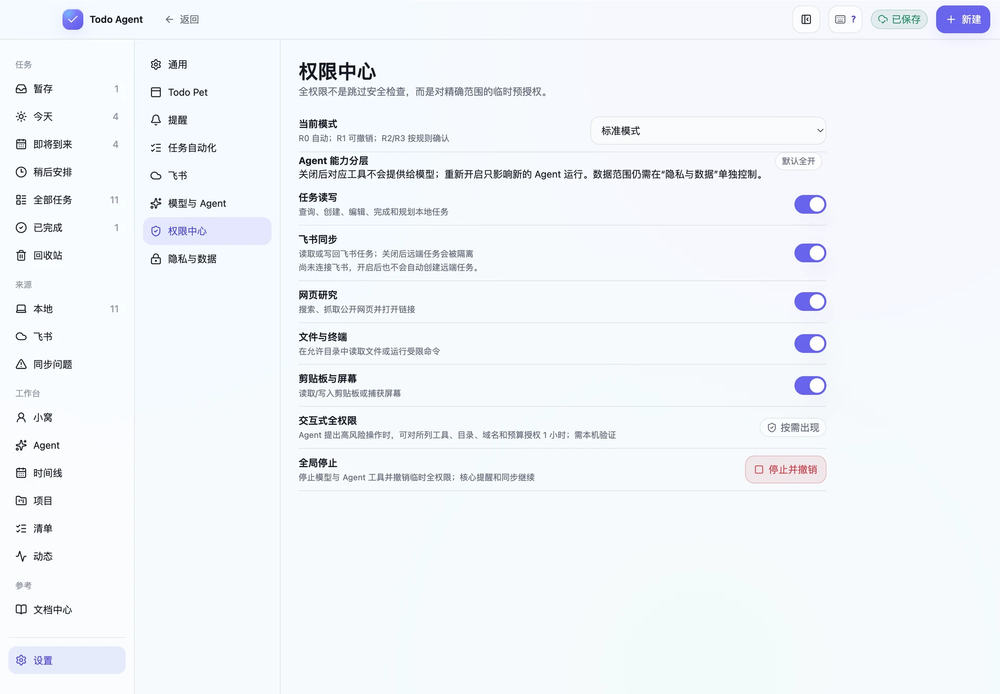</td>
  </tr>
  <tr>
    <td align="center"><sub><strong>模型由你选</strong> · OpenAI-compatible、Codex 与 Ollama，支持主备路由和费用上限</sub></td>
    <td align="center"><sub><strong>能力由你开</strong> · 关闭后工具从下一次运行中消失，执行时仍会复核</sub></td>
  </tr>
</table>

Agent 可以用自然语言查询、创建、修改和整理任务，把大任务拆成子任务，研究网页或本机资料，并把回复转成可编辑的行动项与私人研究卡；所有有副作用的步骤仍由用户确认。

## 飞书任务，不再是另一个孤岛

连接飞书后，本地任务与飞书 Task V2 在同一工作台展示，但始终保留来源。公共字段按授权同步，Today、私人排序、时间块、专注状态、研究卡等本地字段不会写回飞书；离线修改进入队列，冲突不会被静默覆盖。

<table>
  <tr>
    <td width="50%">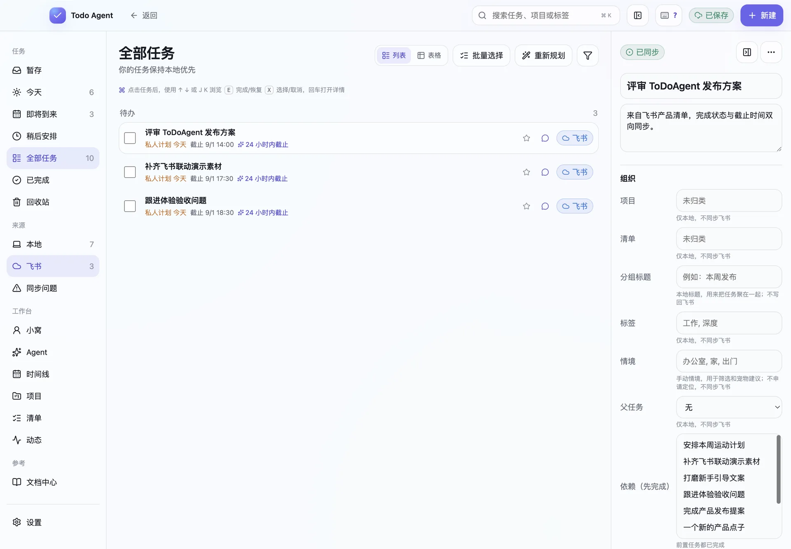</td>
    <td width="50%">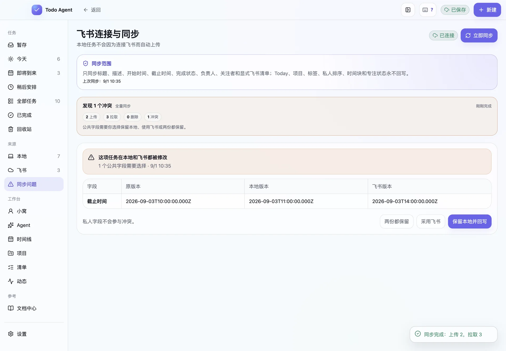</td>
  </tr>
  <tr>
    <td align="center"><sub><strong>统一查看</strong> · 本地 / 飞书来源清楚可辨，私人计划仍留在本机</sub></td>
    <td align="center"><sub><strong>可靠同步</strong> · 全量 / 增量、上传 / 拉取、离线队列与逐字段冲突选择</sub></td>
  </tr>
</table>

## 重复的事交给规则，散落的事交给搜索

本地自动化支持任务新建、完成、临近截止、手动应用与定时运行；AND / OR 条件、试运行预览、周期去重和可撤销记录都在本机完成，不执行脚本，也不会把私人组织字段写回飞书。全局搜索则横跨任务、评论、研究卡、附件元数据、项目、清单、日历事件和 Agent 会话。

<table>
  <tr>
    <td width="50%">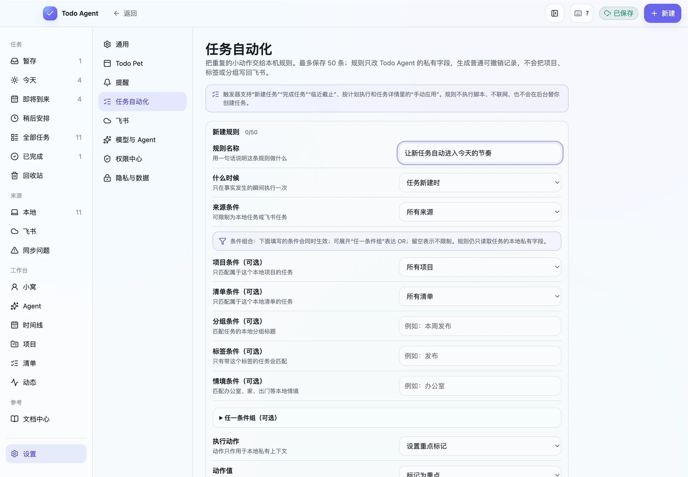</td>
    <td width="50%">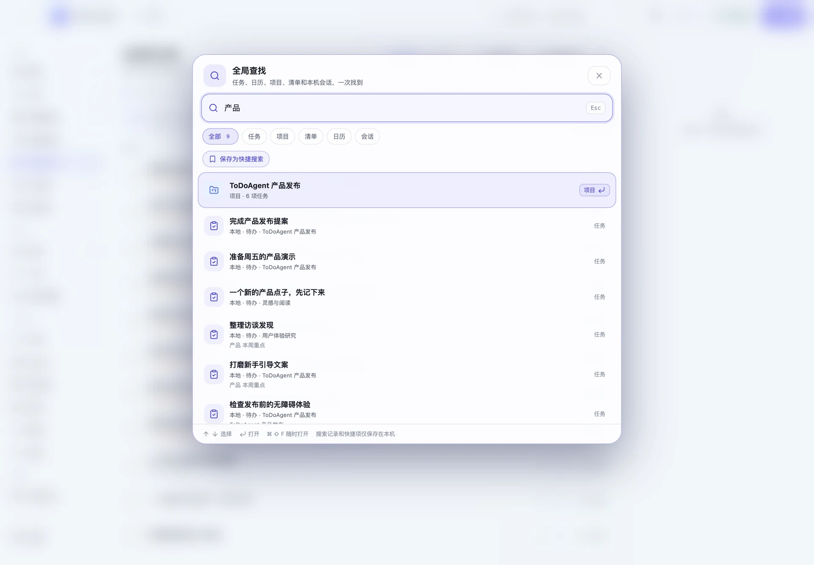</td>
  </tr>
  <tr>
    <td align="center"><sub><strong>任务自动化</strong> · 先试运行，再让确定性规则接手重复动作</sub></td>
    <td align="center"><sub><strong>全局搜索</strong> · 一个快捷键，穿过任务、资料、日历和会话</sub></td>
  </tr>
  <tr>
    <td width="50%">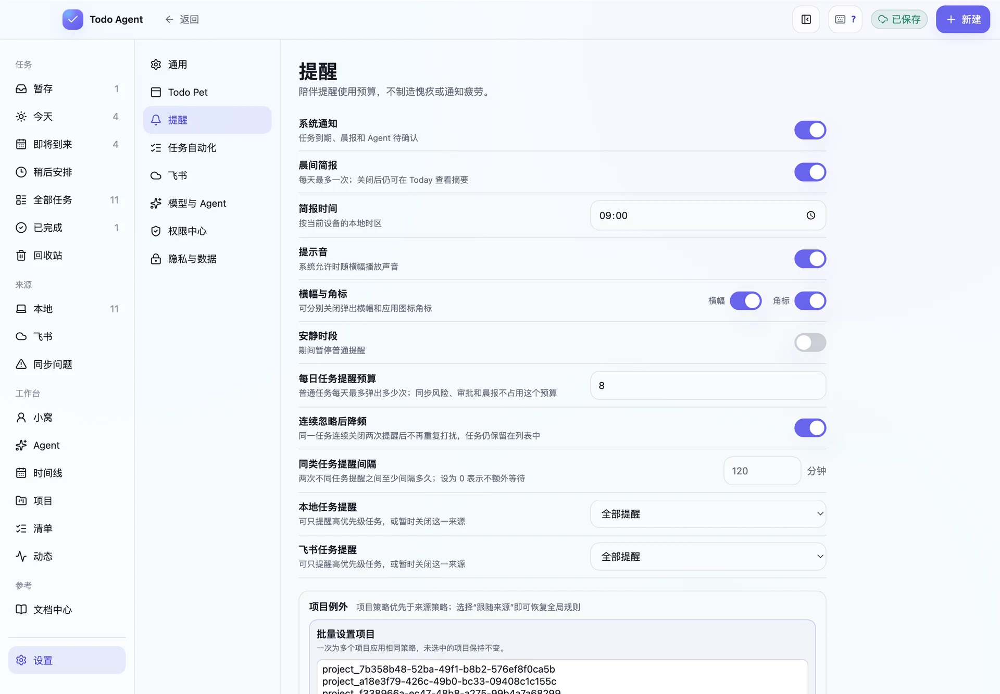</td>
    <td width="50%">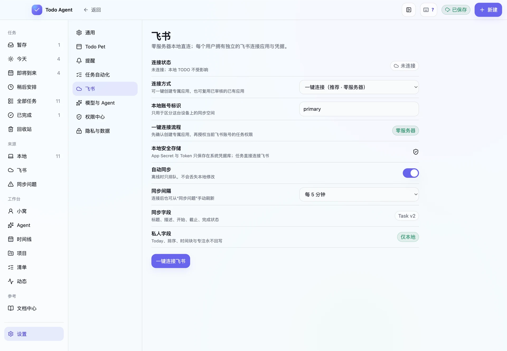</td>
  </tr>
  <tr>
    <td align="center"><sub><strong>温和提醒</strong> · 解释为什么现在提醒，并尊重安静时段与预算</sub></td>
    <td align="center"><sub><strong>外部 Agent 桥接</strong> · 把 Codex、Claude Code 等运行状态投影到桌面伙伴</sub></td>
  </tr>
</table>

## Todo Pet：任务完成之后，也留下了一点温度

Todo Pet 常驻桌面，轮播今天的下一步，也能展开任务、专注、聊天和小窝。五个 DesktopBuddy 原版 Live2D 伙伴持续呼吸、注视与回应；拖动带惯性和边缘弹簧，忙碌时可以收成只露一小截的桌面探头，演示或会议时一键进入 Boss Mode。

<table>
  <tr>
    <td width="50%">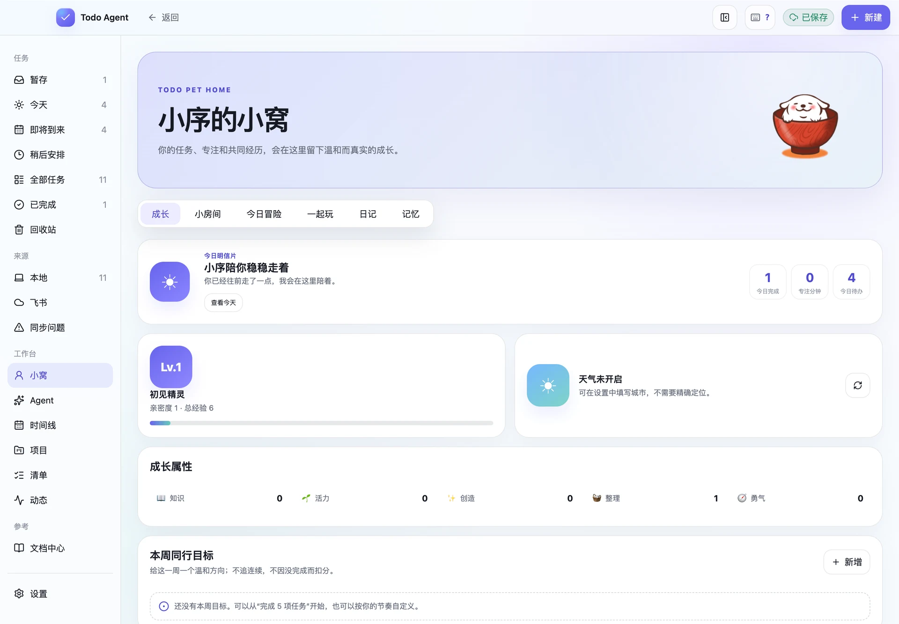</td>
    <td width="50%">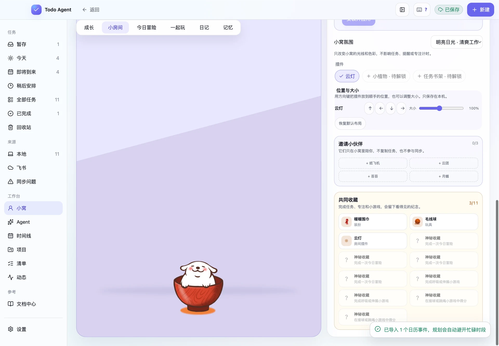</td>
  </tr>
  <tr>
    <td align="center"><sub><strong>成长</strong> · 来自真实完成与专注，不靠惩罚和连续签到</sub></td>
    <td align="center"><sub><strong>小房间</strong> · 氛围、摆件、主题、旅程、日记与共同完成印章</sub></td>
  </tr>
</table>

<p align="center">
  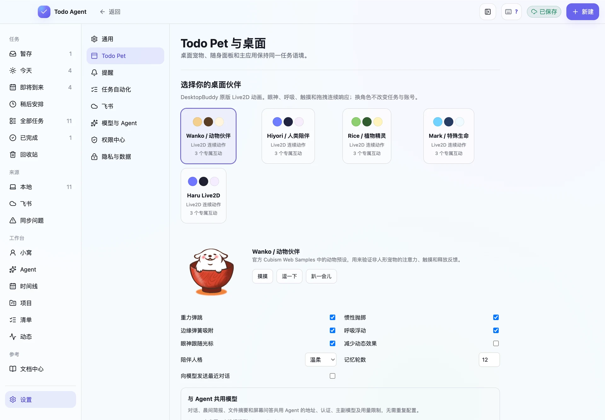
</p>

<table>
  <tr>
    <td width="20%"></td>
    <td width="20%"></td>
    <td width="20%"></td>
    <td width="20%"></td>
    <td width="20%"></td>
  </tr>
  <tr>
    <td align="center"><sub>Wanko</sub></td>
    <td align="center"><sub>Hiyori</sub></td>
    <td align="center"><sub>Rice</sub></td>
    <td align="center"><sub>Mark</sub></td>
    <td align="center"><sub>Haru</sub></td>
  </tr>
</table>

## 功能地图

| 模块 | 已包含能力 |
| --- | --- |
| 捕获 | 一行式快速新增、自然语言日期 / 时长 / 循环 / 优先级解析、剪贴板、当前窗口、选中文本、拖入文本与链接、语音入口、最近 12 条本机捕获回用；保存前可选任务 / 暂存 / 日记 |
| 任务 | 暂存、Today、即将到来、稍后、全部、完成与回收站；列表 / 表格、批量编辑、撤销 / 重做、子任务、依赖防环、讨论、研究卡、附件、链接、自定义字段、重复任务和工作流模板 |
| 组织 | 项目、清单、标签、情境、分组标题、优先级、重点标记、保存视图、一句话筛选、项目健康与任务来源 |
| 规划 | 晨间简报、三步开始今天、可用时段与容量、任务缓冲、日历忙碌区、日 / 周时间线、工作周期、容量预测、项目看板、2 / 4 / 12 周甘特路线、关键路线、每周回顾与估时复盘 |
| 专注 | 25/5、50/10、90/20、自定义番茄钟、正计时、暂停恢复、任务绑定、环境音、专注守护、系统通知、重启恢复和专注节奏分析 |
| 飞书 | Task V2 双向同步、已有应用接入、自动 / 手动 / 交互后同步、离线队列、同步摘要、逐字段冲突处理、按用户与 OAuth 应用隔离；私人计划与本地组织字段不回写 |
| Agent | OpenAI-compatible、Codex 与 Ollama；主备模型、流式 Markdown、会话历史、费用预算、任务 CRUD、任务拆分、网页研究、文件 / 终端、屏幕 / 剪贴板、行动项提取、研究卡和执行过程卡 |
| 自动化 | 最多 50 条本机规则；新建、完成、临近截止、手动与定时触发；AND + OR 条件、试运行预览、补执行、周期去重、原子执行与撤销 |
| 搜索与数据 | 跨任务 / 评论 / 研究卡 / 附件元数据 / 项目 / 清单 / 日历 / 会话的本机搜索；最近查询、保存搜索、可读 Markdown、安全 JSON 备份与宠物档案迁移 |
| Todo Pet | 五个 Live2D 伙伴、桌面常驻与边缘收纳、任务轮播、互动与物理反馈、六种陪伴性格、专注联动、小窝、天气、习惯、同行目标、冒险、日记、记忆、主题、动作包与 Boss Mode |
| 外部 Agent | Claude Code、Codex CLI、Copilot、Gemini、Cursor、OpenClaw、Hermes、opencode、MiMo、Qoder、Qwen、TraeCode 等活动状态桥接；仅监听 `127.0.0.1`，不读取提示词和文件内容 |

想查每一个边界、字段和交互？打开 [完整功能与产品说明](./docs/PRODUCT_GUIDE.md)。

## 本地优先，不是一句口号

<p align="center">
  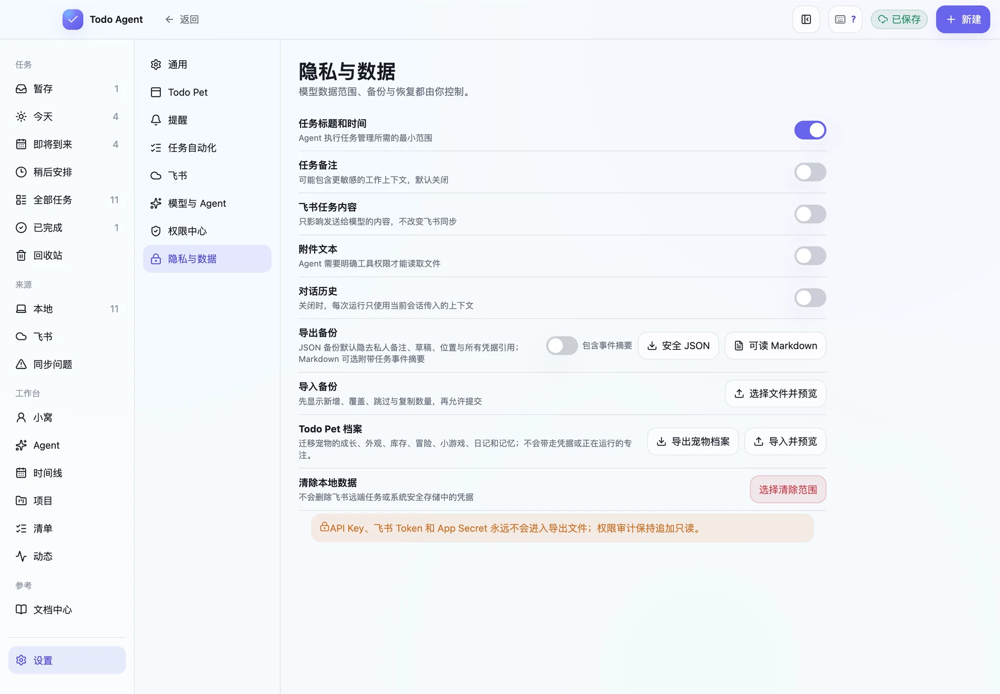
</p>

- **本地事实层**：任务、规划、专注、提醒、成长和日记默认保存在本机，不因为启用模型就自动上传。
- **凭据进安全存储**：飞书 Secret、Token 和模型密钥由系统安全存储保护，普通设置只保存引用。
- **范围看得见**：每次 Agent 运行都显示将使用的数据范围；聊天历史、任务备注、文件与屏幕分别控制。
- **高风险操作先确认**：批量写入、外部访问和高风险工具先展示影响，支持停止、审计与撤销。
- **不制造压力**：宠物不会死亡、饥饿或扣资产，也不靠强制连续签到维持关系；休假模式会暂停主动陪伴。

## 下载

当前为 **Early Preview v0.0.1**，对应源码提交 `ecabc157`。

| 平台 | 安装包 | 免安装 / 备用 |
| --- | --- | --- |
| macOS Apple Silicon | [下载 DMG](https://github.com/BrotherHappy/TodoAgent/releases/download/v0.0.1/Todo.Agent-0.0.1-arm64.dmg) | [下载 ZIP](https://github.com/BrotherHappy/TodoAgent/releases/download/v0.0.1/Todo.Agent-0.0.1-arm64-mac.zip) |
| Windows x64 | [下载安装程序](https://github.com/BrotherHappy/TodoAgent/releases/download/v0.0.1/Todo.Agent.Setup.0.0.1.exe) | [下载 ZIP](https://github.com/BrotherHappy/TodoAgent/releases/download/v0.0.1/Todo.Agent-0.0.1-win.zip) |

[查看版本说明](https://github.com/BrotherHappy/TodoAgent/releases/tag/v0.0.1) · [校验 SHA-256](https://github.com/BrotherHappy/TodoAgent/releases/download/v0.0.1/SHA256SUMS.txt)

> [!WARNING]
> 预览安装包尚未使用公开受信任证书签名：macOS 首次打开可能需要在“隐私与安全性”中确认，Windows 可能显示 SmartScreen 提示。

## 从源码运行

前置条件：Node.js 24 LTS、npm。

```bash
git clone https://github.com/BrotherHappy/TodoAgent.git
cd TodoAgent
npm install
npm run dev
```

提交前的完整检查：

```bash
npm run verify
```

当前门禁包含 TypeScript 类型检查、184 个测试文件 / 1,212 项测试和正式构建。常用开发、打包和截图命令见 [完整功能手册](./docs/PRODUCT_GUIDE.md#从源码启动)。

## 设计原则

1. **事实先于拟人化**：真实任务和飞书同步属于事实层，宠物只负责陪伴，Agent 不能伪造状态。
2. **建议先于替你决定**：规划、研究和 Agent 写入先给可读预览，用户确认后才执行。
3. **推进而不惩罚**：用下一步、专注和正向成长帮助行动，不用焦虑、死亡或连签绑架注意力。
4. **离线仍然完整**：没有云端账号、飞书或模型时，核心任务系统仍然是一款完整应用。

## 文档与边界

- [完整功能与产品说明](./docs/PRODUCT_GUIDE.md)
- [统一 PRD](./docs/PRD.md)
- [技术架构与测试门禁](./docs/TECHNICAL_ARCHITECTURE.md)
- [飞书连接说明](./docs/FEISHU_CONNECTION.md)
- [DesktopBuddy 集成与验收](./docs/DESKTOPBUDDY_INTEGRATION.md)
- [外部 Agent 活动桥接](./docs/CLAWD_INTEGRATION.md)
- [隐私与安全边界](./docs/PRODUCT_GUIDE.md#隐私与安全)
- [第三方资源声明](./assets/desktopbuddy/licenses/NOTICE.md)

## 许可

ToDoAgent 自有代码目前未声明开源许可证，保留全部权利。DesktopBuddy 引入代码保留 MIT 许可；Live2D 模型与 Cubism Core 适用各自条款。公开或商业分发前，请阅读 [第三方资源声明](./assets/desktopbuddy/licenses/NOTICE.md)。

<p align="center">
  <strong>给待办一个位置。给自己一个伙伴。</strong><br />
  <a href="https://todoagent-showcase.brotherhappy.chatgpt.site/">探索 ToDoAgent</a>
</p>
