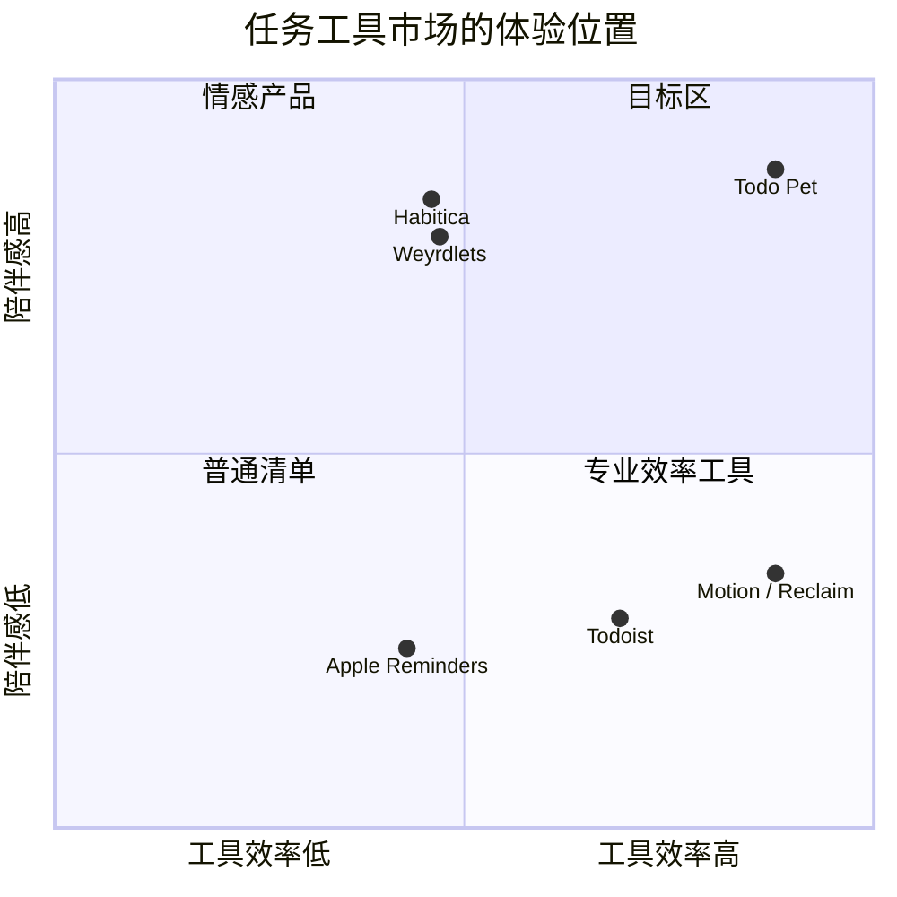

# Todo Pet 竞品研究与可借鉴设计

> 文档状态：Research v1.0 
> 更新日期：2026-08-19 
> 适用产品：Todo Agent / Todo Pet 
> 研究范围：个人任务管理、日程规划、AI 任务代理、开源本地优先、桌面宠物、专注与陪伴产品 
> 关联文档：[PRD.md](./PRD.md)、[Todo Pet 产品与体验设计](./TODO_PET_PRODUCT_DESIGN.md)、[Todo Pet 实现规范](./TODO_PET_IMPLEMENTATION_SPEC.md)

## 0. 先说结论

“市面上所有产品”无法被一次性穷尽，产品、插件和开源分支每天都在变化。本报告采用**代表性覆盖**：横跨 6 个类别、30+ 个产品，并优先使用产品官网、帮助中心、官方 App Store / Steam 页面和 GitHub README 作为证据。它不是简单的功能清单，而是回答三个问题：

1. 哪些产品在 UI、交互或功能上比当前 Todo Pet 更成熟？
2. 它们的成熟点能否直接迁移到“桌面宠物 + 任务 + Agent”的产品模型？
3. 哪些功能会增加压力、复杂度或权限风险，不应该照搬？

### 0.1 Todo Pet 应该占据的位置

Todo Pet 的差异化不是“比 Todoist 多一个可爱的皮肤”，而是把三种价值合成一个闭环：

- **真实任务执行**：本地任务、飞书任务、提醒、番茄钟和 Agent 操作都是真实状态，而不是游戏内的影子任务。
- **桌面存在感**：宠物是透明、置顶、可拖动的入口；用户不必先打开完整应用才知道下一步做什么。
- **温和陪伴**：动作、气泡、小游戏、日记和装扮增加关系感，但不使用死亡、饥饿、惩罚或连续签到制造压力。

### 0.2 对当前产品最重要的 10 个结论

| 结论 | 竞品证据 | Todo Pet 的落地判断 |
|---|---|---|
| 低摩擦捕获比复杂表单更重要 | Todoist Quick Add、Akiflow Universal Inbox、Routine Contextual Capture | 全局快捷键、宠物气泡输入、语音和剪贴板都进入同一个 Inbox；先捕获，再补字段 |
| “今天”应该是工作台，不是永久列表 | Microsoft To Do My Day、Any.do My Day、Sunsama Daily Planning | “今天”每天刷新，但未完成任务必须安全回到全部任务；宠物早报只读今日工作台 |
| 到期日和实际工作时间是两件事 | Motion 的 Do Date / Due Date、Reclaim 的自动排程 | Agent 只能提出时间块方案，默认不静默改动外部日历；用户确认后执行 |
| 时间线比纯列表更适合开始任务 | Structured、TickTick Calendar、Sunsama Timeboxing | 展开窗增加“时间线”视图；宠物气泡只显示当前块，避免桌面变成日历墙 |
| 过滤器和保存视图能处理大量任务 | Todoist Filters、OmniFocus Perspectives、Vikunja Saved Filters | “全部 / 今天 / 专注 / 聊聊 / 小窝”是一级入口；高级筛选作为可保存的视图，不污染默认界面 |
| 快捷键与菜单栏是桌面效率的骨架 | Sunsama Menu Bar、Routine Menu Bar Widget、OmniFocus Quick Entry | `⌘/Ctrl+Shift+Space` 呼出快速捕获；右键菜单只保留高频动作 |
| Agent 必须显示将做什么，而不是只显示一句“好的” | Notion Agent、Taskade Agents、Todoist Assist | 所有增删改、批量操作、网页写入和飞书同步先展示行动预览、权限、影响范围和撤销入口 |
| 宠物互动应有身体反馈和可中断状态机 | Shimeji-ee、Weyrdlets、Desktop Pets、GooseDroid | 采用“待机—被触摸—工作—专注—成功—休息”状态机；动画为状态反馈，不做无意义装饰 |
| 正向奖励有效，但负向惩罚容易反噬 | Habitica 的奖励循环、Forest 的失败代价、Finch 的温和自护 | 奖励共同经历、装扮、家园和日记；不扣资产、不生病、不死亡，支持休假和补记 |
| 本地优先和可迁移是开源产品的信任来源 | Super Productivity、Vikunja、Planify、Lunatask | 本地数据库、离线队列、可导出 JSON/Markdown；飞书和模型都是可插拔连接器 |

## 1. 研究方法与对比维度

### 1.1 研究维度

- **UI**：默认入口、信息密度、层级、视觉焦点、透明桌面形态、时间线 / 看板 / 列表组织方式。
- **交互**：捕获、拖拽、快捷键、自然语言、任务完成、延期、批量编辑、气泡 / 小窗行为、动效与打断规则。
- **功能**：任务模型、子任务、重复、提醒、日历、番茄钟、统计、习惯、奖励、AI、协作、同步、权限和离线。
- **优势**：对用户为什么有用，为什么比普通 TODO 更容易坚持。
- **迁移成本**：是否适合 Todo Pet 的个人贡献者定位、桌面常驻形态和飞书双向同步。
- **风险**：打扰、复杂度、隐私、供应商锁定、游戏化压力和 Agent 误操作。

### 1.2 产品覆盖

| 类别 | 代表产品 |
|---|---|
| 传统任务管理 | Todoist、TickTick、Things 3、OmniFocus、Microsoft To Do、Apple Reminders、Google Tasks、Any.do、Remember The Milk |
| 日程与时间规划 | Sunsama、Akiflow、Motion、Reclaim、Routine、Morgen、Structured、Amazing Marvin |
| AI 工作区 / Agent | Notion AI、Taskade AI、Todoist Assist、Motion AI、Reclaim Assistant |
| 开源 / 本地优先 | Vikunja、Super Productivity、Taskwarrior、Kanboard、Planify、Lunatask、Org mode |
| 宠物 / 游戏化 / 专注 | Finch、Forest、Habitica、Focus Friend、Weyrdlets、Spirit City、Study Bunny |
| 桌面宠物 / 开源交互 | Desktop Goose、Shimeji-ee、Desktop Pets、Deskcat、GooseDroid |
| 业务连接 | Feishu / Lark Tasks、Gmail / Google Tasks、Outlook / Microsoft To Do |

## 2. 商用任务管理产品

### 2.1 Todoist：最快的自然语言捕获和可组合视图

- **UI**：左侧项目 / 标签 / 过滤器导航，主区域以清晰的列表为主；项目可以切换列表和看板，团队项目可以使用日历布局。
- **交互**：Quick Add 一行输入即可解析日期、重复、项目、标签和优先级；任务支持子任务、评论、附件、委派和历史；过滤器用查询语法或自然语言生成。
- **优势**：新任务从想到到落库的时间极短；过滤器将“所有任务”变成用户自己的工作台；优先级、截止日期、估时和提醒组成可组合的任务模型。
- **相对 Todo Pet 的领先点**：成熟的输入解析、过滤器和任务历史；跨平台任务协作也更完整。
- **Todo Pet 借鉴**：宠物气泡输入支持 `明天下午三点给小明发邮件 #工作 p1` 这类语法；对话 Agent 使用同一解析器；过滤器保存为“宠物视图”。
- **不照搬**：不要把查询语法作为默认入口，普通用户仍应看到自然语言和按钮；不要让 Agent 在解析不确定时猜日期。
- **证据**：[Todoist Pricing / Features](https://www.todoist.com/pricing/)、[Todoist Assist](https://www.todoist.com/todoist-assist)、[Todoist API Quick Add](https://developer.todoist.com/api/v1/)。

### 2.2 TickTick：任务、日历、习惯和专注的一体化

- **UI**：任务列表、日历、四象限、习惯和专注均有独立入口；桌面 / 移动组件可以直接新增任务、打开日历、矩阵、习惯或番茄钟。
- **交互**：日历支持拖动改变开始时间和时长；任务可拆分；番茄钟与任务关联；习惯有连续记录和统计；提醒、倒计时和重复任务较完整。
- **优势**：将“要做什么”和“什么时候做”放在同一产品里，适合从清单快速进入专注；组件让高频操作脱离主应用。
- **相对 Todo Pet 的领先点**：专注、习惯、统计和系统组件成熟；时间线操作的反馈更直接。
- **Todo Pet 借鉴**：宠物展开窗提供“当前任务 + 开始专注”；未来增加桌面 / 移动 Widget；时间线支持拖动，但只在详细视图中展示。
- **不照搬**：不把习惯、番茄、倒计时全部塞进宠物气泡；气泡只承载一项当前行动。
- **证据**：[TickTick Features](https://ticktick.com/features?language=en_US)、[TickTick Calendar / Matrix / Habit](https://help.ticktick.com/articles/7054286604315131904)、[TickTick Widgets](https://help.ticktick.com/articles/7055780404896202752)。

### 2.3 Things 3：渐进披露和细腻的拖拽体验

- **UI**：极简白纸式任务卡，默认只显示标题；详情、备注、标签和截止时间收在二级层级；Today、Upcoming、Anytime、Someday、Inbox、Logbook 构成稳定心智模型。
- **交互**：Areas / Projects / Headings 形成层级；拖动标题可以移动整组任务；Magic Plus 在 Today、项目、Upcoming 或 Inbox 中快速插入；拖动任务到日期可以重新安排。
- **优势**：信息密度低但组织能力强；用户可以先写，再逐步补充上下文；完成动作有明确的视觉收束。
- **相对 Todo Pet 的领先点**：默认状态非常安静，适合长期使用；层级、分组和拖放成熟。
- **Todo Pet 借鉴**：宠物小窗默认只显示任务标题和来源；详情通过气泡展开；“拖动到宠物 / Today / 专注”成为可理解的目标区域。
- **不照搬**：Things 是 Apple 生态专属，Todo Pet 需要 Windows / macOS 对等体验；不能依赖系统提醒事项作为唯一数据源。
- **证据**：[Things Features](https://culturedcode.com/things/features/)、[Today / Upcoming / Logbook](https://culturedcode.com/things/support/articles/4001304/)、[Things Discover](https://culturedcode.com/things/support/articles/1059358/)。

### 2.4 OmniFocus：复杂任务的 Perspectives、Forecast 和 Review

- **UI**：Inbox、Projects、Tags、Forecast、Flagged、Nearby、Review、Completed 等标准视图；用户可以建立自定义 Perspectives，保存筛选、排序、分组和焦点。
- **交互**：Quick Entry 快速收集；任务支持重复、等待、依赖、位置、文件和富文本；Forecast 把任务与日历结合；Review 用固定仪式清理项目。
- **优势**：面对大量复杂任务仍能保持可控；“下一步行动”和“每周回顾”将 GTD 方法固化进产品。
- **相对 Todo Pet 的领先点**：高级筛选、回顾和上下文模型更强；适合专业用户。
- **Todo Pet 借鉴**：增加“宠物回顾”流程：每周询问过期任务、阻塞任务和无主任务；允许保存“阅读 / 研究 / 飞书待同步”等视图。
- **不照搬**：不要在首屏暴露 Perspectives、上下文和所有字段；为新用户提供渐进式升级。
- **证据**：[OmniFocus Features](https://www.omnigroup.com/omnifocus/features/)、[Perspectives](https://support.omnigroup.com/documentation/omnifocus/universal/4.8.11/en/perspectives/)。

### 2.5 Microsoft To Do：My Day 和建议的低压力日规划

- **UI**：列表导航 + My Day 日工作台；My Day 每晚清空，未完成任务回到原列表并在次日进入 Suggestions。
- **交互**：用户可从任意列表把任务加入 My Day；Suggestions 提供近期、过期、今天到期和未加入计划的任务；任务支持步骤、提醒、重复和 Planned 智能列表。
- **优势**：每天提供一个干净的开始，不把过去的堆积直接铺满用户；Suggestions 让“今天做什么”有来源可追溯。
- **相对 Todo Pet 的领先点**：日计划的心理负担较低，和 Outlook 生态连接自然。
- **Todo Pet 借鉴**：宠物晨报采用“今日工作台”逻辑；未完成不丢失，宠物只推荐 3–5 个最相关任务；支持“今天先不安排”。
- **不照搬**：不自动把所有到期任务塞进今日焦点；来源、截止时间和用户主动选择要分开显示。
- **证据**：[My Day and Suggestions](https://support.microsoft.com/en-US/ToDo/my-day-and-suggestions)、[Due Dates and Reminders](https://support.microsoft.com/en-us/todo/add-due-dates-and-reminders-in-microsoft-to-do)。

### 2.6 Apple Reminders：Smart Lists、标签、章节和系统级入口

- **UI**：列表、组、章节、标签和 Smart Lists；列表可以用颜色和图标区分；购物清单可自动分类。
- **交互**：拖动任务可改变顺序或变成子任务；模板可以复制整套清单；标签跨列表聚合；Siri / Apple Intelligence 可通过统一 Reminders intents 创建和修改提醒。
- **优势**：系统级捕获、通知、语音和跨设备体验强；小功能组合成很低摩擦的日常系统。
- **相对 Todo Pet 的领先点**：操作系统整合、语音和智能列表非常成熟。
- **Todo Pet 借鉴**：为 Windows / macOS 抽象统一快捷键和语音入口；允许把气泡拖到宠物上变成子任务；模板可生成“晨间 / 周回顾 / 项目启动”流程。
- **不照搬**：不要假设用户只使用 Apple 设备；不要把系统权限当作默认授权。
- **证据**：[Apple Reminders 组织指南](https://support.apple.com/en-gb/119953)、[Reminders App Intents](https://developer.apple.com/documentation/appintents/app-schema-domain-reminders?changes=_2)。

### 2.7 Google Tasks：从上下文直接生成任务

- **UI**：在 Gmail、Calendar、Chat、Drive、Docs、Sheets、Slides 侧栏中出现；任务通常以轻量面板形式存在。
- **交互**：邮件、日历事件和文档上下文可以直接转成任务；支持详情、子任务、到期日、通知和重复。
- **优势**：用户不需要离开当前工作场景；任务天然带有来源上下文。
- **相对 Todo Pet 的领先点**：上下文捕获和 Google Workspace 入口覆盖强。
- **Todo Pet 借鉴**：宠物支持“从剪贴板 / 当前窗口标题 / 选中文本创建任务”；Agent 在创建前显示来源摘要和权限。
- **证据**：[Google Tasks Help](https://support.google.com/tasks/answer/7675772?hl=en-GB)、[Recurring Tasks](https://support.google.com/tasks/answer/12132599?co=GENIE.Platform%3DDesktop&hl=en)。

### 2.8 Any.do：日历、My Day、提醒和外部入口

- **UI**：任务 / 清单、日历、Daily Planner、Widgets、提醒在一个产品内；My Day 是每日命令中心。
- **交互**：支持一次性、重复和位置提醒；日历可连接 Google / iCloud / Outlook；邮件、WhatsApp 等外部入口可以转成任务；任务可以拆分子任务。
- **优势**：个人、家庭和轻协作场景覆盖广；My Day 将日程与任务放到同一个视图。
- **相对 Todo Pet 的领先点**：外部捕获和家庭场景更完整。
- **Todo Pet 借鉴**：扩展 Agent 的“把这封邮件 / 这段文字变成任务”能力；宠物晨报同时汇总日历和任务，但明确标识来源。
- **证据**：[Any.do 首页](https://www.any.do/)、[Personal Features](https://www.any.do/personal)、[My Day](https://support.any.do/en/articles/8609724-getting-started-with-my-day)。

### 2.9 Structured：以时间线帮助用户估算一天

- **UI**：打开即是当天的垂直时间线，任务和日历事件混排；Inbox 收集没有具体日期的任务；颜色、图标和时间段提高可读性。
- **交互**：可以把 Inbox 任务拖到时间线空档；支持拖动调整时间、重复任务、子任务、备注、番茄钟、习惯；AI 可批量编辑、重新排程和删除任务。
- **优势**：把抽象清单变成“今天从几点到几点做什么”；对 ADHD / 时间感弱的用户尤其直观。
- **相对 Todo Pet 的领先点**：时间线可视化和 Replan 逻辑非常清楚。
- **Todo Pet 借鉴**：展开小窗增加“今天时间线”；宠物气泡只播报当前时间块，结束时提供“完成 / 延后 / 重新规划”。
- **证据**：[Structured Getting Started](https://help.structured.app/en/articles/380546)、[Structured App](https://structured.app/)、[Structured 4.0 AI](https://structured.app/blog/4-0)。

## 3. 日程规划与自动排程产品

### 3.1 Sunsama：有引导的每日规划仪式

- **UI**：任务和日历双栏 / 同屏；Today View、Focus Mode、Focus Bar、Breaks、Menu Bar、Weekly Objectives、Daily Highlights 构成一套日常工作流。
- **交互**：按步骤引导每日规划；从外部工具拉取任务；将任务 Timebox 到日历；支持自动排程、自动重新排程、任务 rollover、快捷键和全局新增。
- **优势**：解决“知道要做什么，但没有安排什么时候做”的问题；每日启动和收尾让任务管理形成节奏。
- **相对 Todo Pet 的领先点**：日计划仪式、时间块和每日回顾都很成熟。
- **Todo Pet 借鉴**：宠物晨间气泡分三步问“今天必须做什么 / 有多少时间 / 是否需要专注”；晚间生成温和总结；宠物动作体现规划、执行、收尾。
- **不照搬**：不要强迫用户每天完成仪式；提供跳过、简化和静默模式。
- **证据**：[Sunsama Usage Guides](https://help.sunsama.com/docs/usage-guides/)、[Sunsama](https://www.sunsama.com/)。

### 3.2 Akiflow：Universal Inbox + 键盘优先的时间块

- **UI**：统一收件箱、任务列表、日历和时间框；颜色主要用于日历上的已规划任务，列表保持克制。
- **交互**：`P` 规划任务，`=` 修改时长；拖到日历形成时间块；可把任务锁定到日历并设置可见性；支持重复任务和全局快捷键。
- **优势**：把来自邮件、聊天、项目工具的任务汇总，再用键盘高速处理。
- **相对 Todo Pet 的领先点**：跨工具收件箱和快捷键工作流强。
- **Todo Pet 借鉴**：飞书、本地、Agent 创建和剪贴板任务统一进入“待整理”；宠物右键提供最近捕获；拖到“专注”即锁定一段时间。
- **证据**：[Akiflow Task Features](https://product.akiflow.com/help/articles/0006630-task-features)。

### 3.3 Motion：AI 把“截止日期”变成“可执行时间表”

- **UI**：日历是主界面，固定事件和 AI 排程任务混在时间线上；Agenda View 按时间顺序显示当天的行动。
- **交互**：任务填写优先级、时长、开始 / 截止日期后自动排程；遇到会议或新任务会持续重排；阻塞关系、风险指标和项目阶段在日历上可见；拖动一个任务会触发整体重排。
- **优势**：用户不需要手动安排每个任务的时间；能在任务变长、会议插入或截止风险出现时及时重新规划。
- **相对 Todo Pet 的领先点**：自动排程、依赖、风险和容量管理最强。
- **Todo Pet 借鉴**：Agent 提供“建议日程”，说明依据、受影响任务和冲突；用户确认后批量写入本地和日历；宠物用“搬运任务卡”动画表现重排。
- **不照搬**：不默认自动移动飞书任务的截止日期；同步外部系统前要明确来源、目标、变更和撤销。
- **证据**：[Motion AI Task Manager](https://www.usemotion.com/features/ai-task-manager?gad=1)、[Agenda View](https://help.usemotion.com/motions-agenda-view)、[Tasks vs Events](https://www.usemotion.com/help/project-management/task/reference-tasks/the-difference-between-tasks-and-events-in-motion)。

### 3.4 Reclaim：灵活的习惯、专注时间和日历保护

- **UI**：以日历为中心；Focus Time、Habits、Tasks、Planner 和多日历同步形成“时间防御层”。
- **交互**：习惯不是死板的重复事件，会围绕日程弹性移动；Focus Time 根据每周目标保护深度工作；任务自动在截止日期前找时间；可同步 Todoist、Asana、ClickUp、Linear、Jira、Google Tasks 等。
- **优势**：对变化频繁的日程比固定重复任务更有韧性；能保护休息和个人时间。
- **相对 Todo Pet 的领先点**：习惯和专注时间的弹性排程、跨日历同步和 Agent 化趋势更成熟。
- **Todo Pet 借鉴**：把喝水、休息、回顾等生活提醒设计为“弹性习惯”；宠物在空档主动出现，而不是在固定时间强打断。
- **证据**：[Reclaim Features](https://help.reclaim.ai/en/articles/6210740-features-in-reclaim)、[Reclaim 2.0 Overview](https://help.reclaim.ai/en/articles/14846468-reclaim-ai-2-0-overview)。

### 3.5 Routine：统一捕获、菜单栏和 AI 工作流

- **UI**：Agenda、Dashboard、Planner、Universal Inbox、Menu Bar Widget；产品覆盖 macOS、Windows、Linux、Web、iOS、Android。
- **交互**：Contextual Capture、自然语言、AI Voice Commands、快捷键、时间块、计时器、重复任务、离线和 AI Agents 都从同一工作区进入。
- **优势**：桌面常驻入口与完整工作区的边界清楚；适合把零散信息先收集，再统一处理。
- **相对 Todo Pet 的领先点**：菜单栏、语音、离线和工作流自动化的组合完整。
- **Todo Pet 借鉴**：宠物是更有情感的 Menu Bar / Quick Capture；Agent 可在气泡中把语音内容转成“待确认变更”。
- **证据**：[Routine Features](https://www.routine.co/features)。

### 3.6 Amazing Marvin / Morgen：可定制方法与日历聚合

- **共同优势**：Amazing Marvin 以模块化策略、习惯和工作流适配不同人；Morgen 类产品以多个日历、任务和预约入口聚合为核心。
- **Todo Pet 借鉴**：不要只提供一种番茄钟；让用户选择“25/5、50/10、无计时专注、弹性时间块”，并允许宠物人格和提醒风格独立配置。
- **风险**：策略开关过多会造成设置迷宫；将高级方法放到“实验室”，默认只展示三种简单模式。

## 4. AI 工作区与任务代理

### 4.1 Notion AI：结构化数据上的 Agent 和权限治理

- **UI**：页面、数据库和工作区是主载体；AI 既可以在页面内对话，也可以直接编辑数据库、属性和页面。
- **交互**：AI Autofill 可生成摘要、标签和行动项；Notion Agent 能基于工作区、连接应用和网页完成多步任务；Custom Agents 支持触发器 / 定时运行；Enterprise Search 跨 Slack、Drive、GitHub 等查找信息。
- **优势**：AI 不只是聊天，而是操作用户已有的结构化数据；权限、审计、额度和连接范围被产品化。
- **相对 Todo Pet 的领先点**：多步 Agent、数据上下文、权限和治理明显更成熟。
- **Todo Pet 借鉴**：
  - 每次执行先显示“读取了什么、将修改什么、需要哪些权限”。
  - 任务批量操作以表格预览，允许逐项取消。
  - Agent 记忆分为短期会话、任务事实和用户明确保存的偏好，默认不保存敏感内容。
  - 记录工具调用、同步结果、失败原因和撤销信息。
- **证据**：[Notion AI](https://www.notion.com/product/ai)、[Notion AI Autofill](https://www.notion.com/help/autofill)。

### 4.2 Taskade：持久记忆、工具调用和多视图执行

- **UI**：同一项目可切换 List、Board、Calendar、Table、Mind Map、Gantt、Org Chart；Agent Hub 与项目并列。
- **交互**：自定义 Agent 可用项目、文档或链接作为知识；Agent 能创建任务、更新项目、搜索网页、发邮件、调用 Slack / Teams / Sheets 和自动化；可使用多 Agent 团队。
- **优势**：把 Agent 从“问答框”变成“项目操作员”；多视图让同一状态适配不同思考方式。
- **相对 Todo Pet 的领先点**：工具面和多 Agent 编排更丰富。
- **Todo Pet 借鉴**：Agent 能力分层：任务读写、飞书同步、网页研究、文件、剪贴板、系统操作；每层都可独立授权；任务视图与 Agent 结果可互相跳转。
- **不照搬**：个人 Todo Pet 不需要一开始做多 Agent 团队；先保证一个可靠的任务管家。
- **证据**：[Taskade AI Projects](https://www.taskade.com/ai/projects)、[Autonomous Agents](https://help.taskade.com/en/articles/8958458-autonomous-ai-agents)、[Taskade AI Getting Started](https://docs.taskade.com/docs/ai-powered-intelligence/ai-features/ai-agents-getting-started)。

### 4.3 Todoist Assist：把 AI 放在后台，而非抢走任务列表

- **交互优势**：Ramble 语音捕获、Filter Assist 自然语言生成过滤器等功能增强原有工作流，不要求用户进入一个全新的聊天世界。
- **Todo Pet 借鉴**：Agent 既可在“聊聊”里使用，也应作为列表中的小按钮、输入框建议和批量操作助手；宠物聊天不是唯一入口。
- **证据**：[Todoist Assist](https://www.todoist.com/todoist-assist)。

### 4.4 Motion / Reclaim Assistant：AI 的价值在“下一步”和“冲突处理”

- **共同优势**：从任务、日历、容量和截止风险计算下一步；能在变化发生后重新安排，而不只是给一段漂亮的总结。
- **Todo Pet 借鉴**：早报要包含“今天最值得先做的 1–3 件事”和“如果只剩 2 小时的替代计划”；用户问“我现在做什么”时返回一个可执行任务卡，而不是泛泛建议。

## 5. 开源与本地优先产品

### 5.1 Vikunja：同一任务在列表、看板、表格、甘特之间切换

- **UI**：List、Kanban、Table、Gantt 四种视图；Dashboard 展示近期和即将到期任务；Saved Filters、项目收藏、分享和团队权限完整。
- **交互**：任务可在列表 / 看板中拖动到其他项目；支持日期、重复、提醒、标签、评论、附件、子任务和全局搜索；可导入导出。
- **优势**：开源、自托管、数据可控，同时具备现代项目管理视图。
- **相对 Todo Pet 的领先点**：视图和数据迁移更完整，适合大任务量。
- **Todo Pet 借鉴**：将“宠物视图”定义为任务查询，而非另一份任务数据；全部 / 今天 / 专注等视图共享同一任务 ID；支持 JSON / Markdown 导出。
- **证据**：[Vikunja](https://vikunja.io/)、[Vikunja Help](https://vikunja.io/help/)。

### 5.2 Super Productivity：离线、时间追踪和工程任务集成

- **UI**：项目、任务、子任务、标签、时间记录和 Focus Mode；桌面、Web、Android 共享一套本地优先模型。
- **交互**：时间块和时间追踪结合；Pomodoro、休息提醒、反拖延工具、统计和工作日志；可从 Jira、GitHub、GitLab、Gitea、OpenProject、Linear、ClickUp、Azure DevOps 导入任务。
- **优势**：隐私优先、不强制账号、离线可用、集成工程工作流，且可通过插件扩展。
- **相对 Todo Pet 的领先点**：本地优先、工作日志和工程集成成熟。
- **Todo Pet 借鉴**：本地数据库是权威副本；同步是可重试队列；Agent 不在线时任务和番茄钟照常使用；开放连接器接口。
- **不照搬**：过多统计会让宠物变成计时器仪表盘，默认只呈现对下一步有帮助的信息。
- **证据**：[Super Productivity GitHub](https://github.com/super-productivity/super-productivity)。

### 5.3 Taskwarrior：可解释的优先级和自动化钩子

- **UI / 交互**：命令行和报告为主；项目、标签、虚拟标签、依赖、等待状态和可配置 urgency 形成强大的查询模型；hooks 允许外部脚本介入生命周期。
- **优势**：优先级不是单一手工字段，而是由截止日期、阻塞关系、活动状态、项目、标签和年龄等因素计算；适合自动化和高级用户。
- **相对 Todo Pet 的领先点**：确定性、可脚本化、优先级解释清晰。
- **Todo Pet 借鉴**：宠物说“推荐先做它，因为明天截止、阻塞两个任务、预计 20 分钟”，而不是只显示一个神秘的 AI 分数；允许用户调整优先级权重。
- **证据**：[Taskwarrior Urgency](https://taskwarrior.org/docs/urgency/)、[Tags / Virtual Tags](https://taskwarrior.org/docs/tags/)、[Terminology and Hooks](https://taskwarrior.org/docs/terminology/)。

### 5.4 Kanboard：看板、子任务、自动动作和插件生态

- **UI**：Kanban 列、泳道、卡片、子任务、评论、时间追踪和项目分析；可用插件扩展。
- **交互**：拖卡改变状态；自动动作可在创建、移动、临近截止时触发；支持 Webhooks、iCalendar、Markdown 和快捷键。
- **优势**：流程可视化，自动化规则简单可解释，插件边界清晰。
- **Todo Pet 借鉴**：用“宠物动作触发器”表达任务状态变化；例如任务进入专注列时宠物戴上耳机，任务完成时把卡片搬入完成盒。
- **风险**：看板不适合所有个人任务；只在项目视图中启用，不替代全部任务列表。
- **证据**：[Kanboard Documentation](https://docs.kanboard.org/)、[Kanboard Plugins](https://kanboard.org/plugins.html)。

### 5.5 Planify：现代 GNOME UI、拖放、离线与多后端同步

- **UI**：清晰、现代、低干扰；任务按章节组织；完成进度有可视化指示；支持深色模式和系统主题。
- **交互**：拖拽任务和项目；日历、提醒、重复、搜索、标签、过滤、附件和分析；可连接 Todoist、Nextcloud、CalDAV，离线工作后再同步。
- **优势**：兼顾现代 UI 与开源可迁移性；适合作为桌面客户端参考。
- **Todo Pet 借鉴**：宠物展开小窗采用“卡片 + 段落 + 轻进度”而不是大壳套小壳；同步连接器使用相同的离线队列模式。
- **证据**：[Planify GitHub](https://github.com/alainm23/planify)、[Planify 官网](https://useplanify.com/)。

### 5.6 Lunatask：加密的一体化生活记录

- **UI / 功能**：任务、习惯、日记、生活追踪和笔记整合；强调清晰布局和私密空间。
- **优势**：端到端加密默认开启；即使云端同步，任务、笔记、习惯和日记也不以明文保存。
- **Todo Pet 借鉴**：关系记忆、宠物日记、Agent 对话记忆都必须可选、可查看、可删除；本地先加密敏感字段；不把“宠物变亲密”的数据默默上传。
- **证据**：[Lunatask](https://lunatask.app/)、[Lunatask Privacy](https://lunatask.app/docs/getting-started/privacy)。

### 5.7 Org mode / Todo.txt：文本可读性和可迁移性

- **优势**：任务用文本表达，版本控制、脚本、搜索和迁移成本低。
- **Todo Pet 借鉴**：提供 Markdown / JSON 导出和可读的任务事件日志；如果同步冲突，用户能看到原始内容并选择保留哪一份。
- **不照搬**：不要求普通用户学习特殊标记语法；自然语言解析结果必须可视化。

## 6. 宠物、游戏化与专注产品

### 6.1 Finch：温和的自我照护宠物

- **UI**：宠物房间、目标、心情记录、呼吸练习、问答、旅程和商店；宠物是主要反馈载体。
- **交互**：完成目标获得能量让宠物冒险；通过 Quests 引导用户了解功能；支持 Micropet、Goal Challenges、自我照护领域和每周里程碑；用户可以跳过不适合自己的内容。
- **优势**：把“照顾自己”包装成与宠物共同前进，不以失败惩罚为中心；功能发现和个性化循序渐进。
- **相对 Todo Pet 的领先点**：情绪、呼吸和自我照护内容更丰富，关系感更强。
- **Todo Pet 借鉴**：完成任务 / 休息 / 专注都能让宠物获得“今天的能量”；用轻量问题了解状态，但不诊断、不强迫打卡；允许隐藏任何自护模块。
- **证据**：[Finch Approach](https://help.finchcare.com/hc/en-us/articles/37935669335309-Our-Approach-to-Self-Care)、[Finch New User Guide](https://help.finchcare.com/hc/en-us/articles/42149821015693-New-User-Guide)、[Finch Google Play](https://play.google.com/store/apps/details?hl=en&id=com.finch.finch)。

### 6.2 Forest：专注的可视化结果和轻度代价

- **UI**：开始专注后种下一棵树；专注统计、森林、应用阻断、Plant Together 和真实植树形成结果反馈。
- **交互**：计时结束树长成；离开或违反深度专注会影响结果；支持群组专注、挑战和数字健康工具。
- **优势**：把不可见的时间转成持续增长的视觉成果；启动专注动作极低摩擦。
- **相对 Todo Pet 的领先点**：专注反馈简单且记忆点强，跨用户协作也成熟。
- **Todo Pet 借鉴**：每个专注块让宠物完成一件可见的小事（整理桌面、收集星光、完成一页笔记）；失败只记录“中断”，不让宠物死亡或资产消失。
- **证据**：[Forest](https://www.forestapp.cc/)。

### 6.3 Habitica：任务奖励、宠物、装备和社交任务

- **UI**：Habit、Dailies、To-Dos 三类任务；角色、装备、宠物、坐骑、任务、副本、奖励和社交空间构成 RPG 界面。
- **交互**：完成任务获得经验、金币和掉落，升级并解锁装备、宠物、技能和任务；还支持 Party、Guild、Challenges 和自定义奖励。
- **优势**：任务完成有即时游戏反馈；复杂的长期目标可以被拆成任务、日常和习惯；社区增加承诺感。
- **相对 Todo Pet 的领先点**：奖励经济和内容扩展非常丰富。
- **Todo Pet 借鉴**：用“共同收藏 / 家园 / 装扮 / 任务纪念品”承接完成反馈；可把一个大项目变成宠物的探险章节。
- **不照搬**：不采用掉血、惩罚和社会比较作为默认；个人贡献者产品不需要排行榜。
- **证据**：[Habitica Features](https://habitica.com/static/features)、[Habitica Home](https://habitica.com/static/home)。

### 6.4 Focus Friend：专注计时、应用阻断和休息

- **UI**：宠物 Bean + 计时器；Focus Shield 负责阻断分心应用；支持自定义专注时长、Pomodoro 和内置休息计时。
- **交互**：开始专注即进入专注状态；暂停、休息和完成反馈围绕宠物呈现；移动端还有系统级动态岛 / 状态追踪。
- **优势**：产品承诺非常单一清晰：让用户开始专注；宠物形象与计时器强绑定。
- **Todo Pet 借鉴**：宠物必须有清晰的“开始 / 暂停 / 继续 / 完成 / 休息”操作；专注气泡可折叠但计时状态始终可恢复。
- **证据**：[Focus Friend](https://focusfriend.me/)、[App Store](https://apps.apple.com/us/app/focus-friend-pomodoro-timer/id6775522130)。

### 6.5 Weyrdlets：桌面宠物、小游戏、物品和生产力工具

- **UI**：宠物可作为主桌面 Overlay；岛屿 / 小屋、饰品、家具、零食、玩具和贴纸组成长期收集系统。
- **交互**：桌面模式中宠物会漫游、挖掘、玩玩具、被抚摸、移动，并可参与小游戏；内置 Pomodoro 和 To-Do List。
- **优势**：把桌面常驻、休息、收集和生产力工具放在一个连续体验里；宠物不只是静态图像。
- **相对 Todo Pet 的领先点**：桌面模式、小游戏、装扮和家园内容成熟。
- **Todo Pet 借鉴**：宠物气泡是“生产力 HUD”，小窝是“关系和收藏”；小游戏（跳绳、接球、呼吸、整理）必须能在 30–90 秒内完成并有休息价值。
- **不照搬**：不要让收集和装扮遮盖任务；生产力功能仍是主路径。
- **证据**：[Weyrdlets](https://weyrdworks.com/weyrdlets)、[Desktop Mode Wiki](https://weyrdlets.wiki.gg/wiki/Desktop)。

### 6.6 Spirit City: Lofi Sessions：氛围、角色和生产力工具融合

- **UI**：可布置的舒适空间、角色、宠物 / 生物、Lofi 音乐、环境音和氛围场景；生产力工具整合在场景内。
- **交互**：To-do List、Session Timer、Habit Tracker、Journal 与环境设置共同工作；用户通过专注时长、装饰和角色状态获得持续反馈。
- **优势**：适合长时间工作，情绪氛围比“打卡”更重要；场景是可持续的陪伴容器。
- **Todo Pet 借鉴**：宠物小窝可逐步加入背景音、桌面天气、光线和季节，但第一阶段不要做复杂装饰编辑器。
- **证据**：[Spirit City: Lofi Sessions](https://store.steampowered.com/app/2113850/Spirit_City_Lofi_Sessions/)。

### 6.7 Desktop Goose：桌面存在感和可选调皮行为

- **UI / 交互**：透明、置顶、无边框桌面角色；会走动、追逐光标、拖动窗口、留下便签 / 图片或制造小混乱；通过托盘和 Boss Mode 快速隐藏。
- **优势**：角色真的“住”在桌面上，动作和突发行为带来记忆点。
- **Todo Pet 借鉴**：可加入“调皮但安全”的可选动作，例如把已完成任务盖章、把气泡拖到屏幕边缘、在休息时递水；提供会议 / 全屏 / Boss Mode，任何调皮动作默认关闭。
- **不照搬**：不修改其他窗口、不抢焦点、不偷文件、不遮挡会议和演示。
- **证据**：[Desktop Goose](https://samperson.itch.io/desktop-goose)。

### 6.8 Shimeji-ee：可配置行为、可点击热点和窗口边界

- **UI / 交互**：角色在桌面自由走动、爬窗、跌落、拖动；行为和动画通过 XML 配置；支持点击热点、长按动画、暂停动画、Boss Mode、交互窗口黑名单和跨屏幕设置。
- **优势**：将角色动作、条件、碰撞和用户交互做成可配置系统；社区可以制作角色包而不改引擎。
- **Todo Pet 借鉴**：动作包采用配置驱动；宠物身体不同区域定义可点击热点（摸头、拍肚子、递任务卡）；行为系统支持暂停、打断、优先级和恢复。
- **不照搬**：不要让宠物和其他窗口发生不可控的碰撞；提供“只在自己的透明层互动”模式。
- **证据**：[Shimeji-Desktop](https://github.com/DalekCraft2/Shimeji-Desktop)。

### 6.9 Desktop Pets / Deskcat / GooseDroid：拖动、物理和触摸反馈

- **共同交互**：左键拖动、右键菜单、托盘、睡眠 / 唤醒、投球、追逐光标、多个宠物、触摸反馈、行为树和状态需求。
- **优势**：证明宠物需要真实的物理、手势和状态变化；单纯切换几张静态图片很快会失去新鲜感。
- **Todo Pet 借鉴**：
  - 拖动必须作用于宠物本体和明确的拖动手势，不依赖隐藏的小把手。
  - 点击、长按、拖动、投掷分别映射不同动作，并有光标 / 触觉 / 音效反馈。
  - 任务卡可被宠物“搬运”到完成盒、专注区或小窝。
  - 需求只做“状态表达”（困、专注、开心），不做会衰减和惩罚用户的生存值。
- **证据**：[Desktop Pets](https://github.com/LGaben/Desktop-Pets)、[Deskcat](https://github.com/coglabss/deskcat)、[GooseDroid](https://github.com/skyvanguard/GooseDroid)。

## 7. Feishu / Lark Tasks：Todo Pet 的同步基准

飞书不是普通外部导入源，而是 Todo Pet 的重要真实数据源。设计上应参考飞书任务的任务、清单、子任务、提醒和成员关系，并明确每个任务的来源与同步状态。

### 7.1 应保留的外部任务语义

- `source`: `local` / `feishu`。
- 外部稳定 ID、所属清单、创建者、负责人、协作者、子任务和提醒。
- 完成、标题、描述、截止时间、重复规则等字段的双向映射。
- 最近一次成功同步时间、失败原因、冲突字段和重试次数。

### 7.2 UI / 交互借鉴

- 列表任务右侧显示来源徽标，不把“飞书”写进任务标题。
- 修改完成、标题、日期或清单后立即进入同步队列；小窗展示“正在同步”，完成后变成“已同步”。
- 冲突不覆盖用户数据：显示本地版、飞书版、最后更新时间和选择结果。
- Agent 执行飞书写操作前显示变更摘要；批量操作按任务逐项展示结果。

### 7.3 证据

- [飞书创建任务 API](https://open.feishu.cn/document/task-v2/task/create?lang=zh-CN)
- [Lark CLI Tasks / Agent Skills](https://github.com/larksuite/cli)

## 8. 横向模式：从竞品抽出的可复用交互

| 场景 | 最成熟的参考 | Todo Pet 推荐模式 | 验收要点 |
|---|---|---|---|
| 快速新增 | Todoist、Apple Reminders、Routine | 全局快捷键 / 宠物气泡 / 语音三入口；先写一句话，解析后可确认 | 2 秒内出现草稿；解析不确定时不静默保存错误字段 |
| 收件箱 | Akiflow、Google Tasks、Vikunja | “待整理”是捕获队列，不是长期堆积列表；宠物偶尔建议清理 | 任意来源都能进队列；不整理也不会丢失 |
| 今日工作台 | Microsoft To Do、Any.do、Sunsama | 今日可手动选择；夜间回收未完成；早报最多 3–5 项 | 完成 / 延期 / 移出今日都可一键完成 |
| 全部任务 | Todoist、OmniFocus、Vikunja | 所有未完成任务的稳定视图；支持筛选和保存视图 | 不因今日过滤而隐藏未完成任务 |
| 时间线 | Structured、TickTick、Motion | 详细展开窗使用；宠物只播报当前块 | 拖动后清楚显示受影响任务和同步状态 |
| 重新规划 | Motion、Structured、Reclaim | Agent 生成方案 → 预览差异 → 用户确认 → 批量执行 | 方案有依据；可撤销；失败逐项报告 |
| 专注 | Focus Friend、Forest、TickTick、Sunsama | 宠物专注气泡独立可折叠，暂停 / 继续 / 休息不丢状态 | 计时在后台准确；全屏 / 会议可自动静默 |
| 提醒 | Microsoft To Do、Any.do、Reclaim | 重要 / 临近截止升级；普通提醒变成动作和轻气泡 | 遵守免打扰；同一事项不重复轰炸 |
| 批量操作 | Notion、Todoist、Taskade | 选择任务 → 操作预览 → 单项结果和撤销 | 不能把模糊自然语言直接映射成危险批量删除 |
| Agent 权限 | Notion、Taskade、OpenClaw 风格 Agent | 工具、范围、读写、网络和执行分别授权 | 默认最小权限；高风险动作必须手工确认 |
| 桌面入口 | Sunsama、Routine、Shimeji、Weyrdlets | 透明宠物 + 气泡；拖动、置顶、Boss Mode、跨屏幕 | 不遮挡窗口；完全离开展开区域才收回 |
| 互动 | Shimeji、Desktop Pets、Weyrdlets | 点击热点、长按、拖动、小游戏；动作由状态机驱动 | 每个动作有明确触发、反馈和退出条件 |
| 奖励 | Finch、Forest、Habitica | 共同经历、装扮、家园、日记；允许休假 | 不死亡、不掉资产、不因中断羞辱用户 |
| 隐私 | Super Productivity、Lunatask、Vikunja | 本地数据、可导出、记忆可查看 / 删除、模型可替换 | 无模型时核心任务仍可用 |

## 9. Todo Pet 的优势、短板与取舍

### 9.1 当前可形成的优势

1. **真实任务与宠物身体绑定**：完成飞书任务时宠物可以搬运 / 盖章真实任务卡，市场上少有产品同时拥有这种“可执行的宠物化任务”。
2. **Agent 能力可直接落到任务状态**：对话、网页研究、文件和系统操作都能产生任务、更新任务或生成计划，不停留在聊天。
3. **桌面小形态 + 完整主页面**：轻量宠物承担提醒和下一步，复杂任务仍回到主页面，不强迫一个窗口承载所有信息。
4. **温和关系模型**：吸收 Finch / Forest 的陪伴和成果可视化，同时拒绝 Habitica 式惩罚和高压签到。
5. **飞书同步是核心路径**：用户可以在真实工作系统中继续使用飞书，Todo Pet 负责聚合、提醒和执行。

### 9.2 必须补齐的短板

| 短板 | 竞品参考 | 补齐方向 |
|---|---|---|
| 高速捕获还不够统一 | Todoist、Routine、Akiflow | 统一命令解析器 + 快捷键 + 语音 + 剪贴板 |
| 今日和全部任务的心智边界 | Microsoft To Do、Things | 明确“全部任务是事实，今天是计划”；保存焦点和折叠状态 |
| 时间估算和排程 | Structured、Motion、Reclaim | 任务时长、时间块、冲突预览、Agent 建议排程 |
| 大量任务的筛选 | Todoist、OmniFocus、Vikunja | 过滤器、保存视图、搜索解释、优先级原因 |
| Agent 可控性 | Notion、Taskade | 工具调用卡、权限层级、批量预览、撤销和审计 |
| 宠物动作可信度 | Shimeji、Weyrdlets、GooseDroid | 2D 骨骼 / 状态机、热点、物理拖拽、动画打断规则 |
| 专注与休息循环 | Focus Friend、Forest、Sunsama | 专注气泡、休息气泡、准确计时、免打扰策略 |
| 跨平台和离线 | Super Productivity、Planify、Vikunja | 本地数据库、同步队列、冲突解决、导出导入 |

### 9.3 不应照搬的设计

- 宠物饥饿、死亡、掉血、资产损失和强制喂养。
- 自动修改飞书或系统日历而不展示影响范围。
- 首屏同时放任务、日历、统计、家园、商店和聊天，形成“大壳套小壳”。
- 把 AI 生成的推测当成任务事实，尤其是截止日期、完成状态和天气。
- 无法关闭的随机调皮动作、抢焦点窗口、遮挡会议和全屏内容。
- 为了“养成”而要求用户每天连续签到，忽略真正的休息和生活。

## 10. Todo Pet 建议实现清单

### P0：形成可用且可信的核心闭环

1. **统一任务模型**：本地 / 飞书同一任务接口，稳定外部 ID、来源徽标、同步状态、冲突和撤销。
2. **三种快速捕获**：`⌘/Ctrl+Shift+Space`、宠物气泡输入、可选语音；自然语言解析后显示确认卡。
3. **双层任务入口**：全部、今天、专注、聊聊、小窝；首次默认全部，后续记忆焦点；气泡可收缩为只剩宠物。
4. **可折叠专注气泡**：开始 / 暂停 / 继续 / 结束 / 休息；计时状态后台准确，跨主窗口和宠物小窗一致。
5. **Agent 行动预览**：增删改查、批量规划、网页研究、飞书同步均显示计划、权限、影响范围和逐项结果。
6. **本地优先同步队列**：网络断开可继续操作；恢复后按任务 ID 幂等重试；失败给出可执行修复建议。
7. **可信提醒**：早报、截止升级、休息和天气分级；全屏、会议、用户静默时不打扰。
8. **宠物状态机 v1**：待机、呼吸、眨眼、被摸、拖动、工作、专注、成功、休息、同步中、同步失败；所有状态可被高优先级事件打断并恢复。

### P1：让宠物真正成为陪伴伙伴

1. 时间线 / 周视图和拖动重排。
2. 保存过滤器、智能视图、优先级解释和每周回顾。
3. 弹性习惯（喝水、伸展、休息、早报、晚间回顾）。
4. 30–90 秒互动小游戏：跳绳、接球、呼吸节奏、整理桌面、找物品；每个小游戏都关联休息或任务成果。
5. 任务主题动作包：阅读、写作、开发、调研、沟通、运动、家务。
6. 宠物日记、共同经历卡、轻量装扮和小窝；允许导出和删除。
7. 语音输入、当前窗口 / 剪贴板上下文捕获、快捷回答气泡。
8. 模型路由、成本上限、离线本地模型和自定义人格。

### P2：扩展内容和生态

1. 可安装动作包、主题包和连接器。
2. 多宠物协作或不同人格的 Agent，但仍由一个任务事实层管理。
3. 移动端 Widget、Live Activity、Android 悬浮层和跨设备状态。
4. 可选的共享清单、家庭任务和低压力协作。
5. 季节事件、家园装饰和社区内容；不建立排行榜压力。

## 11. 推荐的最终 UI / 交互基线

### 11.1 紧凑宠物

- 透明无大容器，只保留宠物本体、极小状态标记和必要气泡。
- 宠物始终置顶、可拖动、可跨屏；拖动期间显示落点和吸附边缘。
- 鼠标停留默认 1 秒展开，可配置；鼠标离开宠物和完整展开区域后才收回。
- 右键菜单包含：新增任务、今日任务、开始专注、同步、聊聊、小游戏、静默、Boss Mode、设置、退出。

### 11.2 气泡与展开窗

- 任务气泡、专注气泡、Agent 气泡均可独立收起；收起后只保留宠物，不保留空壳。
- 展开窗不是主页面套在宠物旁边的大壳，而是一个轻量、无重复标题栏的任务面板。
- 顶部一级焦点：全部 / 今天 / 专注 / 聊聊 / 小窝；焦点、滚动位置和折叠状态持久化。
- 任务长列表可滚动；宠物和气泡层 `z-index` 高于任务面板，但不覆盖系统安全对话框。
- Agent Markdown 使用真实段落、列表、代码块、表格和链接渲染；流式输出期间显示正在思考 / 工具调用 / 结果阶段。

### 11.3 动作反馈

- 状态优先级：系统安全 / 用户直接操作 > 专注与任务执行 > 同步状态 > 主动交流 > 随机待机。
- 每个动作必须定义：触发、动画、可打断点、结束回到哪个状态、失败时怎么表现。
- 动作不能只改变表情：至少有位移、姿态、道具、气泡或音效中的两项；但遵守减少动态效果设置。
- 任何随机主动交流都有频率上限、免打扰窗口、全屏检测和“今天不再提醒”。

## 12. 研究后的产品原则

1. **先让用户完成下一步，再让宠物变可爱。**
2. **把复杂度放在展开层，把确定性放在任务事实层。**
3. **让 Agent 解释和预览，而不是替用户猜测和覆盖。**
4. **让宠物拥有身体反馈，但不要把用户变成宠物的饲养员。**
5. **把日历、飞书、文件和网页当作连接器，不让任何单一服务锁死产品。**
6. **每一项新功能都要能回答：它帮助用户捕获、选择、开始、坚持、完成或恢复哪一步？**

## 13. 来源索引

### 任务与规划

- [Todoist](https://www.todoist.com/pricing/)
- [Todoist Assist](https://www.todoist.com/todoist-assist)
- [TickTick](https://ticktick.com/features?language=en_US)
- [Things](https://culturedcode.com/things/features/)
- [OmniFocus](https://www.omnigroup.com/omnifocus/features/)
- [Microsoft To Do](https://support.microsoft.com/en-US/ToDo/my-day-and-suggestions)
- [Apple Reminders](https://support.apple.com/en-gb/119953)
- [Google Tasks](https://support.google.com/tasks/answer/7675772?hl=en-GB)
- [Any.do](https://www.any.do/personal)
- [Structured](https://structured.app/)
- [Sunsama](https://help.sunsama.com/docs/usage-guides/)
- [Akiflow](https://product.akiflow.com/help/articles/0006630-task-features)
- [Motion](https://www.usemotion.com/features/ai-task-manager?gad=1)
- [Reclaim](https://help.reclaim.ai/en/articles/6210740-features-in-reclaim)
- [Routine](https://www.routine.co/features)

### AI 与 Agent

- [Notion AI](https://www.notion.com/product/ai)
- [Notion AI Autofill](https://www.notion.com/help/autofill)
- [Taskade AI Projects](https://www.taskade.com/ai/projects)
- [Taskade Autonomous Agents](https://help.taskade.com/en/articles/8958458-autonomous-ai-agents)

### 开源与隐私

- [Vikunja](https://vikunja.io/)
- [Super Productivity](https://github.com/super-productivity/super-productivity)
- [Taskwarrior](https://taskwarrior.org/docs/urgency/)
- [Kanboard](https://docs.kanboard.org/)
- [Planify](https://github.com/alainm23/planify)
- [Lunatask](https://lunatask.app/docs/getting-started/privacy)

### 宠物与专注

- [Finch](https://help.finchcare.com/hc/en-us/articles/37935669335309-Our-Approach-to-Self-Care)
- [Forest](https://www.forestapp.cc/)
- [Habitica](https://habitica.com/static/features)
- [Focus Friend](https://focusfriend.me/)
- [Weyrdlets](https://weyrdworks.com/weyrdlets)
- [Spirit City](https://store.steampowered.com/app/2113850/Spirit_City_Lofi_Sessions/)
- [Desktop Goose](https://samperson.itch.io/desktop-goose)
- [Shimeji-ee](https://github.com/DalekCraft2/Shimeji-Desktop)
- [Desktop Pets](https://github.com/LGaben/Desktop-Pets)
- [Deskcat](https://github.com/coglabss/deskcat)
- [GooseDroid](https://github.com/skyvanguard/GooseDroid)

### 飞书 / Lark

- [飞书创建任务 API](https://open.feishu.cn/document/task-v2/task/create?lang=zh-CN)
- [Lark CLI](https://github.com/larksuite/cli)

## 14. 变更记录

| 日期 | 版本 | 变更 |
|---|---|---|
| 2026-08-19 | v1.0 | 建立代表性竞品研究、横向模式、Todo Pet 差异化结论和实现清单 |
