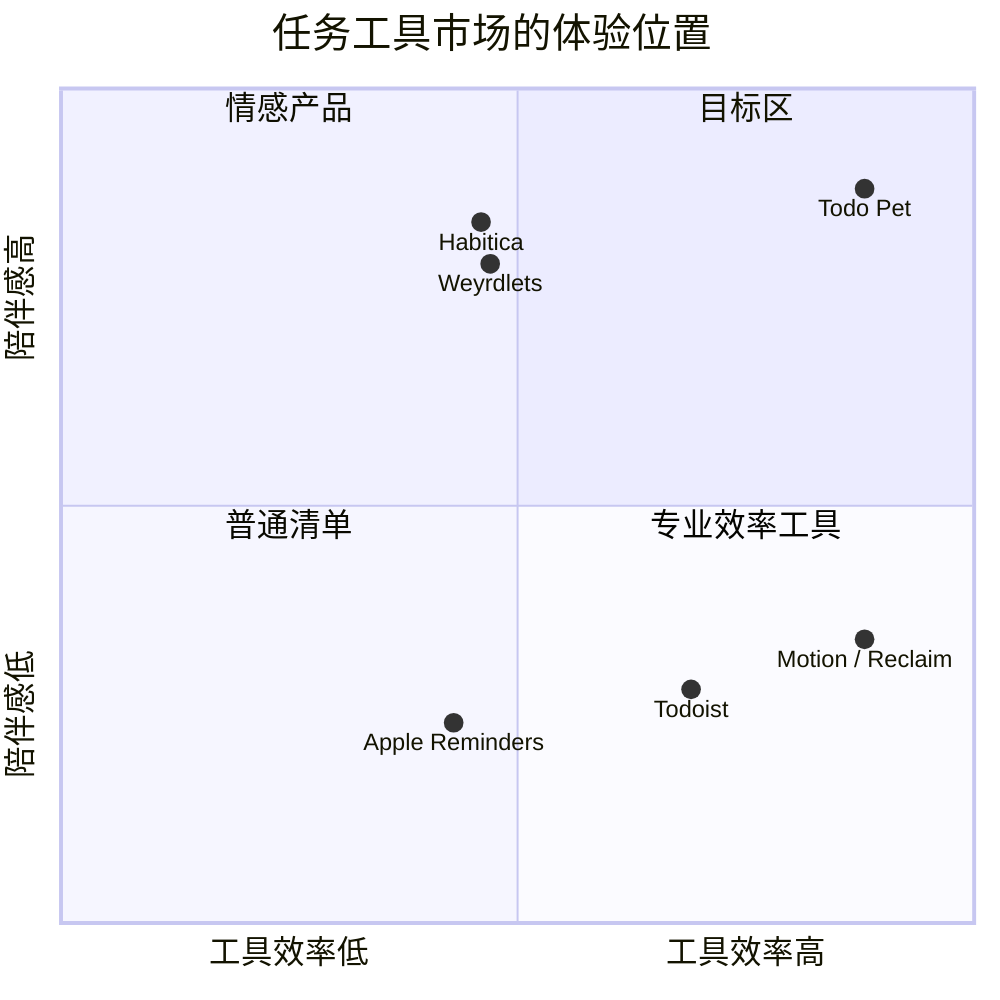

# Todo Pet 竞品研究与可借鉴设计

> 文档状态：Research v1.0 
> 更新日期：2026-08-20 
> 适用产品：Todo Agent / Todo Pet 
> 研究范围：个人任务管理、日程规划、AI 任务代理、开源本地优先、桌面宠物、专注与陪伴产品 
> 关联文档：[PRD.md](./PRD.md)、[Todo Pet 产品与体验设计](./TODO_PET_PRODUCT_DESIGN.md)、[Todo Pet 实现规范](./TODO_PET_IMPLEMENTATION_SPEC.md)

## 0. 先说结论

“市面上所有产品”无法被一次性穷尽，产品、插件和开源分支每天都在变化。本报告采用**代表性覆盖**：横跨 6 个类别、50+ 个产品，并优先使用产品官网、帮助中心、官方 App Store / Steam 页面和 GitHub README 作为证据。它不是简单的功能清单，而是回答三个问题：

1. 哪些产品在 UI、交互或功能上比当前 Todo Pet 更成熟？
2. 它们的成熟点能否直接迁移到“桌面宠物 + 任务 + Agent”的产品模型？
3. 哪些功能会增加压力、复杂度或权限风险，不应该照搬？

### 0.1 Todo Pet 应该占据的位置

Todo Pet 的差异化不是“比 Todoist 多一个可爱的皮肤”，而是把三种价值合成一个闭环：

- **真实任务执行**：本地任务、飞书任务、提醒、番茄钟和 Agent 操作都是真实状态，而不是游戏内的影子任务。
- **桌面存在感**：宠物是透明、置顶、可拖动的入口；用户不必先打开完整应用才知道下一步做什么。
- **温和陪伴**：动作、气泡、小游戏、日记和装扮增加关系感，但不使用死亡、饥饿、惩罚或连续签到制造压力。

### 0.2 对当前产品最重要的 10 个结论

| 结论 | 竞品证据 | Todo Pet 的落地判断 |
|---|---|---|
| 低摩擦捕获比复杂表单更重要 | Todoist Quick Add、Akiflow Universal Inbox、Routine Contextual Capture | 全局快捷键、宠物气泡输入、语音和剪贴板都进入同一个 Inbox；先捕获，再补字段 |
| “今天”应该是工作台，不是永久列表 | Microsoft To Do My Day、Any.do My Day、Sunsama Daily Planning | “今天”每天刷新，但未完成任务必须安全回到全部任务；宠物早报只读今日工作台 |
| 到期日和实际工作时间是两件事 | Motion 的 Do Date / Due Date、Reclaim 的自动排程 | Agent 只能提出时间块方案，默认不静默改动外部日历；用户确认后执行 |
| 时间线比纯列表更适合开始任务 | Structured、TickTick Calendar、Sunsama Timeboxing | 展开窗增加“时间线”视图；宠物气泡只显示当前块，避免桌面变成日历墙 |
| 过滤器和保存视图能处理大量任务 | Todoist Filters、OmniFocus Perspectives、Vikunja Saved Filters | “全部 / 今天 / 专注 / 聊聊 / 小窝”是一级入口；高级筛选作为可保存的视图，不污染默认界面 |
| 快捷键与菜单栏是桌面效率的骨架 | Sunsama Menu Bar、Routine Menu Bar Widget、OmniFocus Quick Entry | `⌘/Ctrl+Shift+Space` 呼出快速捕获；右键菜单只保留高频动作 |
| Agent 必须显示将做什么，而不是只显示一句“好的” | Notion Agent、Taskade Agents、Todoist Assist | 所有增删改、批量操作、网页写入和飞书同步先展示行动预览、权限、影响范围和撤销入口 |
| 宠物互动应有身体反馈和可中断状态机 | Shimeji-ee、Weyrdlets、Desktop Pets、GooseDroid | 采用“待机—被触摸—工作—专注—成功—休息”状态机；动画为状态反馈，不做无意义装饰 |
| 正向奖励有效，但负向惩罚容易反噬 | Habitica 的奖励循环、Forest 的失败代价、Finch 的温和自护 | 奖励共同经历、装扮、家园和日记；不扣资产、不生病、不死亡，支持休假和补记 |
| 本地优先和可迁移是开源产品的信任来源 | Super Productivity、Vikunja、Planify、Lunatask | 本地数据库、离线队列、可导出 JSON/Markdown；飞书和模型都是可插拔连接器 |

## 1. 研究方法与对比维度

### 1.1 研究维度

- **UI**：默认入口、信息密度、层级、视觉焦点、透明桌面形态、时间线 / 看板 / 列表组织方式。
- **交互**：捕获、拖拽、快捷键、自然语言、任务完成、延期、批量编辑、气泡 / 小窗行为、动效与打断规则。
- **功能**：任务模型、子任务、重复、提醒、日历、番茄钟、统计、习惯、奖励、AI、协作、同步、权限和离线。
- **优势**：对用户为什么有用，为什么比普通 TODO 更容易坚持。
- **迁移成本**：是否适合 Todo Pet 的个人贡献者定位、桌面常驻形态和飞书双向同步。
- **风险**：打扰、复杂度、隐私、供应商锁定、游戏化压力和 Agent 误操作。

### 1.2 产品覆盖

| 类别 | 代表产品 |
|---|---|
| 传统任务管理 | Todoist、TickTick、Things 3、OmniFocus、Microsoft To Do、Apple Reminders、Google Tasks、Any.do、Remember The Milk、Superlist |
| 日程与时间规划 | Sunsama、Akiflow、Motion、Reclaim、Routine、Morgen、Structured、Amazing Marvin、Amie、Tiimo、Sorted³、SkedPal |
| AI 工作区 / Agent | Notion AI、Taskade AI、Todoist Assist、Motion AI、Reclaim Assistant、ClickUp Brain、Asana AI、AppFlowy AI |
| 开源 / 本地优先 | Vikunja、Super Productivity、Taskwarrior、Kanboard、Planify、Lunatask、Org mode、Focalboard、AppFlowy、Anytype、Joplin |
| 宠物 / 游戏化 / 专注 | Finch、Forest、Habitica、Focus Friend、Weyrdlets、Spirit City、Study Bunny、Wokamon、Tamagotchi |
| 桌面宠物 / 开源交互 | Desktop Goose、Shimeji-ee、Desktop Pets、Deskcat、GooseDroid、PawPal、OpenDesktopPet、Cat Fidget、BongoCat |
| 项目与开发任务 | ClickUp、Asana、Trello、Linear |
| 业务连接 | Feishu / Lark Tasks、Gmail / Google Tasks、Outlook / Microsoft To Do |

## 2. 商用任务管理产品

### 2.1 Todoist：最快的自然语言捕获和可组合视图

- **UI**：左侧项目 / 标签 / 过滤器导航，主区域以清晰的列表为主；项目可以切换列表和看板，团队项目可以使用日历布局。
- **交互**：Quick Add 一行输入即可解析日期、重复、项目、标签和优先级；任务支持子任务、评论、附件、委派和历史；过滤器用查询语法或自然语言生成。
- **优势**：新任务从想到到落库的时间极短；过滤器将“所有任务”变成用户自己的工作台；优先级、截止日期、估时和提醒组成可组合的任务模型。
- **相对 Todo Pet 的领先点**：成熟的输入解析、过滤器和任务历史；跨平台任务协作也更完整。
- **Todo Pet 借鉴**：宠物气泡输入支持 `明天下午三点给小明发邮件 #工作 p1` 这类语法；对话 Agent 使用同一解析器；过滤器保存为“宠物视图”。
- **不照搬**：不要把查询语法作为默认入口，普通用户仍应看到自然语言和按钮；不要让 Agent 在解析不确定时猜日期。
- **证据**：[Todoist Pricing / Features](https://www.todoist.com/pricing/)、[Todoist Assist](https://www.todoist.com/todoist-assist)、[Todoist API Quick Add](https://developer.todoist.com/api/v1/)。

### 2.2 TickTick：任务、日历、习惯和专注的一体化

- **UI**：任务列表、日历、四象限、习惯和专注均有独立入口；桌面 / 移动组件可以直接新增任务、打开日历、矩阵、习惯或番茄钟。
- **交互**：日历支持拖动改变开始时间和时长；任务可拆分；番茄钟与任务关联；习惯有连续记录和统计；提醒、倒计时和重复任务较完整。
- **优势**：将“要做什么”和“什么时候做”放在同一产品里，适合从清单快速进入专注；组件让高频操作脱离主应用。
- **相对 Todo Pet 的领先点**：专注、习惯、统计和系统组件成熟；时间线操作的反馈更直接。
- **Todo Pet 借鉴**：宠物展开窗提供“当前任务 + 开始专注”；未来增加桌面 / 移动 Widget；时间线支持拖动，但只在详细视图中展示。
- **不照搬**：不把习惯、番茄、倒计时全部塞进宠物气泡；气泡只承载一项当前行动。
- **证据**：[TickTick Features](https://ticktick.com/features?language=en_US)、[TickTick Calendar / Matrix / Habit](https://help.ticktick.com/articles/7054286604315131904)、[TickTick Widgets](https://help.ticktick.com/articles/7055780404896202752)。

### 2.3 Things 3：渐进披露和细腻的拖拽体验

- **UI**：极简白纸式任务卡，默认只显示标题；详情、备注、标签和截止时间收在二级层级；Today、Upcoming、Anytime、Someday、Inbox、Logbook 构成稳定心智模型。
- **交互**：Areas / Projects / Headings 形成层级；拖动标题可以移动整组任务；Magic Plus 在 Today、项目、Upcoming 或 Inbox 中快速插入；拖动任务到日期可以重新安排。
- **优势**：信息密度低但组织能力强；用户可以先写，再逐步补充上下文；完成动作有明确的视觉收束。
- **相对 Todo Pet 的领先点**：默认状态非常安静，适合长期使用；层级、分组和拖放成熟。
- **Todo Pet 借鉴**：宠物小窗默认只显示任务标题和来源；详情通过气泡展开；“拖动到宠物 / Today / 专注”成为可理解的目标区域。
- **不照搬**：Things 是 Apple 生态专属，Todo Pet 需要 Windows / macOS 对等体验；不能依赖系统提醒事项作为唯一数据源。
- **证据**：[Things Features](https://culturedcode.com/things/features/)、[Today / Upcoming / Logbook](https://culturedcode.com/things/support/articles/4001304/)、[Things Discover](https://culturedcode.com/things/support/articles/1059358/)。

### 2.4 OmniFocus：复杂任务的 Perspectives、Forecast 和 Review

- **UI**：Inbox、Projects、Tags、Forecast、Flagged、Nearby、Review、Completed 等标准视图；用户可以建立自定义 Perspectives，保存筛选、排序、分组和焦点。
- **交互**：Quick Entry 快速收集；任务支持重复、等待、依赖、位置、文件和富文本；Forecast 把任务与日历结合；Review 用固定仪式清理项目。
- **优势**：面对大量复杂任务仍能保持可控；“下一步行动”和“每周回顾”将 GTD 方法固化进产品。
- **相对 Todo Pet 的领先点**：高级筛选、回顾和上下文模型更强；适合专业用户。
- **Todo Pet 借鉴**：增加“宠物回顾”流程：每周询问过期任务、阻塞任务和无主任务；允许保存“阅读 / 研究 / 飞书待同步”等视图。
- **不照搬**：不要在首屏暴露 Perspectives、上下文和所有字段；为新用户提供渐进式升级。
- **证据**：[OmniFocus Features](https://www.omnigroup.com/omnifocus/features/)、[Perspectives](https://support.omnigroup.com/documentation/omnifocus/universal/4.8.11/en/perspectives/)。

### 2.5 Microsoft To Do：My Day 和建议的低压力日规划

- **UI**：列表导航 + My Day 日工作台；My Day 每晚清空，未完成任务回到原列表并在次日进入 Suggestions。
- **交互**：用户可从任意列表把任务加入 My Day；Suggestions 提供近期、过期、今天到期和未加入计划的任务；任务支持步骤、提醒、重复和 Planned 智能列表。
- **优势**：每天提供一个干净的开始，不把过去的堆积直接铺满用户；Suggestions 让“今天做什么”有来源可追溯。
- **相对 Todo Pet 的领先点**：日计划的心理负担较低，和 Outlook 生态连接自然。
- **Todo Pet 借鉴**：宠物晨报采用“今日工作台”逻辑；未完成不丢失，宠物只推荐 3–5 个最相关任务；支持“今天先不安排”。
- **不照搬**：不自动把所有到期任务塞进今日焦点；来源、截止时间和用户主动选择要分开显示。
- **证据**：[My Day and Suggestions](https://support.microsoft.com/en-US/ToDo/my-day-and-suggestions)、[Due Dates and Reminders](https://support.microsoft.com/en-us/todo/add-due-dates-and-reminders-in-microsoft-to-do)。

### 2.6 Apple Reminders：Smart Lists、标签、章节和系统级入口

- **UI**：列表、组、章节、标签和 Smart Lists；列表可以用颜色和图标区分；购物清单可自动分类。
- **交互**：拖动任务可改变顺序或变成子任务；模板可以复制整套清单；标签跨列表聚合；Siri / Apple Intelligence 可通过统一 Reminders intents 创建和修改提醒。
- **优势**：系统级捕获、通知、语音和跨设备体验强；小功能组合成很低摩擦的日常系统。
- **相对 Todo Pet 的领先点**：操作系统整合、语音和智能列表非常成熟。
- **Todo Pet 借鉴**：为 Windows / macOS 抽象统一快捷键和语音入口；允许把气泡拖到宠物上变成子任务；模板可生成“晨间 / 周回顾 / 项目启动”流程。
- **不照搬**：不要假设用户只使用 Apple 设备；不要把系统权限当作默认授权。
- **证据**：[Apple Reminders 组织指南](https://support.apple.com/en-gb/119953)、[Reminders App Intents](https://developer.apple.com/documentation/appintents/app-schema-domain-reminders?changes=_2)。

### 2.7 Google Tasks：从上下文直接生成任务

- **UI**：在 Gmail、Calendar、Chat、Drive、Docs、Sheets、Slides 侧栏中出现；任务通常以轻量面板形式存在。
- **交互**：邮件、日历事件和文档上下文可以直接转成任务；支持详情、子任务、到期日、通知和重复。
- **优势**：用户不需要离开当前工作场景；任务天然带有来源上下文。
- **相对 Todo Pet 的领先点**：上下文捕获和 Google Workspace 入口覆盖强。
- **Todo Pet 借鉴**：宠物支持“从剪贴板 / 当前窗口标题 / 选中文本创建任务”；Agent 在创建前显示来源摘要和权限。
- **证据**：[Google Tasks Help](https://support.google.com/tasks/answer/7675772?hl=en-GB)、[Recurring Tasks](https://support.google.com/tasks/answer/12132599?co=GENIE.Platform%3DDesktop&hl=en)。

### 2.8 Any.do：日历、My Day、提醒和外部入口

- **UI**：任务 / 清单、日历、Daily Planner、Widgets、提醒在一个产品内；My Day 是每日命令中心。
- **交互**：支持一次性、重复和位置提醒；日历可连接 Google / iCloud / Outlook；邮件、WhatsApp 等外部入口可以转成任务；任务可以拆分子任务。
- **优势**：个人、家庭和轻协作场景覆盖广；My Day 将日程与任务放到同一个视图。
- **相对 Todo Pet 的领先点**：外部捕获和家庭场景更完整。
- **Todo Pet 借鉴**：扩展 Agent 的“把这封邮件 / 这段文字变成任务”能力；宠物晨报同时汇总日历和任务，但明确标识来源。
- **证据**：[Any.do 首页](https://www.any.do/)、[Personal Features](https://www.any.do/personal)、[My Day](https://support.any.do/en/articles/8609724-getting-started-with-my-day)。

### 2.9 Structured：以时间线帮助用户估算一天

- **UI**：打开即是当天的垂直时间线，任务和日历事件混排；Inbox 收集没有具体日期的任务；颜色、图标和时间段提高可读性。
- **交互**：可以把 Inbox 任务拖到时间线空档；支持拖动调整时间、重复任务、子任务、备注、番茄钟、习惯；AI 可批量编辑、重新排程和删除任务。
- **优势**：把抽象清单变成“今天从几点到几点做什么”；对 ADHD / 时间感弱的用户尤其直观。
- **相对 Todo Pet 的领先点**：时间线可视化和 Replan 逻辑非常清楚。
- **Todo Pet 借鉴**：已在主应用增加“时间线”入口：半小时日视图、拖动任务卡到空档、待安排托盘；宠物气泡继续只播报当前时间块，结束时提供“完成 / 延后 / 重新规划”。
- **证据**：[Structured Getting Started](https://help.structured.app/en/articles/380546)、[Structured App](https://structured.app/)、[Structured 4.0 AI](https://structured.app/blog/4-0)。

## 3. 日程规划与自动排程产品

### 3.1 Sunsama：有引导的每日规划仪式

- **UI**：任务和日历双栏 / 同屏；Today View、Focus Mode、Focus Bar、Breaks、Menu Bar、Weekly Objectives、Daily Highlights 构成一套日常工作流。
- **交互**：按步骤引导每日规划；从外部工具拉取任务；将任务 Timebox 到日历；支持自动排程、自动重新排程、任务 rollover、快捷键和全局新增。
- **优势**：解决“知道要做什么，但没有安排什么时候做”的问题；每日启动和收尾让任务管理形成节奏。
- **相对 Todo Pet 的领先点**：日计划仪式、时间块和每日回顾都很成熟。
- **Todo Pet 借鉴**：宠物晨间气泡分三步问“今天必须做什么 / 有多少时间 / 是否需要专注”；晚间生成温和总结；宠物动作体现规划、执行、收尾。
- **不照搬**：不要强迫用户每天完成仪式；提供跳过、简化和静默模式。
- **证据**：[Sunsama Usage Guides](https://help.sunsama.com/docs/usage-guides/)、[Sunsama](https://www.sunsama.com/)。

### 3.2 Akiflow：Universal Inbox + 键盘优先的时间块

- **UI**：统一收件箱、任务列表、日历和时间框；颜色主要用于日历上的已规划任务，列表保持克制。
- **交互**：`P` 规划任务，`=` 修改时长；拖到日历形成时间块；可把任务锁定到日历并设置可见性；支持重复任务和全局快捷键。
- **优势**：把来自邮件、聊天、项目工具的任务汇总，再用键盘高速处理。
- **相对 Todo Pet 的领先点**：跨工具收件箱和快捷键工作流强。
- **Todo Pet 借鉴**：飞书、本地、Agent 创建和剪贴板任务统一进入“待整理”；宠物右键提供最近捕获；拖到“专注”即锁定一段时间。
- **证据**：[Akiflow Task Features](https://product.akiflow.com/help/articles/0006630-task-features)。

### 3.3 Motion：AI 把“截止日期”变成“可执行时间表”

- **UI**：日历是主界面，固定事件和 AI 排程任务混在时间线上；Agenda View 按时间顺序显示当天的行动。
- **交互**：任务填写优先级、时长、开始 / 截止日期后自动排程；遇到会议或新任务会持续重排；阻塞关系、风险指标和项目阶段在日历上可见；拖动一个任务会触发整体重排。
- **优势**：用户不需要手动安排每个任务的时间；能在任务变长、会议插入或截止风险出现时及时重新规划。
- **相对 Todo Pet 的领先点**：自动排程、依赖、风险和容量管理最强。
- **Todo Pet 借鉴**：Agent 提供“建议日程”，说明依据、受影响任务和冲突；用户确认后批量写入本地和日历；宠物用“搬运任务卡”动画表现重排。
- **不照搬**：不默认自动移动飞书任务的截止日期；同步外部系统前要明确来源、目标、变更和撤销。
- **证据**：[Motion AI Task Manager](https://www.usemotion.com/features/ai-task-manager?gad=1)、[Agenda View](https://help.usemotion.com/motions-agenda-view)、[Tasks vs Events](https://www.usemotion.com/help/project-management/task/reference-tasks/the-difference-between-tasks-and-events-in-motion)。

### 3.4 Reclaim：灵活的习惯、专注时间和日历保护

- **UI**：以日历为中心；Focus Time、Habits、Tasks、Planner 和多日历同步形成“时间防御层”。
- **交互**：习惯不是死板的重复事件，会围绕日程弹性移动；Focus Time 根据每周目标保护深度工作；任务自动在截止日期前找时间；可同步 Todoist、Asana、ClickUp、Linear、Jira、Google Tasks 等。
- **优势**：对变化频繁的日程比固定重复任务更有韧性；能保护休息和个人时间。
- **相对 Todo Pet 的领先点**：习惯和专注时间的弹性排程、跨日历同步和 Agent 化趋势更成熟。
- **Todo Pet 借鉴**：把喝水、休息、回顾等生活提醒设计为“弹性习惯”；宠物在空档主动出现，而不是在固定时间强打断。
- **证据**：[Reclaim Features](https://help.reclaim.ai/en/articles/6210740-features-in-reclaim)、[Reclaim 2.0 Overview](https://help.reclaim.ai/en/articles/14846468-reclaim-ai-2-0-overview)。

### 3.5 Routine：统一捕获、菜单栏和 AI 工作流

- **UI**：Agenda、Dashboard、Planner、Universal Inbox、Menu Bar Widget；产品覆盖 macOS、Windows、Linux、Web、iOS、Android。
- **交互**：Contextual Capture、自然语言、AI Voice Commands、快捷键、时间块、计时器、重复任务、离线和 AI Agents 都从同一工作区进入。
- **优势**：桌面常驻入口与完整工作区的边界清楚；适合把零散信息先收集，再统一处理。
- **相对 Todo Pet 的领先点**：菜单栏、语音、离线和工作流自动化的组合完整。
- **Todo Pet 借鉴**：宠物是更有情感的 Menu Bar / Quick Capture；Agent 可在气泡中把语音内容转成“待确认变更”。
- **证据**：[Routine Features](https://www.routine.co/features)。

### 3.6 Amazing Marvin / Morgen：可定制方法与日历聚合

- **共同优势**：Amazing Marvin 以模块化策略、习惯和工作流适配不同人；Morgen 类产品以多个日历、任务和预约入口聚合为核心。
- **Todo Pet 借鉴**：不要只提供一种番茄钟；让用户选择“25/5、50/10、无计时专注、弹性时间块”，并允许宠物人格和提醒风格独立配置。
- **风险**：策略开关过多会造成设置迷宫；将高级方法放到“实验室”，默认只展示三种简单模式。

## 4. AI 工作区与任务代理

### 4.1 Notion AI：结构化数据上的 Agent 和权限治理

- **UI**：页面、数据库和工作区是主载体；AI 既可以在页面内对话，也可以直接编辑数据库、属性和页面。
- **交互**：AI Autofill 可生成摘要、标签和行动项；Notion Agent 能基于工作区、连接应用和网页完成多步任务；Custom Agents 支持触发器 / 定时运行；Enterprise Search 跨 Slack、Drive、GitHub 等查找信息。
- **优势**：AI 不只是聊天，而是操作用户已有的结构化数据；权限、审计、额度和连接范围被产品化。
- **相对 Todo Pet 的领先点**：多步 Agent、数据上下文、权限和治理明显更成熟。
- **Todo Pet 借鉴**：
  - 每次执行先显示“读取了什么、将修改什么、需要哪些权限”。
  - 任务批量操作以表格预览，允许逐项取消。
  - Agent 记忆分为短期会话、任务事实和用户明确保存的偏好，默认不保存敏感内容。
  - 记录工具调用、同步结果、失败原因和撤销信息。
- **证据**：[Notion AI](https://www.notion.com/product/ai)、[Notion AI Autofill](https://www.notion.com/help/autofill)。

### 4.2 Taskade：持久记忆、工具调用和多视图执行

- **UI**：同一项目可切换 List、Board、Calendar、Table、Mind Map、Gantt、Org Chart；Agent Hub 与项目并列。
- **交互**：自定义 Agent 可用项目、文档或链接作为知识；Agent 能创建任务、更新项目、搜索网页、发邮件、调用 Slack / Teams / Sheets 和自动化；可使用多 Agent 团队。
- **优势**：把 Agent 从“问答框”变成“项目操作员”；多视图让同一状态适配不同思考方式。
- **相对 Todo Pet 的领先点**：工具面和多 Agent 编排更丰富。
- **Todo Pet 借鉴**：Agent 能力分层：任务读写、飞书同步、网页研究、文件、剪贴板、系统操作；每层都可独立授权；任务视图与 Agent 结果可互相跳转。
- **不照搬**：个人 Todo Pet 不需要一开始做多 Agent 团队；先保证一个可靠的任务管家。
- **证据**：[Taskade AI Projects](https://www.taskade.com/ai/projects)、[Autonomous Agents](https://help.taskade.com/en/articles/8958458-autonomous-ai-agents)、[Taskade AI Getting Started](https://docs.taskade.com/docs/ai-powered-intelligence/ai-features/ai-agents-getting-started)。

### 4.3 Todoist Assist：把 AI 放在后台，而非抢走任务列表

- **交互优势**：Ramble 语音捕获、Filter Assist 自然语言生成过滤器等功能增强原有工作流，不要求用户进入一个全新的聊天世界。
- **Todo Pet 借鉴**：Agent 既可在“聊聊”里使用，也应作为列表中的小按钮、输入框建议和批量操作助手；宠物聊天不是唯一入口。
- **证据**：[Todoist Assist](https://www.todoist.com/todoist-assist)。

### 4.4 Motion / Reclaim Assistant：AI 的价值在“下一步”和“冲突处理”

- **共同优势**：从任务、日历、容量和截止风险计算下一步；能在变化发生后重新安排，而不只是给一段漂亮的总结。
- **Todo Pet 借鉴（v1.49 已落地）**：早报与低频主动消息会从当前任务快照确定性选出一个可执行下一步，显示标题与选择原因，并在气泡内提供“开始专注 / 查看任务”；未完成前置依赖的任务不会被推荐，隐私模式只保留泛化提醒。

## 5. 开源与本地优先产品

### 5.1 Vikunja：同一任务在列表、看板、表格、甘特之间切换

- **UI**：List、Kanban、Table、Gantt 四种视图；Dashboard 展示近期和即将到期任务；Saved Filters、项目收藏、分享和团队权限完整。
- **交互**：任务可在列表 / 看板中拖动到其他项目；支持日期、重复、提醒、标签、评论、附件、子任务和全局搜索；可导入导出。
- **优势**：开源、自托管、数据可控，同时具备现代项目管理视图。
- **相对 Todo Pet 的领先点**：视图和数据迁移更完整，适合大任务量。
- **Todo Pet 借鉴**：将“宠物视图”定义为任务查询，而非另一份任务数据；全部 / 今天 / 专注等视图共享同一任务 ID；支持 JSON / Markdown 导出。
- **证据**：[Vikunja](https://vikunja.io/)、[Vikunja Help](https://vikunja.io/help/)。

### 5.2 Super Productivity：离线、时间追踪和工程任务集成

- **UI**：项目、任务、子任务、标签、时间记录和 Focus Mode；桌面、Web、Android 共享一套本地优先模型。
- **交互**：时间块和时间追踪结合；Pomodoro、休息提醒、反拖延工具、统计和工作日志；可从 Jira、GitHub、GitLab、Gitea、OpenProject、Linear、ClickUp、Azure DevOps 导入任务。
- **优势**：隐私优先、不强制账号、离线可用、集成工程工作流，且可通过插件扩展。
- **相对 Todo Pet 的领先点**：本地优先、工作日志和工程集成成熟。
- **Todo Pet 借鉴**：本地数据库是权威副本；同步是可重试队列；Agent 不在线时任务和番茄钟照常使用；开放连接器接口。
- **不照搬**：过多统计会让宠物变成计时器仪表盘，默认只呈现对下一步有帮助的信息。
- **证据**：[Super Productivity GitHub](https://github.com/super-productivity/super-productivity)。

### 5.3 Taskwarrior：可解释的优先级和自动化钩子

- **UI / 交互**：命令行和报告为主；项目、标签、虚拟标签、依赖、等待状态和可配置 urgency 形成强大的查询模型；hooks 允许外部脚本介入生命周期。
- **优势**：优先级不是单一手工字段，而是由截止日期、阻塞关系、活动状态、项目、标签和年龄等因素计算；适合自动化和高级用户。
- **相对 Todo Pet 的领先点**：确定性、可脚本化、优先级解释清晰。
- **Todo Pet 借鉴**：宠物说“推荐先做它，因为明天截止、阻塞两个任务、预计 20 分钟”，而不是只显示一个神秘的 AI 分数；允许用户调整优先级权重。
- **证据**：[Taskwarrior Urgency](https://taskwarrior.org/docs/urgency/)、[Tags / Virtual Tags](https://taskwarrior.org/docs/tags/)、[Terminology and Hooks](https://taskwarrior.org/docs/terminology/)。

### 5.4 Kanboard：看板、子任务、自动动作和插件生态

- **UI**：Kanban 列、泳道、卡片、子任务、评论、时间追踪和项目分析；可用插件扩展。
- **交互**：拖卡改变状态；自动动作可在创建、移动、临近截止时触发；支持 Webhooks、iCalendar、Markdown 和快捷键。
- **优势**：流程可视化，自动化规则简单可解释，插件边界清晰。
- **Todo Pet 借鉴**：用“宠物动作触发器”表达任务状态变化；例如任务进入专注列时宠物戴上耳机，任务完成时把卡片搬入完成盒。
- **风险**：看板不适合所有个人任务；只在项目视图中启用，不替代全部任务列表。
- **证据**：[Kanboard Documentation](https://docs.kanboard.org/)、[Kanboard Plugins](https://kanboard.org/plugins.html)。

### 5.5 Planify：现代 GNOME UI、拖放、离线与多后端同步

- **UI**：清晰、现代、低干扰；任务按章节组织；完成进度有可视化指示；支持深色模式和系统主题。
- **交互**：拖拽任务和项目；日历、提醒、重复、搜索、标签、过滤、附件和分析；可连接 Todoist、Nextcloud、CalDAV，离线工作后再同步。
- **优势**：兼顾现代 UI 与开源可迁移性；适合作为桌面客户端参考。
- **Todo Pet 借鉴**：宠物展开小窗采用“卡片 + 段落 + 轻进度”而不是大壳套小壳；同步连接器使用相同的离线队列模式。
- **证据**：[Planify GitHub](https://github.com/alainm23/planify)、[Planify 官网](https://useplanify.com/)。

### 5.6 Lunatask：加密的一体化生活记录

- **UI / 功能**：任务、习惯、日记、生活追踪和笔记整合；强调清晰布局和私密空间。
- **优势**：端到端加密默认开启；即使云端同步，任务、笔记、习惯和日记也不以明文保存。
- **Todo Pet 借鉴**：关系记忆、宠物日记、Agent 对话记忆都必须可选、可查看、可删除；本地先加密敏感字段；不把“宠物变亲密”的数据默默上传。
- **证据**：[Lunatask](https://lunatask.app/)、[Lunatask Privacy](https://lunatask.app/docs/getting-started/privacy)。

### 5.7 Org mode / Todo.txt：文本可读性和可迁移性

- **优势**：任务用文本表达，版本控制、脚本、搜索和迁移成本低。
- **Todo Pet 借鉴**：提供 Markdown / JSON 导出和可读的任务事件日志；如果同步冲突，用户能看到原始内容并选择保留哪一份。
- **不照搬**：不要求普通用户学习特殊标记语法；自然语言解析结果必须可视化。

## 6. 宠物、游戏化与专注产品

### 6.1 Finch：温和的自我照护宠物

- **UI**：宠物房间、目标、心情记录、呼吸练习、问答、旅程和商店；宠物是主要反馈载体。
- **交互**：完成目标获得能量让宠物冒险；通过 Quests 引导用户了解功能；支持 Micropet、Goal Challenges、自我照护领域和每周里程碑；用户可以跳过不适合自己的内容。
- **优势**：把“照顾自己”包装成与宠物共同前进，不以失败惩罚为中心；功能发现和个性化循序渐进。
- **相对 Todo Pet 的领先点**：情绪、呼吸和自我照护内容更丰富，关系感更强。
- **Todo Pet 借鉴**：完成任务 / 休息 / 专注都能让宠物获得“今天的能量”；用轻量问题了解状态，但不诊断、不强迫打卡；允许隐藏任何自护模块。
- **证据**：[Finch Approach](https://help.finchcare.com/hc/en-us/articles/37935669335309-Our-Approach-to-Self-Care)、[Finch New User Guide](https://help.finchcare.com/hc/en-us/articles/42149821015693-New-User-Guide)、[Finch Google Play](https://play.google.com/store/apps/details?hl=en&id=com.finch.finch)。

### 6.2 Forest：专注的可视化结果和轻度代价

- **UI**：开始专注后种下一棵树；专注统计、森林、应用阻断、Plant Together 和真实植树形成结果反馈。
- **交互**：计时结束树长成；离开或违反深度专注会影响结果；支持群组专注、挑战和数字健康工具。
- **优势**：把不可见的时间转成持续增长的视觉成果；启动专注动作极低摩擦。
- **相对 Todo Pet 的领先点**：专注反馈简单且记忆点强，跨用户协作也成熟。
- **Todo Pet 借鉴**：每个专注块让宠物完成一件可见的小事（整理桌面、收集星光、完成一页笔记）；失败只记录“中断”，不让宠物死亡或资产消失。
- **证据**：[Forest](https://www.forestapp.cc/)。

### 6.3 Habitica：任务奖励、宠物、装备和社交任务

- **UI**：Habit、Dailies、To-Dos 三类任务；角色、装备、宠物、坐骑、任务、副本、奖励和社交空间构成 RPG 界面。
- **交互**：完成任务获得经验、金币和掉落，升级并解锁装备、宠物、技能和任务；还支持 Party、Guild、Challenges 和自定义奖励。
- **优势**：任务完成有即时游戏反馈；复杂的长期目标可以被拆成任务、日常和习惯；社区增加承诺感。
- **相对 Todo Pet 的领先点**：奖励经济和内容扩展非常丰富。
- **Todo Pet 借鉴**：用“共同收藏 / 家园 / 装扮 / 任务纪念品”承接完成反馈；可把一个大项目变成宠物的探险章节。
- **不照搬**：不采用掉血、惩罚和社会比较作为默认；个人贡献者产品不需要排行榜。
- **证据**：[Habitica Features](https://habitica.com/static/features)、[Habitica Home](https://habitica.com/static/home)。

### 6.4 Focus Friend：专注计时、应用阻断和休息

- **UI**：宠物 Bean + 计时器；Focus Shield 负责阻断分心应用；支持自定义专注时长、Pomodoro 和内置休息计时。
- **交互**：开始专注即进入专注状态；暂停、休息和完成反馈围绕宠物呈现；移动端还有系统级动态岛 / 状态追踪。
- **优势**：产品承诺非常单一清晰：让用户开始专注；宠物形象与计时器强绑定。
- **Todo Pet 借鉴**：宠物必须有清晰的“开始 / 暂停 / 继续 / 完成 / 休息”操作；专注气泡可折叠但计时状态始终可恢复。
- **证据**：[Focus Friend](https://focusfriend.me/)、[App Store](https://apps.apple.com/us/app/focus-friend-pomodoro-timer/id6775522130)。

### 6.5 Weyrdlets：桌面宠物、小游戏、物品和生产力工具

- **UI**：宠物可作为主桌面 Overlay；岛屿 / 小屋、饰品、家具、零食、玩具和贴纸组成长期收集系统。
- **交互**：桌面模式中宠物会漫游、挖掘、玩玩具、被抚摸、移动，并可参与小游戏；内置 Pomodoro 和 To-Do List。
- **优势**：把桌面常驻、休息、收集和生产力工具放在一个连续体验里；宠物不只是静态图像。
- **相对 Todo Pet 的领先点**：桌面模式、小游戏、装扮和家园内容成熟。
- **Todo Pet 借鉴**：宠物气泡是“生产力 HUD”，小窝是“关系和收藏”；小游戏（跳绳、接球、呼吸、整理）必须能在 30–90 秒内完成并有休息价值。
- **不照搬**：不要让收集和装扮遮盖任务；生产力功能仍是主路径。
- **证据**：[Weyrdlets](https://weyrdworks.com/weyrdlets)、[Desktop Mode Wiki](https://weyrdlets.wiki.gg/wiki/Desktop)。

### 6.6 Spirit City: Lofi Sessions：氛围、角色和生产力工具融合

- **UI**：可布置的舒适空间、角色、宠物 / 生物、Lofi 音乐、环境音和氛围场景；生产力工具整合在场景内。
- **交互**：To-do List、Session Timer、Habit Tracker、Journal 与环境设置共同工作；用户通过专注时长、装饰和角色状态获得持续反馈。
- **优势**：适合长时间工作，情绪氛围比“打卡”更重要；场景是可持续的陪伴容器。
- **Todo Pet 借鉴**：宠物小窝可逐步加入背景音、桌面天气、光线和季节，但第一阶段不要做复杂装饰编辑器。
- **证据**：[Spirit City: Lofi Sessions](https://store.steampowered.com/app/2113850/Spirit_City_Lofi_Sessions/)。

### 6.7 Desktop Goose：桌面存在感和可选调皮行为

- **UI / 交互**：透明、置顶、无边框桌面角色；会走动、追逐光标、拖动窗口、留下便签 / 图片或制造小混乱；通过托盘和 Boss Mode 快速隐藏。
- **优势**：角色真的“住”在桌面上，动作和突发行为带来记忆点。
- **Todo Pet 借鉴**：可加入“调皮但安全”的可选动作，例如把已完成任务盖章、把气泡拖到屏幕边缘、在休息时递水；提供会议 / 全屏 / Boss Mode，任何调皮动作默认关闭。
- **不照搬**：不修改其他窗口、不抢焦点、不偷文件、不遮挡会议和演示。
- **证据**：[Desktop Goose](https://samperson.itch.io/desktop-goose)。

### 6.8 Shimeji-ee：可配置行为、可点击热点和窗口边界

- **UI / 交互**：角色在桌面自由走动、爬窗、跌落、拖动；行为和动画通过 XML 配置；支持点击热点、长按动画、暂停动画、Boss Mode、交互窗口黑名单和跨屏幕设置。
- **优势**：将角色动作、条件、碰撞和用户交互做成可配置系统；社区可以制作角色包而不改引擎。
- **Todo Pet 借鉴**：动作包采用配置驱动；宠物身体不同区域定义可点击热点（摸头、拍肚子、递任务卡）；行为系统支持暂停、打断、优先级和恢复。
- **不照搬**：不要让宠物和其他窗口发生不可控的碰撞；提供“只在自己的透明层互动”模式。
- **证据**：[Shimeji-Desktop](https://github.com/DalekCraft2/Shimeji-Desktop)。

### 6.9 Desktop Pets / Deskcat / GooseDroid：拖动、物理和触摸反馈

- **共同交互**：左键拖动、右键菜单、托盘、睡眠 / 唤醒、投球、追逐光标、多个宠物、触摸反馈、行为树和状态需求。
- **优势**：证明宠物需要真实的物理、手势和状态变化；单纯切换几张静态图片很快会失去新鲜感。
- **Todo Pet 借鉴**：
  - 拖动必须作用于宠物本体和明确的拖动手势，不依赖隐藏的小把手。
  - 点击、长按、拖动、投掷分别映射不同动作，并有光标 / 触觉 / 音效反馈。
  - 任务卡可被宠物“搬运”到完成盒、专注区或小窝。
  - 需求只做“状态表达”（困、专注、开心），不做会衰减和惩罚用户的生存值。
- **证据**：[Desktop Pets](https://github.com/LGaben/Desktop-Pets)、[Deskcat](https://github.com/coglabss/deskcat)、[GooseDroid](https://github.com/skyvanguard/GooseDroid)。

## 7. Feishu / Lark Tasks：Todo Pet 的同步基准

飞书不是普通外部导入源，而是 Todo Pet 的重要真实数据源。设计上应参考飞书任务的任务、清单、子任务、提醒和成员关系，并明确每个任务的来源与同步状态。

### 7.1 应保留的外部任务语义

- `source`: `local` / `feishu`。
- 外部稳定 ID、所属清单、创建者、负责人、协作者、子任务和提醒。
- 完成、标题、描述、截止时间、重复规则等字段的双向映射。
- 最近一次成功同步时间、失败原因、冲突字段和重试次数。

### 7.2 UI / 交互借鉴

- 列表任务右侧显示来源徽标，不把“飞书”写进任务标题。
- 修改完成、标题、日期或清单后立即进入同步队列；小窗展示“正在同步”，完成后变成“已同步”。
- 冲突不覆盖用户数据：显示本地版、飞书版、最后更新时间和选择结果。
- Agent 执行飞书写操作前显示变更摘要；批量操作按任务逐项展示结果。

### 7.3 证据

- [飞书创建任务 API](https://open.feishu.cn/document/task-v2/task/create?lang=zh-CN)
- [Lark CLI Tasks / Agent Skills](https://github.com/larksuite/cli)

## 8. 横向模式：从竞品抽出的可复用交互

| 场景 | 最成熟的参考 | Todo Pet 推荐模式 | 验收要点 |
|---|---|---|---|
| 快速新增 | Todoist、Apple Reminders、Routine | 全局快捷键 / 宠物气泡 / 语音三入口；先写一句话，解析后可确认 | 2 秒内出现草稿；解析不确定时不静默保存错误字段 |
| 收件箱 | Akiflow、Google Tasks、Vikunja | “待整理”是捕获队列，不是长期堆积列表；宠物偶尔建议清理 | 任意来源都能进队列；不整理也不会丢失 |
| 今日工作台 | Microsoft To Do、Any.do、Sunsama | 今日可手动选择；夜间回收未完成；早报最多 3–5 项 | 完成 / 延期 / 移出今日都可一键完成 |
| 全部任务 | Todoist、OmniFocus、Vikunja | 所有未完成任务的稳定视图；支持筛选和保存视图 | 不因今日过滤而隐藏未完成任务 |
| 时间线 | Structured、TickTick、Motion | 主应用日时间线；宠物只播报当前块 | 拖动后清楚显示受影响任务和同步状态 |
| 重新规划 | Motion、Structured、Reclaim | Agent 生成方案 → 预览差异 → 用户确认 → 批量执行 | 方案有依据；可撤销；失败逐项报告 |
| 专注 | Focus Friend、Forest、TickTick、Sunsama | 宠物专注气泡独立可折叠，暂停 / 继续 / 休息不丢状态 | 计时在后台准确；全屏 / 会议可自动静默 |
| 提醒 | Microsoft To Do、Any.do、Reclaim | 重要 / 临近截止升级；普通提醒变成动作和轻气泡；连续忽略后自动降频 | 遵守免打扰；普通任务有可调整的每日预算；同步风险和审批不被预算吞掉 |
| 批量操作 | Notion、Todoist、Taskade | 选择任务 → 操作预览 → 单项结果和撤销 | 不能把模糊自然语言直接映射成危险批量删除 |
| Agent 权限 | Notion、Taskade、OpenClaw 风格 Agent | 工具、范围、读写、网络和执行分别授权 | 默认最小权限；高风险动作必须手工确认 |
| 桌面入口 | Sunsama、Routine、Shimeji、Weyrdlets | 透明宠物 + 气泡；拖动、置顶、Boss Mode、跨屏幕 | 不遮挡窗口；完全离开展开区域才收回 |
| 互动 | Shimeji、Desktop Pets、Weyrdlets | 点击热点、长按、拖动、小游戏；动作由状态机驱动 | 每个动作有明确触发、反馈和退出条件 |
| 奖励 | Finch、Forest、Habitica | 共同经历、装扮、家园、日记；允许休假 | 不死亡、不掉资产、不因中断羞辱用户 |
| 隐私 | Super Productivity、Lunatask、Vikunja | 本地数据、可导出、记忆可查看 / 删除、模型可替换 | 无模型时核心任务仍可用 |

## 9. Todo Pet 的优势、短板与取舍

### 9.1 当前可形成的优势

1. **真实任务与宠物身体绑定**：完成飞书任务时宠物可以搬运 / 盖章真实任务卡，市场上少有产品同时拥有这种“可执行的宠物化任务”。
2. **Agent 能力可直接落到任务状态**：对话、网页研究、文件和系统操作都能产生任务、更新任务或生成计划，不停留在聊天。
3. **桌面小形态 + 完整主页面**：轻量宠物承担提醒和下一步，复杂任务仍回到主页面，不强迫一个窗口承载所有信息。
4. **温和关系模型**：吸收 Finch / Forest 的陪伴和成果可视化，同时拒绝 Habitica 式惩罚和高压签到。
5. **飞书同步是核心路径**：用户可以在真实工作系统中继续使用飞书，Todo Pet 负责聚合、提醒和执行。

### 9.2 必须补齐的短板

| 短板 | 竞品参考 | 补齐方向 |
|---|---|---|
| 高速捕获还不够统一 | Todoist、Routine、Akiflow | 统一命令解析器 + 快捷键 + 语音 + 剪贴板 |
| 今日和全部任务的心智边界 | Microsoft To Do、Things | 明确“全部任务是事实，今天是计划”；保存焦点和折叠状态 |
| 时间估算和排程 | Structured、Motion、Reclaim、SkedPal | 任务时长、时间块、冲突预览、跨工作日只读候选、Agent 建议排程 |
| 大量任务的筛选 | Todoist、OmniFocus、Vikunja | 过滤器、保存视图、搜索解释、优先级原因 |
| Agent 可控性 | Notion、Taskade | 工具调用卡、权限层级、批量预览、撤销和审计 |
| 宠物动作可信度 | Shimeji、Weyrdlets、GooseDroid | 2D 骨骼 / 状态机、热点、物理拖拽、动画打断规则 |
| 专注与休息循环 | Focus Friend、Forest、Sunsama | 专注气泡、休息气泡、准确计时、免打扰策略 |
| 跨平台和离线 | Super Productivity、Planify、Vikunja | 本地数据库、同步队列、冲突解决、导出导入 |

### 9.3 不应照搬的设计

- 宠物饥饿、死亡、掉血、资产损失和强制喂养。
- 自动修改飞书或系统日历而不展示影响范围。
- 首屏同时放任务、日历、统计、家园、商店和聊天，形成“大壳套小壳”。
- 把 AI 生成的推测当成任务事实，尤其是截止日期、完成状态和天气。
- 无法关闭的随机调皮动作、抢焦点窗口、遮挡会议和全屏内容。
- 为了“养成”而要求用户每天连续签到，忽略真正的休息和生活。

## 10. Todo Pet 建议实现清单

### P0：形成可用且可信的核心闭环

1. **统一任务模型**：本地 / 飞书同一任务接口，稳定外部 ID、来源徽标、同步状态、冲突和撤销。
2. **三种快速捕获**：`⌘/Ctrl+Shift+Space`、宠物气泡输入、可选语音；自然语言解析后显示确认卡。快速捕获还支持会议跟进、研究简报和发布文章等本地流程模板，先列出步骤再一次性确认创建。
3. **双层任务入口**：全部、今天、专注、聊聊、小窝；首次默认全部，后续记忆焦点；气泡可收缩为只剩宠物。
4. **可折叠专注气泡**：开始 / 暂停 / 继续 / 结束 / 休息；计时状态后台准确，跨主窗口和宠物小窗一致。
5. **Agent 行动预览**：增删改查、批量规划、网页研究、飞书同步均显示计划、权限、影响范围和逐项结果。
6. **本地优先同步队列**：网络断开可继续操作；恢复后按任务 ID 幂等重试；失败给出可执行修复建议。
7. **可信提醒**：早报、截止升级、休息和天气分级；全屏、会议、用户静默时不打扰。
8. **宠物状态机 v1**：待机、呼吸、眨眼、被摸、拖动、工作、专注、成功、休息、同步中、同步失败；所有状态可被高优先级事件打断并恢复。

### P1：让宠物真正成为陪伴伙伴

1. 时间线 / 周视图和拖动重排（已落地桌面日时间线 v1 与周概览：半小时刻度、拖动任务卡、未安排托盘、前后日/周切换；周回顾展示完成、专注、逾期和待安排信号）。晨间规划另外提供“保守 / 平衡 / 冲刺”三种容量策略：保守保留缓冲，冲刺明确允许轻微超配，所有计划仍需预览确认；周视图新增项目健康卡，解释依赖阻塞、逾期、未排时间和容量负载，不自动改期；v1.51 增加跨未来 5 个工作日的只读顺延预览，截止日、固定块和周末规则均显式解释。
2. 保存过滤器、智能视图和优先级解释（已落地）；每周回顾已随周概览提供，并增加低压力的每周 Check-in：记录能量和工作节奏，跨周自动失效，不维护连续签到；Todo Pet 小窝增加只读“宠物回顾队列”，把逾期、依赖阻塞和待排时间任务集中分组，并可进入已有任务视图处理。
3. 弹性习惯（喝水、伸展、收尾）已落地为小窝首页的低压力本地提示；专注阶段的本地环境音（轻雨、林间、咖啡馆、白噪音）也已接入，暂停、休息和结束自动静音且默认关闭；小窝增加基于任务完成、专注分钟和待处理事实的“今日进展 / 今晚回顾”，不要求清空任务、不维护连续签到。v1.52 增加“安排明天”入口：只在还有待处理事项时出现，打开同一套规划预览并将目标切换到明天，确认前不移动任何任务；确认后只写私人 `plannedDate`，不改飞书截止时间。v1.53 吸收 Akiflow Universal Inbox、Things Inbox 和 Microsoft To Do Suggestions 的逐项整理节奏：暂存页逐项选择今天、明天、稍后、完成或打开详情，快捷键与进度只属于当前视图，写入仍走普通任务更新与同步队列。普通任务提醒增加可调整的每日预算（默认 8 次），关闭同一任务提醒两次后自动降频；晨报、同步风险和 Agent 审批走独立重要通道。v1.70 延伸 Microsoft To Do Suggestions / My Day：晨间简报从全部开放任务中找出较早日期的未完成私人 Today 计划，提供“安排今天”、查看全部和稍后再看；只做本地建议，不自动滚动计划、不写入飞书共享字段。
4. 30–90 秒互动小游戏：跳绳、接球、呼吸节奏、整理桌面、找物品；每个小游戏都关联休息或任务成果。
5. 任务主题动作包：阅读、写作、开发、调研、沟通、运动、家务；当前已按任务标题、备注和标签做本地可解释推断，宠物会选择相应姿态并在任务气泡显示主题，未匹配时保持通用动作。任务详情同时支持依赖关系编辑与防循环：可选择“先完成”的前置任务，项目健康和宠物回顾沿用同一依赖图；本地服务拒绝形成循环，但保留导入数据中暂时不可见的依赖并明确显示阻塞。
6. 宠物日记、共同经历卡、轻量装扮和小窝；允许导出和删除。任务详情现可显式把一项任务写入共同日记，保留原任务链接，不复制任务，也不把私人备注带入日记正文。
7. 语音输入、当前窗口 / 选中文本上下文捕获、快捷回答气泡；快速捕获和宠物小窗已提供显式语音入口，识别结果只进入可编辑草稿，不自动创建或发送；当前窗口应用/标题、剪贴板、外部拖入（文本/URL/文件/图片）和选中文本都已提供“读取→预览→带入”闭环。主 Agent 页面与宠物小窗均提供上下文快捷回答，主页面按当前是否有未完成任务给出“看看今天 / 排一下今天 / 找个下一步”等只读优先入口，点击后仍走原有模型、权限和审批链。快速捕获还提供内置工作流模板和本地 JSON 自定义模板，模板步骤先预览再批量创建。选中文本只在用户显式点击或用全局快捷键呼出快速捕获时读取，读取后恢复原剪贴板内容，不会后台监听。
8. 模型路由、成本上限、离线本地模型和自定义人格（模型路由与本地模型已落地；v1.79 增加主/备用模型的用户可填写输入/输出单价、本地费用累计和安全硬上限；没有可计费用量时不猜价格而停止新运行）。
9. Agent 拆分任务：吸收 Tiimo / Superlist 的“brain dump → 可执行步骤”模式，`task_split` 已支持 2–7 个步骤的结构化预览、审批、估时、优先级和本地父子任务创建；Feishu 父任务只保留原事实，不自动创建远端子任务。
10. 宠物日记回看：吸收 Lunatask / Joplin / Anytype 的“任务与日记分开建模、用关系连接”模式；`PetDiaryEntry.taskIds` 已记录当日完成任务的本地关系，日记卡可点击回到原任务，找不到的历史任务明确显示“任务已移除”，不复制正文、不进入飞书同步。
11. 手动情境：吸收 Remember The Milk 的 Smart List / 位置上下文模式；任务可标记办公室、家、出门等短情境，筛选器和保存视图可复用；默认不读取定位、不申请权限，情境只保存在本地私人字段，飞书任务也不会被写回。
12. 可执行下一步卡：吸收 Motion / Reclaim Assistant / Taskwarrior 的“下一步 + 可解释 urgency”模式；主动气泡从真实开放任务中跳过已完成、已删除和未解锁前置依赖的任务，确定性选出一项并显示原因，用户可直接开始专注或打开任务，不自动改动任务状态。
13. 暂存整理仪式：吸收 Akiflow Universal Inbox、Things Inbox 和 Microsoft To Do Suggestions 的“逐项决定、不把堆积直接铺满”模式；暂存页现在可以按一项一项的节奏选择今天、明天、稍后、完成或打开详情，快捷键和进度只属于当前视图，写入仍走普通任务更新与同步队列。
14. 宠物搬运任务卡目标区：吸收 Trello 的拖卡反馈、Focus Friend 的专注入口和宠物产品的“把东西交给它”隐喻；拖动任务卡时，宠物旁出现“专注 / 完成 / 稍后”三个明确目标区，放下后直接执行对应动作或暂存到宠物手边，不新增影子任务，也继续沿用普通权限、错误反馈和同步路径。
15. 依赖链解释卡：吸收 Asana / Linear / Taskwarrior 的阻塞链、项目健康和 urgency 可解释性；任务详情在已有依赖编辑下面展示前置、当前和后续任务，按关系深度排序，缺失或循环关系只提示不静默修复，点击节点回到原任务。
16. 专注守护：吸收 Focus Friend 的 Focus Shield 与 Forest 的专注保护思路，但采用 Todo Pet 的安全边界。设置允许用户维护最多 12 个应用名片段；专注时只读取前台应用名，匹配后由宠物温和提醒或暂停本次专注。它不读取窗口标题/内容、不关闭或阻挡其他应用、不抢焦点；气泡可折叠并可暂时忽略，会议/全屏/安静模式优先。
17. 引导式回顾：吸收 OmniFocus Review、Things Logbook 和 Microsoft To Do Suggestions 的“逐项决定”节奏。小窝的回顾队列保留为事实投影，用户主动点击后才进入临时会话；每次只展示一项，并提供完成、安排今天、专注、打开或稍后，结束后给出处理/跳过摘要，不把“未清空”变成失败。
18. 短期 Agent 会话：吸收 Taskade 的持久短期上下文与 OpenDesktopPet 的可恢复聊天气泡。Agent 页面默认只在本机保留最近 50 条非流式消息，最多保留 8 个会话，支持切换、按标题/正文搜索、重命名、置顶、删除、新建和导出 Markdown；标题与置顶只用于本机整理，不是关系记忆，也不进入飞书或宠物档案，只有用户打开“聊天历史”数据范围时才会送给模型。

### P2：扩展内容和生态

1. 声明式 JSON 动作包已支持安装、启用、更新和卸载；工作流模板已支持内置流程和安全 JSON 导入，模板只能描述任务字段和相对日期，不携带脚本、网络请求或任意文件操作。季节小事件已落地为可关闭的本地日期装饰与温和提示，只改变宠物外观和气泡，不影响任务、成长或同步；带素材的主题包和外部连接器仍列为后续扩展。
2. 多宠物协作或不同人格的 Agent，但仍由一个任务事实层管理。
3. 移动端 Widget、Live Activity、Android 悬浮层和跨设备状态。
4. 可选的共享清单、家庭任务和低压力协作。
5. 季节事件（已落地 v1.40 的轻量日期装饰）；更丰富的家园装饰和社区内容仍后续，不建立排行榜压力。

## 11. 推荐的最终 UI / 交互基线

### 11.1 紧凑宠物

- 透明无大容器，只保留宠物本体、极小状态标记和必要气泡。
- 宠物始终置顶、可拖动、可跨屏；拖动期间显示落点和吸附边缘。
- 鼠标停留默认 1 秒展开，可配置；鼠标离开宠物和完整展开区域后才收回。
- 右键菜单包含：新增任务、今日任务、开始专注、同步、聊聊、小游戏、静默、Boss Mode、设置、退出。

### 11.2 气泡与展开窗

- 任务气泡、专注气泡、Agent 气泡均可独立收起；收起后只保留宠物，不保留空壳。
- 展开窗不是主页面套在宠物旁边的大壳，而是一个轻量、无重复标题栏的任务面板。
- 顶部一级焦点：全部 / 今天 / 专注 / 聊聊 / 小窝；焦点、滚动位置和折叠状态持久化。
- 任务长列表可滚动；宠物和气泡层 `z-index` 高于任务面板，但不覆盖系统安全对话框。
- Agent Markdown 使用真实段落、列表、代码块、表格和链接渲染；流式输出期间显示正在思考 / 工具调用 / 结果阶段。

### 11.3 动作反馈

- 状态优先级：系统安全 / 用户直接操作 > 专注与任务执行 > 同步状态 > 主动交流 > 随机待机。
- 每个动作必须定义：触发、动画、可打断点、结束回到哪个状态、失败时怎么表现。
- 动作不能只改变表情：至少有位移、姿态、道具、气泡或音效中的两项；但遵守减少动态效果设置。
- 任何随机主动交流都有频率上限、免打扰窗口、全屏检测和“今天不再提醒”。

## 12. 研究后的产品原则

1. **先让用户完成下一步，再让宠物变可爱。**
2. **把复杂度放在展开层，把确定性放在任务事实层。**
3. **让 Agent 解释和预览，而不是替用户猜测和覆盖。**
4. **让宠物拥有身体反馈，但不要把用户变成宠物的饲养员。**
5. **把日历、飞书、文件和网页当作连接器，不让任何单一服务锁死产品。**
6. **每一项新功能都要能回答：它帮助用户捕获、选择、开始、坚持、完成或恢复哪一步？**

## 13. 来源索引

### 任务与规划

- [Todoist](https://www.todoist.com/pricing/)
- [Todoist Assist](https://www.todoist.com/todoist-assist)
- [TickTick](https://ticktick.com/features?language=en_US)
- [Things](https://culturedcode.com/things/features/)
- [OmniFocus](https://www.omnigroup.com/omnifocus/features/)
- [Microsoft To Do](https://support.microsoft.com/en-US/ToDo/my-day-and-suggestions)
- [Apple Reminders](https://support.apple.com/en-gb/119953)
- [Google Tasks](https://support.google.com/tasks/answer/7675772?hl=en-GB)
- [Any.do](https://www.any.do/personal)
- [Structured](https://structured.app/)
- [Sunsama](https://help.sunsama.com/docs/usage-guides/)
- [Akiflow](https://product.akiflow.com/help/articles/0006630-task-features)
- [Motion](https://www.usemotion.com/features/ai-task-manager?gad=1)
- [Reclaim](https://help.reclaim.ai/en/articles/6210740-features-in-reclaim)
- [Routine](https://www.routine.co/features)

### AI 与 Agent

- [Notion AI](https://www.notion.com/product/ai)
- [Notion AI Autofill](https://www.notion.com/help/autofill)
- [Taskade AI Projects](https://www.taskade.com/ai/projects)
- [Taskade Autonomous Agents](https://help.taskade.com/en/articles/8958458-autonomous-ai-agents)

### 开源与隐私

- [Vikunja](https://vikunja.io/)
- [Super Productivity](https://github.com/super-productivity/super-productivity)
- [Taskwarrior](https://taskwarrior.org/docs/urgency/)
- [Kanboard](https://docs.kanboard.org/)
- [Planify](https://github.com/alainm23/planify)
- [Lunatask](https://lunatask.app/docs/getting-started/privacy)

### 宠物与专注

- [Finch](https://help.finchcare.com/hc/en-us/articles/37935669335309-Our-Approach-to-Self-Care)
- [Forest](https://www.forestapp.cc/)
- [Habitica](https://habitica.com/static/features)
- [Focus Friend](https://focusfriend.me/)
- [Weyrdlets](https://weyrdworks.com/weyrdlets)
- [Spirit City](https://store.steampowered.com/app/2113850/Spirit_City_Lofi_Sessions/)
- [Desktop Goose](https://samperson.itch.io/desktop-goose)
- [Shimeji-ee](https://github.com/DalekCraft2/Shimeji-Desktop)
- [Desktop Pets](https://github.com/LGaben/Desktop-Pets)
- [Deskcat](https://github.com/coglabss/deskcat)
- [GooseDroid](https://github.com/skyvanguard/GooseDroid)

### 飞书 / Lark

- [飞书创建任务 API](https://open.feishu.cn/document/task-v2/task/create?lang=zh-CN)
- [Lark CLI](https://github.com/larksuite/cli)

### 补充代表产品

- [Superlist](https://www.superlist.com/)
- [Superlist Talk](https://help.superlist.com/en/articles/74945-talk-superlist-s-ai-voice-assistant-for-hands-free-tasks)
- [Amie Tasks](https://amie.so/documentation/features/tasks)
- [Tiimo](https://www.tiimoapp.com/)
- [Sorted³](https://www.sortedapp.com/how-it-works)
- [ClickUp](https://clickup.com/features)
- [Asana](https://asana.com/features)
- [Trello Views](https://trello.com/en/views)
- [Linear Conceptual Model](https://linear.app/docs/conceptual-model)
- [Focalboard](https://www.focalboard.com/)
- [AppFlowy](https://appflowy.com/)
- [Anytype](https://anytype.io/)
- [Joplin To-dos](https://joplinapp.org/help/apps/to-dos/)
- [Remember The Milk](https://www.rememberthemilk.com/help/guide/?hl=en-GB)
- [Amazing Marvin](https://amazingmarvin.com/product/)
- [SkedPal](https://www.skedpal.com/how-it-works)
- [Study Bunny](https://superbyte.site/tutorial)
- [Wokamon](https://wokamon.com/)
- [Tamagotchi Paradise](https://tamagotchi-official.com/us/series/paradise/howto/)
- [Desktop Pet](https://github.com/duzexu/desktop-pet)
- [PawPal](https://github.com/zebangeth/PawPal)
- [OpenDesktopPet](https://github.com/HanLoney/OpenDesktop-Pet)
- [Cat Fidget](https://www.highroadsoftware.com/apps/catfidget/)
- [BongoCat](https://bongocat.gjxx.dev/)

## 附录 A. 补充代表产品

前文已经展开了最接近 Todo Pet 核心闭环的产品。本附录补齐四类容易被忽略、但对后续设计很有价值的产品：把任务和笔记合并的产品、面向团队的项目系统、开源本地优先工作区，以及更接近“真实宠物”的桌面陪伴。

### A.1 Superlist：任务、笔记、会议和语音捕获的轻量融合

- **UI**：以列表和 section 组织工作 / 生活 / 兴趣项目，任务详情中可以保留长文本、附件和会议内容，整体比传统项目管理工具更像一张可持续编辑的清单。
- **交互**：Enter 快速新增；Talk 用语音创建任务、完整列表或笔记，并把口述内容转成标题、截止日期、子任务和描述；会议可以自动提取摘要、行动项和日期。
- **优势**：把“想法、笔记、任务”放在同一个上下文里，减少会议后手工复制任务；共享列表支持文字和语音讨论。
- **Todo Pet 借鉴**：宠物气泡支持“说一段话 → 预览任务和备注 → 选择保存到任务 / 日记 / Inbox”；同一条 Agent 对话可以引用任务上下文，但不自动把所有聊天写进长期记忆。
- **不照搬**：语音转写和任务创建必须有可编辑预览，不能让听错的日期直接进入飞书。
- **证据**：[Superlist Basics](https://help.superlist.com/en/articles/10050-superlist-basics-lists-tasks-sections-meetings-explained)、[Talk 语音助手](https://help.superlist.com/en/articles/74945-talk-superlist-s-ai-voice-assistant-for-hands-free-tasks)、[Superlist](https://www.superlist.com/)。

### A.2 Amie：日历、任务和 AI 找时间的同屏工作台

- **UI**：日历和 Todo panel 同屏，任务能以时间块出现在日历中；快速菜单和命令面板减少页面跳转。
- **交互**：Enter 新建，`⌘/Ctrl+K` 呼出命令菜单；自然语言解析日期、时长、重复和优先级；AI 为任务寻找可用时间；可连接 Linear、Notion、Todoist。
- **优势**：将“任务是什么、何时做、要花多久”放在一次输入中解决；任务和事件的视觉关系直观。
- **Todo Pet 借鉴（v1.50 已落地）**：宠物在用户说“下午处理 30 分钟”时，把任务、时长和建议时间块一起展示；Today 规划面板会以只读时间线预览已有时间块、可用时段、任务时长和过渡缓冲，确认仍只写 Today 私人计划，Agent 不静默改日历或飞书时间块。
- **证据**：[Amie Tasks & Todos](https://amie.so/documentation/features/tasks)、[Amie Calendar](https://amieapp.com/Calendar)。

### A.3 Tiimo：针对执行功能差异的视觉时间和 AI 拆解

- **UI**：彩色时间线、图标、视觉倒计时、任务 checklist、Widget 和周 / 月视图；强调“下一步”和剩余时间，而不是密集字段。
- **交互**：用户可以输入或说出一段 brain dump，AI 将其拆成步骤、估算时长、排序并放入计划；计划变化后可让 AI 重新安排；焦点计时器绑定具体任务。
- **优势**：把过大的任务变成可开始的步骤，并用时间估算避免过度规划；对需要视觉锚点的用户更友好。
- **Todo Pet 借鉴**：Agent 的“拆分任务”结果先显示 3–7 个可执行步骤；宠物气泡每次只提示当前步骤，并显示剩余时间，不把整个项目一次性吐出来。
- **证据**：[Tiimo](https://www.tiimoapp.com/)。

### A.4 Sorted³：自动排程、时间尺和重排手势

- **UI**：日程时间线把事件、任务和笔记混排；Calendar Drawer、Time Ruler 和 Widgets 让用户在不离开当天视图的情况下调整计划。
- **交互**：Auto Schedule 根据优先级、时长和可用时间生成可行日程；Magic Select、Reorganize、Merge 和拖动时间尺用于快速重排。
- **优势**：自动排程和手动微调的边界很清楚；用户能看到“我今天实际装得下多少任务”。
- **Todo Pet 借鉴（v1.50 已落地）**：宠物可以把用户的“今天太满了”转成两套方案：保守计划和冲刺计划，显示每套会移动哪些任务；规划面板先用可用时间窗、已有固定块和缓冲生成可解释的只读预览，放不下的任务明确标记，不悄悄丢弃。
- **证据**：[Sorted³ How It Works](https://www.sortedapp.com/how-it-works)、[Sorted³](https://ss3.staysorted.com/)。

### A.5 ClickUp：层级、自动化和上下文型 Agent

- **UI**：Workspace → Space → Folder → List → Task 的层级，提供 List、Board、Calendar、Gantt、Dashboard、Docs、Whiteboard 等多视图；功能密度很高。
- **交互**：自定义字段、状态、关系、自动化、AI Cards、AI Notetaker、Talk to Text 和 Super Agents；任务、文档、聊天、历史可以被统一搜索。
- **优势**：能把复杂组织流程映射为结构化状态；Agent 有真实的任务、文档、人员和历史上下文。
- **Todo Pet 借鉴**：为 Agent 建立“工具注册表 + 数据范围 + 操作预览”；把复杂字段收进展开详情，宠物只暴露最重要的状态。
- **不照搬**：个人产品不能复制 ClickUp 的全量导航和字段墙；采用按需启用能力的策略。
- **证据**：[ClickUp Features](https://clickup.com/features)。

### A.6 Asana：依赖、规则、多视图和人机协作

- **UI**：项目可切换 List、Calendar、Timeline、Gantt、Kanban；My Tasks 汇总个人负责项，Inbox 只保留相关更新。
- **交互**：任务有 owner、起止日期、依赖、审批、评论、附件、自定义字段；Rules 自动分配、分类和更新；AI Teammates / AI Studio 参与工作流。
- **优势**：任务依赖和项目健康状态清晰；同一个任务可以跨项目显示（multi-home），避免复制任务。
- **Todo Pet 借鉴**：任务模型支持阻塞 / 阻塞者和多视图引用；Agent 重新规划时先显示依赖链；一份本地任务不能因进入多个宠物视图而复制。
- **证据**：[Asana Features](https://asana.com/features)、[Asana Feature Guide](https://help.asana.com/s/article/all-asana-features?language=en_US)。

### A.7 Trello：卡片、拖放和可理解的自动化

- **UI**：Board 是最核心入口，卡片在列表之间移动；Timeline、Table、Calendar、Dashboard 和 Map 作为视角扩展。
- **交互**：拖卡改变状态；Inbox 从邮件 / Slack 捕获；Butler 自动化使用按钮、规则和命令；模板和 Power-Ups 让团队以熟悉的卡片语法扩展。
- **优势**：状态变更的空间隐喻非常容易理解；自动化直接贴近卡片和列表，不需要编写脚本。
- **Todo Pet 借鉴**：把“任务卡搬运”做成宠物的身体动作；小游戏和气泡可以让用户把卡拖入“专注 / 完成 / 稍后”三个目标区。
- **证据**：[Trello Views](https://trello.com/en/views)、[Trello Automation](https://trello.com/power-ups/5935cab6b26816f9d49fd814/butler)。

### A.8 Linear：开发者任务的状态、Cycle 和容量信号

- **UI**：Issue 列表 / Board，Project 和 Initiative 形成层级；Cycle 以时间盒组织工作；状态列和快捷键偏向键盘用户。
- **交互**：Issue 可以被分配、标记、加入项目 / Cycle、讨论、关联依赖；Cycle 显示 capacity dial 预测当前周期能否完成。
- **优势**：状态、估算、周期和项目之间非常紧凑；适合工程任务的高频键盘和批量操作。
- **Todo Pet 借鉴**：为开发 / 写作等长任务加入“工作周期”和剩余容量，不要求所有个人任务都走复杂项目流程。
- **证据**：[Linear Conceptual Model](https://linear.app/docs/conceptual-model)、[Linear Cycles](https://linear.app/docs/use-cycles)。

### A.9 Focalboard：保存视图和开放字段的开源看板

- **UI**：Board、Table、Calendar、Gallery、List；筛选、分组、排序和保存视图是主操作；卡片内容支持 Markdown 和图片。
- **交互**：拖卡改变分组属性；自定义字段、模板、评论、权限和备份快照；个人桌面版支持 macOS、Windows、Linux。
- **优势**：看板的直观性和数据库字段的灵活性兼得；保存视图可以把同一批任务变成不同工作台。
- **Todo Pet 借鉴**：把“全部 / 今天 / 专注 / 来源”做成查询视图，宠物只绑定当前视图，不复制任务数据。
- **证据**：[Focalboard](https://www.focalboard.com/)、[Focalboard User Guide](https://www.focalboard.com/guide/user/)。

### A.10 AppFlowy：本地 AI、数据库和可自托管工作区

- **UI**：页面、数据库、属性、卡片视图和自定义主题；可以在同一工作区处理文档、项目和任务。
- **交互**：AI 负责问答、写作、表格 Autofill 和行动项提取；支持本地模型（如 Mistral / Llama）和离线模式；可自托管并同步到移动端。
- **优势**：模型可替换、数据可本地化；结构化数据库比纯聊天更容易追踪 AI 结果。
- **Todo Pet 借鉴**：允许接入 DeepSeek、OpenAI-compatible、本地 Ollama 等模型；Agent 的计划和结果都写回结构化任务记录，不只留在聊天历史。
- **证据**：[AppFlowy](https://appflowy.com/)。

### A.11 Anytype：对象、关系和端到端加密

- **UI**：对象、集合、数据库、图谱、模板和块编辑器；任务、项目、笔记、资源可以是相互关联的对象。
- **交互**：离线创建和本地 / 局域网同步；对象可通过关系和视图重新组合；本地加密、用户持有密钥。
- **优势**：不把任务限制在单一列表里；隐私模型和数据所有权清晰。
- **Todo Pet 借鉴**：任务、日记、宠物事件和 Agent 记忆分开建模，使用关系连接；支持离线工作和用户可读的导出。
- **不照搬**：图谱不是默认工作台，普通用户先看到“下一步”；关系视图作为高级入口。
- **证据**：[Anytype](https://anytype.io/)、[Anytype FAQ](https://anytype.io/faq/)。

### A.12 Joplin：任务和笔记可以互相转换

- **UI**：笔记本 / 标签 / Markdown 编辑器；To-do 笔记和普通笔记在同一列表中，完成项可置顶或隐藏。
- **交互**：右键或操作菜单切换 note / todo；待办可设闹钟；插件可提供日历面板、重复任务和逾期聚合。
- **优势**：任务不脱离上下文，适合“研究笔记里长出行动项”；Markdown 和同步格式可迁移。
- **Todo Pet 借鉴**：Agent 研究网页后可把来源、摘要和行动项作为同一任务的可折叠上下文；允许把任务转换为宠物日记或研究卡。
- **证据**：[Joplin To-dos](https://joplinapp.org/help/apps/to-dos/)、[Calendar Notes Plugin](https://joplinapp.org/plugins/plugin/com.github.eugenelesnov.CalendarNotes/)。

### A.13 Remember The Milk：Smart List 和位置上下文

- **UI**：列表、标签、联系人、地点和 Smart List；界面轻量，强调快速排序和搜索。
- **交互**：Smart Add 一行输入多个字段；搜索可保存为 Smart List；任务和子任务可以按地点、标签、联系人和提醒筛选。
- **优势**：位置和上下文过滤很早就被产品化；适合“我在某个地方能做什么”的场景。
- **Todo Pet 借鉴**：位置提醒默认关闭、需要用户授权；可将“办公室 / 家 / 出门”作为用户手动定义的上下文，不申请精确定位。
- **证据**：[Remember The Milk Getting Started](https://www.rememberthemilk.com/help/guide/?hl=en-GB)、[Smart Add](https://blog.rememberthemilk.com/introducing-smart-add-a-smarter-way-to-add-your-tasks/)。

### A.14 Amazing Marvin：可配置策略和个性化工作流

- **UI**：Day Planner、任务列表、目标、习惯和策略模块；用户可开关、排序和配置功能；右键菜单和悬停按钮也可自定义。
- **交互**：策略可以逐项启用；快捷键创建任务；目标可把长期目的与项目 / 习惯关联；Check-ins 提供定期反思。
- **优势**：不假设所有人使用同一种生产力方法；功能模块化，适合 ADHD / 高度个性化用户。
- **Todo Pet 借鉴**：把宠物主动性、提醒严格度、番茄方式、奖励风格做成可组合策略；设置页面提供推荐模板，而不是一开始展示几十个开关。
- **证据**：[Amazing Marvin Product](https://amazingmarvin.com/product/)、[Strategies](https://help.amazingmarvin.com/en/collections/1139197-strategies)。

### A.15 SkedPal：基于约束的 AI 自动排程

- **UI**：任务、时间预算、日历和计划视图；用户设置目标、偏好和时间约束后由 Auto-Scheduler 生成计划。
- **交互**：用户像对助理一样说“在 5 月 10 日前完成这个项目”，系统根据可用时间、优先级和约束排程；计划变化后可重排。
- **优势**：比固定提醒更贴近“我希望什么时候完成”；适合任务很多且时间受限的人。
- **Todo Pet 借鉴**：Agent 的重排输入同时支持截止日、可用时段、最小连续时长、缓冲和“不安排在晚上”等约束；结果必须可解释。
- **证据**：[SkedPal How It Works](https://www.skedpal.com/how-it-works)。

### A.16 Study Bunny：专注时间驱动宠物互动

- **UI**：兔子、计时器、待办、学习统计、商店和房间；学习时间可以兑换胡萝卜、物品和装扮。
- **交互**：倒计时 / 正计时 / 休息；暂停用于重新找回注意力；Study Tracker、Flashcards 和 Honesty Mode 提供不同学习强度。
- **优势**：专注时长转化为宠物成长和房间内容，反馈清晰且有情绪记忆。
- **Todo Pet 借鉴**：将专注成果转成宠物动作、收藏和小窝装饰；暂停不是失败，而是宠物陪用户重新进入节奏。
- **证据**：[Study Bunny Tutorial](https://superbyte.site/tutorial)。

### A.17 Wokamon：现实活动直接喂养成长

- **UI**：步数、能量、宠物收集和活动统计；成长曲线把现实运动转成角色变化。
- **交互**：每一步都会转化为宠物能量；连接 Fitbit 等设备；完成活动可以解锁新角色并与朋友互动。
- **优势**：现实行为和宠物成长之间的映射非常直接，用户不用额外维护一套游戏任务。
- **Todo Pet 借鉴**：把完成任务、专注时长、主动休息和户外活动映射为“共同旅程”；不要把数值做成必须照顾的生命条。
- **证据**：[Wokamon](https://wokamon.com/)。

### A.18 Tamagotchi：养成分支、小游戏和可见关系

- **UI**：宠物、环境 / 房间、食物、健康、小游戏、商店和图鉴；成长阶段和外观变化是主线。
- **交互**：照顾、玩游戏、清理、治疗和喂食会影响成长分支；新版本加入连接、合作 / 竞技小游戏、礼物和繁殖。
- **优势**：用户行为会形成独特的宠物结果；小游戏、收藏和外观为长期关系提供内容。
- **Todo Pet 借鉴**：用户完成的任务类型、专注节奏和互动偏好可以解锁不同动作包 / 装扮路线；只做正向分支，不因缺席让宠物生病。
- **证据**：[Tamagotchi Paradise How-to](https://tamagotchi-official.com/us/series/paradise/howto/)、[Tamagotchi Connection](https://www.bandai.com/tamagotchi-connection-citrus)。

### A.19 Desktop Pet / PawPal / OpenDesktopPet：开源桌宠的工程基线

- **UI**：透明无边框、始终置顶、托盘和独立控制面板；支持缩放、透明度、位置锁定、鼠标穿透和导入素材包。
- **交互**：Desktop Pet 以点击、拖拽、悬停、定时和番茄钟组成自定义规则；PawPal 加入休息、喝水、专注和当前应用提醒；OpenDesktopPet 加入 Live2D、语音、截图视觉、长期记忆和流式气泡。
- **优势**：证明“桌面存在感”需要窗口层、输入穿透、动画素材和配置系统共同配合；开源项目对拖动、位置记忆和 Boss Mode 的处理很具体。
- **Todo Pet 借鉴**：
  - 将动作和交互规则配置化，支持冷却时间和优先级。
  - 宠物和气泡使用独立层，但拥有统一的 hit-test 和拖动状态。
  - 全屏、演示、会议和 Boss Mode 是系统能力，而不是临时 CSS。
  - 素材包必须带许可证、尺寸、锚点和减少动态效果版本。
- **证据**：[Desktop Pet](https://github.com/duzexu/desktop-pet)、[PawPal](https://github.com/zebangeth/PawPal)、[OpenDesktopPet](https://github.com/HanLoney/OpenDesktop-Pet)。

### A.20 Cat Fidget / BongoCat：轻量互动和输入映射

- **UI**：小型透明宠物窗口，不占 Dock / 任务栏；角色可由照片抠图、像素素材或 Live2D 模型构成。
- **交互**：点击、抚摸、拖拽、甩动；BongoCat 还将键盘和鼠标输入映射到角色动作，并支持多平台、离线和自定义模型。
- **优势**：轻量、低承诺、立即可玩；角色对用户输入有连续反应，不依赖复杂养成。
- **Todo Pet 借鉴**：在用户工作时用低频输入节奏触发敲键盘 / 阅读动作，但不记录具体内容；所有输入感知默认关闭且不上传。
- **证据**：[Cat Fidget](https://www.highroadsoftware.com/apps/catfidget/)、[BongoCat](https://bongocat.gjxx.dev/)。

## 附录 B. 逐产品横向矩阵

以下矩阵用统一维度压缩 50+ 个产品的优势，便于后续实现时快速定位参考对象。评级是“该产品在此维度的突出程度”，不是产品优劣总分。

### B.1 任务 / 规划 / Agent

| 产品 | UI 形态 | 关键交互 | 相比 Todo Pet 的突出优势 | Todo Pet 具体吸收 |
|---|---|---|---|---|
| Todoist | 列表 + 项目 / 看板 | Quick Add、自然语言、Filter Assist | 捕获和过滤器成熟 | 统一解析器、保存视图 |
| TickTick | 列表 + 日历 + 矩阵 | 拖动时间、番茄、习惯 | 任务 / 专注 / 习惯一体化 | 时间线与 Widget |
| Things 3 | 极简列表 | Magic Plus、拖动分组 | 渐进披露、低噪声 | 气泡只显示下一步 |
| OmniFocus | Perspectives / Forecast | Quick Entry、Review、上下文 | 复杂任务可控 | 宠物周回顾与解释筛选 |
| Microsoft To Do | My Day 工作台 | Suggestions、夜间回收 | 日计划心理负担低 | 今日不是事实库 |
| Apple Reminders | 列表 + Smart Lists | 标签、章节、模板、Siri | 系统级入口 | 快捷键、语音、模板 |
| Google Tasks | Workspace 侧栏 | 从邮件 / 日历 / 文档创建 | 上下文捕获无跳转 | 剪贴板 / 当前窗口捕获 |
| Any.do | 日历 + Daily Planner | My Day、位置 / 重复提醒 | 个人和家庭入口广 | 来源聚合与提醒策略 |
| Structured | 垂直日线 | 拖 Inbox 到时间线、Replan | 视觉时间计划 | 展开窗时间线 |
| Sunsama | 日计划 + 时间块 | Guided Planning、Rollover、Weekly Objectives | 日常仪式与方向感成熟 | 早报 / 晚报流程，以及可选的本周同行目标 |
| Akiflow | Universal Inbox + 日历 | 快捷键、P 规划、锁定时间 | 跨工具捕获高效 | 飞书 / 本地统一待整理 |
| Motion | AI 日历 | 自动排程、依赖、风险 | 处理变化和容量 | Agent 建议日程 |
| Reclaim | 日历防御层 | 弹性习惯、Focus Time | 习惯能围绕日程移动 | 弹性休息与生活提醒 |
| Routine | 工作区 + 菜单栏 | 语音、Context Capture、离线 | 桌面入口完整 | 宠物 Quick Capture |
| Amie | 日历与 Todo 同屏 | `⌘/Ctrl+K`、自然语言、AI 找时间 | 任务时长和时间块同录入 | 语音 + 时长预览 |
| Tiimo | 视觉时间线 | Brain dump → 步骤 / 时长 / 计划 | 适合执行功能困难用户 | 每次只提示下一步 |
| Sorted³ | 日线 + Calendar Drawer | Auto Schedule、Magic Select | 自动和手动重排结合 | 两套可解释计划 |
| Amazing Marvin | 可配置 Day Planner | 策略开关、Check-in、Goals | 个性化工作流与长期方向极强 | 主动性策略模板与不施压的目标卡 |
| SkedPal | 约束式日程 | 截止日 + 约束 → 自动排程 | 以“完成目标”而非提醒为中心 | 约束模型和预览 |
| Remember The Milk | 列表 + Smart List | Smart Add、地点 / 标签 | 上下文过滤简单直接 | 手动上下文，不默认定位 |
| Superlist | 列表 + section + 笔记 | Talk 语音、会议行动项 | 任务和笔记同上下文 | 语音预览、日记联动 |

### B.2 项目 / 开源 / 本地优先

| 产品 | UI 形态 | 关键交互 | 相比 Todo Pet 的突出优势 | Todo Pet 具体吸收 |
|---|---|---|---|---|
| ClickUp | 全量工作区、多视图 | 字段、自动化、Super Agents | 结构化工作上下文最全 | 工具注册表与分层能力 |
| Asana | 项目多视图 | 依赖、Rules、Multi-home | 项目关系和健康状态 | 阻塞链与跨视图引用 |
| Trello | Board / Card | 拖卡、Butler、模板 | 状态变化最直观 | 宠物搬运任务卡 |
| Linear | Issue / Cycle | 快捷键、周期、capacity | 开发任务状态紧凑 | 周期和容量信号 |
| Vikunja | List / Kanban / Table / Gantt | Saved Filters、拖动、导入导出 | 开源项目视图完整 | 任务查询视图与迁移 |
| Super Productivity | 项目 + Focus Mode | 时间追踪、插件、离线 | 隐私和工程集成强 | 本地优先、连接器 |
| Taskwarrior | CLI / 报告 | urgency、虚拟标签、hooks | 优先级可解释和可脚本 | 推荐原因与规则 |
| Kanboard | Kanban / Swimlane | 子任务、自动动作、插件 | 轻量自动化边界清晰 | 动作触发器 |
| Planify | GNOME 列表 / 日历 | 拖放、离线、Todoist / CalDAV | 桌面 UI 清晰 | 卡片和同步队列 |
| Lunatask | 任务 + 日记 + 习惯 | 默认加密、云同步 | 隐私关系模型成熟 | 记忆可查看 / 删除 |
| Focalboard | Board / Table / Calendar / Gallery | 自定义字段、保存视图 | 开源看板和数据库平衡 | 保存宠物视图 |
| AppFlowy | 页面 + 数据库 | 本地 AI、离线、自托管 | 模型与数据可控 | 本地模型路由 |
| Anytype | 对象 + 关系 + 图谱 | 离线创建、P2P、本地加密 | 所有权和关系模型强 | 任务 / 日记 / 记忆分层 |
| Joplin | 笔记本 + Markdown | note / todo 转换、闹钟 | 行动项保留原始上下文 | 研究卡和任务联动 |
| Org mode / Todo.txt | 纯文本 | 版本控制、脚本、查询 | 可迁移、可审计 | JSON / Markdown 导出 |

### B.3 宠物 / 游戏化 / 桌面陪伴

| 产品 | UI 形态 | 关键交互 | 相比 Todo Pet 的突出优势 | Todo Pet 具体吸收 |
|---|---|---|---|---|
| Finch | 宠物房间 + 目标 | 目标、Goal Challenges、呼吸、Quests、Micropet | 温和自护和功能引导 | 低压力问候、可选模块与基于事实的目标进度 |
| Forest | 种树专注 | 计时、阻断、群组、森林 | 专注成果视觉化强 | 任务成果变收藏 |
| Habitica | RPG 任务 | 经验、金币、装备、宠物、任务 | 奖励经济和长期目标 | 装扮 / 家园 / 章节 |
| Focus Friend | 宠物 + 计时器 | Focus Shield、暂停、休息 | 专注主线极清楚 | 专注气泡状态机 |
| Weyrdlets | 桌面 Overlay + 小岛 | 抚摸、玩具、小游戏、收集 | 桌面宠物内容最完整 | 30–90 秒小游戏 |
| Spirit City | 氛围房间 + 工具 | Lofi、习惯、日记、计时 | 情绪氛围适合长时陪伴 | 小窝和环境层 |
| Study Bunny | 兔子 + 学习计时 | 专注、商店、Tracker、Flashcards | 学习反馈循环具体 | 专注成果和动作 |
| Wokamon | 活动统计 + 宠物 | 步数喂养、收集、社交 | 现实行为到成长映射直接 | 任务 / 休息 / 活动成长 |
| Tamagotchi | 宠物 + 环境 + 图鉴 | 照顾、小游戏、成长分支 | 关系和演化内容深 | 正向动作 / 装扮分支 |
| Desktop Goose | 透明桌面角色 | 漫游、追逐、调皮、Boss Mode | 桌面存在感强 | 可选安全调皮动作 |
| Shimeji-ee | 行为脚本 + 角色 | 热点、拖拽、窗口、暂停 | 动作系统可配置 | 动作包与状态机 |
| Desktop Pet | 透明桌宠 + 控制面板 | Petpack、规则、缩放、穿透 | 素材与交互工程化 | 资源包协议 |
| PawPal | 宠物 + 健康提醒 | 休息、喝水、专注、应用感知 | 低打扰桌面提醒 | 温和生活提醒 |
| OpenDesktopPet | Live2D + AI 气泡 | 语音、截图、记忆、流式对话 | AI 桌宠能力完整 | 模型 / 工具 / 记忆边界 |
| Cat Fidget | 小型透明窗口 | 抚摸、拖动、甩动、照片抠图 | 极低承诺、马上有反馈 | 轻互动模式 |
| BongoCat | 输入映射宠物 | 键鼠驱动、模型导入、离线 | 输入反馈连续可见 | 默认不记录内容的输入感知 |

## 附录 C. 研究结论的实现优先级

把竞品优势真正转化为 Todo Pet 设计时，优先级应遵循以下顺序：

1. **可信任务事实**：完成、同步、截止时间、来源和冲突必须先正确；这是飞书、Todoist、Vikunja 等产品共同的底座。
2. **低摩擦开始**：快捷键、气泡、语音、上下文捕获和“一键开始专注”；这是 Todoist、Akiflow、Routine、Superlist、Apple Reminders 的共同优势。
3. **可行的今天**：时间线、时长、弹性重排、冲突预览；这是 Structured、Motion、Reclaim、Tiimo、Sorted³、SkedPal 的共同优势。
4. **Agent 可控执行**：使用 Notion、Taskade、ClickUp、Asana 的行动预览、工具边界和审计思路。
5. **真实陪伴反馈**：使用 Finch、Forest、Weyrdlets、Shimeji、Desktop Pet 的动作、成果和互动，但删除惩罚性养成。
6. **长期关系内容**：最后再做装扮、家园、季节、图鉴和社交；Tamagotchi、Habitica、Spirit City 的内容值得借鉴，但不能阻塞任务主线。

## 14. 变更记录

| 日期 | 版本 | 变更 |
|---|---|---|
| 2026-08-19 | v1.0 | 建立代表性竞品研究、横向模式、Todo Pet 差异化结论和实现清单 |
| 2026-08-19 | v1.1 | 将 Structured / Motion / Sunsama 的时间块模式转化为 Todo Agent 桌面日时间线：半小时刻度、拖动重排、未安排任务托盘和本地计划边界 |
| 2026-08-19 | v1.2 | 补齐周概览与每周回顾（完成、专注、逾期、待安排、下周候选），并将剪贴板上下文做成快速捕获中的安全预览入口 |
| 2026-08-19 | v1.3 | 增加当前窗口应用/标题的显式上下文读取：macOS 前台应用查询、Windows 前台窗口 API、超时与权限失败降级，并与剪贴板预览共享二次带入流程 |
| 2026-08-19 | v1.4 | 将 PET-24 外部拖放闭环落地：文本/URL/文件/图片拖入宠物或快速捕获时只展示预览，文本与链接可手动带入，不读取文件内容、不自动上传或执行 |
| 2026-08-19 | v1.5 | 将 Spirit City / Focus Friend 的氛围层收敛为本地生成环境音：专注阶段可选轻雨、林间、咖啡馆或白噪音，暂停/休息/结束自动停止，默认关闭且设备不可用时静默降级 |
| 2026-08-19 | v1.6 | 将 Superlist / Apple Reminders 的低摩擦语音捕获落地到快速窗和宠物小窗：只在用户点击后识别，实时显示中间结果，最终文本回到可编辑输入，不自动创建或发送 |
| 2026-08-19 | v1.7 | 将阅读、写作、开发、调研、沟通、运动和家务主题动作包做成本地可解释推断：只改变宠物姿态和轻量标签，不修改任务字段、优先级或同步载荷 |
| 2026-08-19 | v1.8 | 将 Finch / Sunsama 的低压力回顾做成小窝“今日进展 / 今晚回顾”卡：只汇总完成任务、专注分钟和待处理事实，不自动改期、不惩罚未完成 |
| 2026-08-19 | v1.9 | 将 AppFlowy / Super Productivity 的可替换模型思路落地为主模型、本地备用模型和 local-only 路由；只在网络/5xx 等可重试失败且尚未产生流式内容时切换，避免重复工具执行 |
| 2026-08-19 | v1.10 | 将竞品的可扩展动作包与上下文捕获模式落地：支持安全的声明式 JSON 动作包安装/启用/卸载，以及显式选中文本读取、预览、带入和剪贴板格式恢复；不允许脚本、后台监听或自动建任务 |
| 2026-08-19 | v1.11 | 吸收 Motion / Sorted³ 的计划场景模式：今日规划支持保守、平衡、冲刺三种容量策略，并在同一确认与撤销闭环中显示策略影响 |
| 2026-08-19 | v1.12 | 吸收 Superlist / Apple Reminders / Joplin 的模板和流程能力：快速捕获增加内置工作流预览与批量创建，设置支持受限 JSON 自定义模板；步骤仅允许任务字段和相对日期，不支持脚本或后台执行 |
| 2026-08-19 | v1.13 | 吸收 Microsoft To Do / Any.do / Reclaim 的通知防疲劳模式：普通任务提醒支持每日预算、关闭同一提醒两次后降频；同步风险、晨报与 Agent 审批不占用普通任务预算 |
| 2026-08-19 | v1.14 | 将 Todoist / Things / Reclaim 的来源与节奏控制落地：本地 / 飞书任务可分别设置全部、仅高优先级或关闭，同类任务提醒支持最小间隔；Todo Pet 主动陪伴增加独立的每日消息预算 |
| 2026-08-19 | v1.15 | 将 Any.do / Amazing Marvin 的项目级策略吸收进提醒设置：项目例外覆盖来源默认值，支持跟随来源、仅高优先级和关闭，并限制最多 100 个项目规则 |
| 2026-08-20 | v1.16 | 将 Linear / Asana 的周期容量与项目健康信号、Amazing Marvin 的 Check-in 和 Sunsama 的回顾仪式收敛到周视图与 Todo Pet 小窝：只读解释阻塞 / 逾期 / 负载，记录可选的本周能量与节奏，不自动改动任务或制造连续签到压力 |
| 2026-08-20 | v1.17 | 将 OmniFocus / Amazing Marvin 的回顾队列落地到 Todo Pet 小窝：逾期、依赖阻塞和待排时间三类事实分组，按优先级给出下一项，并用已有任务视图承接处理，不新增第二份任务数据 |
| 2026-08-20 | v1.18 | 将 Asana / Linear 的依赖关系交互补齐到任务详情：可视化选择前置任务、显示阻塞状态；TaskService 对新增与编辑统一做循环校验，缺失依赖继续保留并可解释 |
| 2026-08-20 | v1.19 | 将 Todoist / Joplin / Vikunja 的任务上下文链接落地到任务详情：仅允许 http/https，支持命名、打开和移除；链接保存在本地私人上下文，不进入飞书共享写回 |
| 2026-08-20 | v1.20 | 将 Vikunja / ClickUp / Kanboard / Linear 的项目看板落地到时间线：同一任务按项目在待处理、被阻塞、已完成三列展示；拖动或按钮只改变完成状态，阻塞列继续由依赖事实决定 |
| 2026-08-20 | v1.21 | 将 ClickUp / Asana / Notion 的轻量自定义字段落地到任务详情：字段名和值可添加、覆盖和移除，限制长度并保存为本地私人上下文，不写回飞书 |
| 2026-08-20 | v1.24 | 将自定义字段从单一文本扩展为文本、数字、日期、http/https 链接和勾选五种轻量类型；仍限制长度、由用户显式保存、只属于本地私人上下文 |
| 2026-08-20 | v1.25 | 将项目入口从任务详情里的自由文本筛选扩展为独立项目总览：按同一任务快照聚合待办/完成数、完成率、逾期和阻塞信号，点击任务回到原任务详情，不复制数据 |
| 2026-08-20 | v1.22 | 将 Todoist / Vikunja / ClickUp 的附件上下文落地为安全的外部引用：支持命名、打开和移除 http/https 附件链接，不读取本地文件或自动上传 |
| 2026-08-20 | v1.23 | 将附件能力补成桌面闭环：通过系统文件选择器多选本地文件，复制到应用私有附件目录后支持打开与移除；大小、数量、路径穿越和符号链接均在主进程拒绝，文件不上传飞书，导出只保留可脱敏的附件元数据而不带路径与内容 |
| 2026-08-20 | v1.26 | 将 Todoist / Things / Linear 的项目上下文从自由文本投影升级为本地项目实体：支持新建、重命名、归档、二次确认删除，删除时原子解除任务关联；项目元数据随安全导入导出复制并自动重映射任务引用，飞书任务的项目变更仍保持私人字段边界 |
| 2026-08-20 | v1.27 | 将 Todoist / Things / Microsoft To Do 的轻量清单上下文落地为独立本地清单实体：支持新建、颜色、重命名、归档/恢复、二次确认删除；删除只原子解除任务关联，任务不被删除，飞书共享字段和队列不受影响；任务编辑器、快速新建、清单总览与安全导入导出均支持清单 ID 重映射 |
| 2026-08-20 | v1.28 | 将 Todoist / Vikunja / ClickUp 的附件上下文推进为受限内置预览：本地文本与常见栅格图片由主进程按大小和真实路径校验后返回脱离路径的预览；PDF、Office、压缩包和外部 URL 不自动读取，明确回退系统打开；预览不进入飞书写回、导出或 Agent 上下文 |
| 2026-08-20 | v1.29 | 将 Todoist / Things / ClickUp 的任务历史思路落地到任务详情：从既有可撤销操作日志生成按任务筛选的脱敏时间线，显示创建、编辑、完成、恢复、计划和回收站变化及字段标签；不把 before/after 快照或私人正文暴露给渲染层，飞书远端变化仍由同步状态与内容负责呈现 |
| 2026-08-20 | v1.30 | 吸收 Todoist / Remember The Milk / ClickUp 的全局检索习惯：全部任务的确定性文本搜索现在也覆盖本地附件名称与类型、上下文链接名称/地址和自定义字段键值；只检索已保存的元数据，不读取附件正文、不上传飞书 |
| 2026-08-20 | v1.31 | 吸收 Todoist / Asana / ClickUp 的任务讨论能力：任务详情增加最多 100 条的本地讨论串，支持添加、编辑、删除和撤销；Feishu 任务讨论明确保持本地，不冒充飞书评论或进入共享写回，只有用户授权备注范围后 Agent 才可读取 |
| 2026-08-20 | v1.32 | 吸收 Notion / Todoist / Taskade 的批量操作能力：任务列表进入选择模式后先展示精确目标和影响，再由主进程原子执行完成、恢复、安排到今天或回收站动作；统一 operation 支持单次撤销，飞书共享字段仍走既有同步与权限校验 |
| 2026-08-20 | v1.33 | 吸收 Todoist Filters / OmniFocus Perspectives / Vikunja Saved Filters：保存视图新增标签与日期范围条件（逾期、今天、未来 7 天、无日期），旧版视图自动补默认条件，不改变任务事实或飞书同步边界 |
| 2026-08-20 | v1.34 | 吸收 Todoist / Asana / Vikunja 的子任务进度可见性：父任务行显示已完成/总数，详情提供可访问进度条；完成子任务不会隐式完成父任务，进度只从同一任务快照投影，不新增同步字段 |
| 2026-08-20 | v1.35 | 吸收 OmniFocus Perspectives / Todoist Filters 的保存排序能力：智能视图可保存默认、优先级、截止、标题或创建时间排序；默认顺序保留 Today 手动拖动，排序只是当前快照投影，不改变任务或飞书字段 |
| 2026-08-20 | v1.36 | 吸收 Joplin / Notion / Taskade 的研究上下文能力：任务详情增加可折叠研究卡，保存来源、摘要和行动项；全文搜索覆盖卡片元数据，Agent 通过独立 R1 工具添加，始终作为本地私人字段与飞书共享 payload 隔离 |
| 2026-08-20 | v1.37 | 吸收 Linear / Asana 的 Cycle + capacity dial：时间线周视图新增 1 周 / 2 周本地工作周期，展示已安排负载、剩余/超载容量和下一批待排候选；只读投影，不自动改期、不写回飞书 |
| 2026-08-20 | v1.38 | 吸收 Tiimo / Superlist 的 brain dump → 执行步骤：Agent 新增 `task_split` 结构化工具，2–7 步先预览再审批，创建本地子任务并保留父任务 / Feishu 边界 |
| 2026-08-20 | v1.39 | 吸收 Lunatask / Joplin / Anytype 的任务—日记关系：日记新增可选本地 `taskIds`，日记卡展示可点击完成任务胶囊与移除占位，不复制任务、不写回飞书 |
| 2026-08-20 | v1.40 | 吸收 Finch / Weyrdlets / Tamagotchi 的季节陪伴：按本地日期为宠物添加春花、夏帽、秋叶或冬围巾装饰，并提供可关闭的温和季节提示；不修改任务、成长或同步 |
| 2026-08-20 | v1.41 | 吸收 Remember The Milk 的 Smart List / 位置上下文思路：任务支持办公室、家、出门等手动情境，列表可筛选并保存到智能视图；默认不读取定位、不申请权限，情境仅属于本地私人字段，不进入飞书同步 |
| 2026-08-20 | v1.42 | 将 Smart Add 的低摩擦上下文入口接入快速捕获：支持 `@办公室` 与 `情境：办公室` 解析为可编辑情境 chip，并随任务写入本地私人字段；不触发定位、不改变飞书共享载荷 |
| 2026-08-20 | v1.43 | 吸收 Structured / Motion / Reclaim / Amie 的“任务时长先于排程”模式：快速捕获支持 `预计 45 分钟`、`用时 1 小时` 和 `30m`，先展示预计时长 chip，再写入本地 `estimatedMinutes`；仅用于容量、时间线和专注建议，不静默创建时间块或修改飞书共享字段 |
| 2026-08-20 | v1.44 | 吸收 Todoist / Microsoft To Do / Any.do 的自然语言重复任务入口：快速捕获支持每天、工作日、指定星期、每月指定日期和有限间隔，先展示循环 chip，再复用本地 `RecurrenceRule`；飞书任务不因快速录入而静默写入本地循环 |
| 2026-08-20 | v1.45 | 吸收 Motion / Reclaim Assistant 的“可用时间骤减时给替代方案”模式：晨间简报新增只读“只剩 2 小时？”卡片，按同一确定性规划器挑选最多 3 项并解释依据；确认仍回到 Today 规划，不自动改任务或日历 |
| 2026-08-20 | v1.46 | 将 Vikunja / Joplin / Anytype 的可迁移与可读性模式落地：设置页同时提供安全 JSON 备份和按待办/完成/取消分组的 Markdown 任务清单；Markdown 默认 private 脱敏，只保留任务、项目和清单上下文，去除凭据、备注、撤销历史、设置与附件本地路径，适合系统阅读器、编辑器或 GitHub 直接查看 |
| 2026-08-20 | v1.47 | 吸收 Joplin 的“任务与笔记互相转换”与 Anytype 的关系对象思路：任务详情新增“写入宠物日记”，由主进程原子创建本地共同经历条目并保留 `taskIds` 关系；重复点击幂等，不复制任务、不写回飞书、不带入任务私人备注 |
| 2026-08-20 | v1.48 | 吸收 SkedPal / Sorted³ / Amie 的约束式排程：今日规划新增可用起止时段、过渡缓冲和最小连续工作块；规划器返回有效容量与“短于连续块”的可解释原因，自动建议只选择能在有效时间窗内完成的任务，用户仍可手动加入并在确认前调整 |
| 2026-08-20 | v1.49 | 吸收 Motion / Reclaim Assistant / Taskwarrior 的“下一步”模式：Todo Pet 主动气泡从当前任务事实中确定性选择一项可执行任务，显示选择原因并提供“开始专注 / 查看任务”；跳过已完成、已删除和未解锁依赖，隐私模式不泄露任务标题，不修改任务或飞书字段 |
| 2026-08-20 | v1.50 | 吸收 Amie / Sorted³ / Sunsama 的时间块预览：今日规划新增只读时间线，将已有时间块固定在原位，其余已选任务按可用时段、预计时长与过渡缓冲顺序排布；重叠、超出时段和无空档会明确标记，确认仍只写入 Today 私人计划，不静默修改 `timeBlock` 或飞书 |
| 2026-08-20 | v1.51 | 吸收 SkedPal / Motion 的跨日可行性提示：当当天装不下时，按工作日容量、固定时间块和截止日期生成未来 5 个工作日只读顺延预览；周末、过期和超出规划窗口的任务明确标记，默认不改 `plannedDate`、`timeBlock` 或飞书 |
| 2026-08-20 | v1.52 | 吸收 Sunsama / Microsoft To Do / Amazing Marvin 的低压力日终收尾：Todo Pet “今晚回顾”在仍有待处理事项时提供“安排明天”，复用同一规划预览但改为明日目标；确认后以单次原子操作写入私人 `plannedDate`，允许撤销，过期目标日期会被拒绝，不触碰飞书共享字段 |
| 2026-08-20 | v1.53 | 吸收 Akiflow / Things / Microsoft To Do 的暂存整理：新增逐项“今天 / 明天 / 稍后 / 完成 / 打开详情”面板和 1/2/S/C/O 快捷键；“稍后”不写任务，其他动作复用普通任务更新、完成和同步队列，不创建第二份 Inbox 数据 |
| 2026-08-20 | v1.54 | 吸收 Trello / Focus Friend / 桌面宠物的拖卡隐喻：拖动任务卡时显示“专注 / 完成 / 稍后”目标区；放下后分别开始专注、完成任务或保留在宠物手边，目标区只操作原任务，不创建影子任务 |
| 2026-08-20 | v1.55 | 吸收 Asana / Linear / Taskwarrior 的依赖链与阻塞可解释性：任务详情在依赖编辑下展示“前置 → 当前 → 后续”关系链，按深度排序，缺失依赖和循环关系明确提示；点击节点回到原任务，不复制任务、不写回飞书 |
| 2026-08-20 | v1.56 | 吸收 Super Productivity / Forest / Study Bunny 的专注成果可视化：时间线周视图新增专注节奏卡，按任务专注记录展示每日投入柱状图、总分钟、专注段、平均时长和投入最多任务；只读投影，不引入连续打卡、不写回飞书 |
| 2026-08-20 | v1.57 | 吸收 Taskwarrior 的可解释 urgency：Todo Pet 下一步建议将截止、Today、优先级和短任务作为四个透明信号；通用设置提供 0–100 本地权重与恢复默认，推荐卡继续显示文字依据，不引入神秘分数、不写回任务或飞书 |
| 2026-08-20 | v1.58 | 吸收 Amazing Marvin / Focus Friend / Finch 的可组合陪伴策略：设置提供温和陪伴、自然平衡、深度专注和活泼互动模板，一次组合主动程度、提醒语气、动作性格和专注衔接；手工修改后显示自定义，不增加连续打卡压力 |
| 2026-08-20 | v1.59 | 吸收 Todoist Assist / Taskade 的“Agent 不应只存在于聊天页”模式：任务列表每行新增低视觉重量的“让 Agent 处理”入口，一键把标题、稳定 ID、来源和状态带入可编辑 Agent 草稿；不自动发送、不自动修改，批量选择时隐藏，发送后的查询、权限预览、确认、审计和撤销仍走统一链路 |
| 2026-08-20 | v1.60 | 延伸 Todoist Assist / Taskade 的列表内 Agent 入口：批量选择工具栏新增“让 Agent 处理所选”，最多内嵌 20 项任务上下文，超出只提示数量；Agent 先逐项查询、解释目标和影响，再等待用户确认，不把模糊批量意图直接映射为完成、删除、改期或同步 |
| 2026-08-20 | v1.61 | 吸收 Todoist Assist 的 Filter Assist：筛选弹窗新增本地一句话解析和预览，可组合日期、优先级、来源、项目、标签、情境与排序；未知值、同类冲突、空语句和超长语句均 fail-closed，点击“套用”才改变当前任务视图，不调用模型、不修改任务 |
| 2026-08-20 | v1.62 | 延伸 Vikunja / Joplin / Org mode / Todo.txt 的可迁移与可审计思路：Markdown 导出新增可选“任务事件摘要”，按时间输出操作类型、任务标识、字段摘要和撤销标记；默认关闭，且不输出 before/after 快照、私人路径、凭据或可恢复导入数据 |
| 2026-08-20 | v1.63 | 吸收 Superlist 的 Talk / 任务与笔记同上下文捕获：快速捕获解析后新增“任务 / 暂存 / 日记”去向预览；暂存创建真正无日期/项目/提醒的本地任务，日记只保存标题与原文并以 captureId 幂等重试，不创建任务、不调用飞书 |
| 2026-08-20 | v1.64 | 吸收 Todoist Quick Add 的低摩擦语法：Todo Pet 任务栏复用 Quick Capture 解析器，支持日期、标签、手动情境、预计时长、循环和 `p1`–`p4` 优先级；解析失败回退普通本地标题，宠物输入始终保持本地来源，不因文本隐式写入飞书 |
| 2026-08-20 | v1.65 | 吸收 Amie / Routine 的命令菜单：主窗口 `⌘/Ctrl+K` 打开可搜索命令面板，把任务搜索、快速捕获、Today/暂存/全部、今日规划、Todo Pet、Agent、飞书同步、显示宠物和设置集中到一个键盘入口；执行仍复用原有导航、确认和同步边界 |
| 2026-08-20 | v1.66 | 吸收 Sunsama / Motion 的 morning kickoff：晨间简报可展开三步启动卡，先选最多 3 项重点，再选 1/2/4/6 小时容量，最后选择先专注或先看规划；预选值只进入既有规划/专注入口，不自动改任务、日历或飞书 |
| 2026-08-20 | v1.67 | 吸收 Desktop Goose / Shimeji / Weyrdlets 的 Boss Mode：宠物右键菜单与系统托盘共用一个可恢复开关，一次隐藏宠物并启用会议模式、停止宠物主动消息；退出时重新显示宠物，不取消任务、专注、飞书同步或系统安全通知 |
| 2026-08-20 | v1.68 | 吸收 Structured / Any.do / Sunsama / Morgen 的“任务与日历同屏”模式：时间线支持本地 `.ics` 导入、当天议程只读卡和清空/撤销；今日规划把日历忙碌时段视为容量占用，排程会留出会议前后缓冲，不写回外部日历 |
| 2026-08-20 | v1.69 | 延伸 Any.do / Sunsama 的晨间工作台：Today 晨间简报同步显示当天日历议程、总占用时长和时间线入口；仍只读取本地缓存，不把日历事件送入 AI 或外部写入链路 |
| 2026-08-20 | v1.70 | 延伸 Microsoft To Do Suggestions / My Day：Today 晨间简报温和提示较早日期的未完成私人 Today 计划，用户可逐项安排到今天、打开全部任务或稍后处理；默认不自动改期，不改变飞书共享字段 |
| 2026-08-20 | v1.71 | 延伸 Structured / Morgen 的周规划视图：时间线周概览为有日历事件的日期显示会议数量与占用时长，并在周摘要显示总会议负载；点击日期仍进入只读日议程，不写回日历或任务 |
| 2026-08-20 | v1.72 | 延伸 Any.do / Amazing Marvin 的项目级提醒例外：设置 → 提醒支持按住 Cmd/Ctrl 多选最多 100 个项目，一次应用“跟随来源 / 全部提醒 / 仅高优先级 / 关闭”；未选项目保持不变，策略只影响本地普通任务提醒，不改变任务或飞书字段 |
| 2026-08-20 | v1.73 | 延伸 Todoist / Remember The Milk 的保存查询模式：Todo Pet 的“全部”任务面板可直接选择主窗口已保存的智能视图，复用项目、标签、情境、日期、来源和排序；只做本地投影，不复制任务、不写回飞书 |
| 2026-08-20 | v1.74 | 延伸 Vikunja / Joplin / Anytype 的本地优先迁移与可读备份：Todo Pet 新增独立 `.todo-pet.json` 档案导出与导入预览，覆盖成长、外观、库存、冒险、小游戏、日记、记忆、主动消息和专注历史；导入可保留本机或覆盖，活动专注、凭据和本地路径永不进入档案 |
| 2026-08-20 | v1.75 | 延伸 TickTick / Reclaim / Finch 的弹性节奏能力：Todo Pet 将原本固定的喝水、伸展和收尾提示迁移为 PetService 中最多 12 项可配置习惯，支持自定义名称/提示/间隔、完成、稍后、暂停/恢复和移除；旧版 renderer 本地习惯会一次性迁移，习惯随 `.todo-pet.json` 档案备份，不创建任务、不发放奖励、不维护连续签到，也不在专注或会议期间强打断 |
| 2026-08-20 | v1.76 | 吸收 Sunsama Weekly Objectives、Finch Goal Challenges 与 Amazing Marvin Goals 的方向感：Todo Pet 小窝新增最多 3 项可选本周同行目标，支持完成任务、专注分钟或习惯照顾三类指标；进度从真实任务/专注/习惯事实实时投影，支持编辑、暂停/恢复、移除和档案迁移，不复制任务、不维护第二份计数、不制造连续签到或惩罚，也不写回飞书 |
| 2026-08-20 | v1.77 | 吸收 Focus Friend Focus Shield 与 Forest 的专注保护思路：新增可选“专注守护”，用户维护最多 12 个应用名片段，专注期间只读取前台应用名；匹配后可温和提醒或自动暂停本次 Todo Agent 专注。守护不读取窗口标题/内容、不关闭或阻挡其他应用、不抢焦点；气泡可折叠、可暂时忽略，默认关闭并服从会议/全屏/安静边界 |
| 2026-08-20 | v1.78 | 吸收 OmniFocus Review、Things Logbook 与 Microsoft To Do Suggestions 的逐项回顾节奏：Todo Pet 小窝新增“开始回顾”临时会话，逐项提供完成、安排今天、开始专注、打开任务或稍后；保留事实队列、不复制任务、不强迫清空，写操作复用普通任务控制器、撤销和飞书同步 |
| 2026-08-21 | v1.79 | 延伸 AppFlowy / Super Productivity 的可替换模型与成本治理：设置分别记录主模型和备用模型的输入/输出单价，模型用量文件累计本地费用；达到每日费用预算或缺少可计费用量时安全阻止新运行，不根据模型名猜价、不上传费用明细或凭据 |
| 2026-08-21 | v1.80 | 吸收 Taskade / OpenDesktopPet 的短期上下文体验：Agent 页面本机恢复最近 50 条非流式消息，提供新对话、清除和 Markdown 导出；恢复内容仍受聊天历史数据范围控制，不自动升级为关系记忆 |
| 2026-08-21 | v1.81 | 延伸 Todoist Assist / Taskade 的低摩擦 Agent 入口：主 Agent 页面根据是否存在未完成任务提供三项上下文快捷回答，优先查询、规划和下一步建议；点击只发送明确提示，不自动写入任务，也不绕过权限、审批或审计 |
| 2026-08-21 | v1.82 | 将 Taskade 的短期上下文从单一恢复会话扩展为本机最多 8 个会话归档：支持切换、删除、新建和当前会话恢复；仍不上传、不进入飞书或宠物关系记忆 |
| 2026-08-21 | v1.83 | 延伸 Taskade / Notion 的本地会话检索：会话面板支持按标题和消息正文搜索，搜索只在 renderer 本机执行，不改变聊天历史发送范围，也不上传索引 |
| 2026-08-21 | v1.84 | 延伸 Taskade / Notion 的持久工作区整理：本机会话支持用户重命名和置顶，置顶只改变本地排序，不进入模型、飞书或宠物档案 |
| 2026-08-21 | v1.85 | 延伸 Superlist / Structured / Any.do 的会后行动项体验：本地 `.ics` 事件卡新增“创建跟进”入口，打开预填标题、日期与会议上下文的本地任务编辑器；只有用户确认后才创建任务，不写回日历、飞书或外部事件 |
| 2026-08-21 | v1.86 | 吸收 Super Productivity / TickTick / Study Bunny 的时间追踪复盘：时间线周视图新增本地只读“估时复盘”，比较预计时长与实际专注投入，列出偏差最大的任务并可回到详情；不引入惩罚、连续打卡或外部写回 |
| 2026-08-21 | v1.87 | 延伸 Superlist 的“会议自动提取行动项”能力：`.ics` 事件保留受限 `DESCRIPTION`，时间线可从明确行动项/待办/下一步段落、清单或动作动词中生成最多 8 个本地草稿；用户可逐项勾选、编辑并批量确认创建，解析不调用模型，不写回日历、飞书或外部事件 |
| 2026-08-21 | v1.88 | 延伸 Structured / Motion 的任务与日历同屏体验：时间线每个半小时格直接投影裁剪后的会议忙碌区，全天/跨午夜事件也可见；忙碌区只读且不阻挡拖放，规划器仍以同一事实避让和扣除容量，不写回日历、飞书或任务 |
| 2026-08-21 | v1.89 | 延伸 Finch / Weyrdlets / Spirit City 的个性化陪伴：Todo Pet 小窝新增六种本地性格预设，主窗口、宠物小窗和小游戏共享同一性格，以动作节奏和表达标签体现差异；旧档案安全回退，性格不影响任务、提醒、权限或同步 |
| 2026-08-21 | v1.90 | 延伸 Finch / Weyrdlets / Desktop Goose 的“陪伴群体”方向：小窝可邀请最多 3 个房间小伙伴（纸飞机、云团、苔苔、月蛾），每个伙伴可独立调整陪伴节奏并随 Todo Pet 档案备份迁移；伙伴只在小窝可见，不复制任务、不创建第二事实层、不参与提醒、权限或飞书同步；主桌面仍保持一个宠物入口，避免视觉噪音 |
| 2026-08-21 | v1.91 | 延伸 Structured / Morgen 的日时间线可感知性：半小时时间线新增本地“现在”指示线、当前时间标签和一键回到现在；打开今天的日视图会温和定位到当前时刻，历史/未来日期与工作时段外不显示实时线；不写入任务、不改日历或飞书 |
