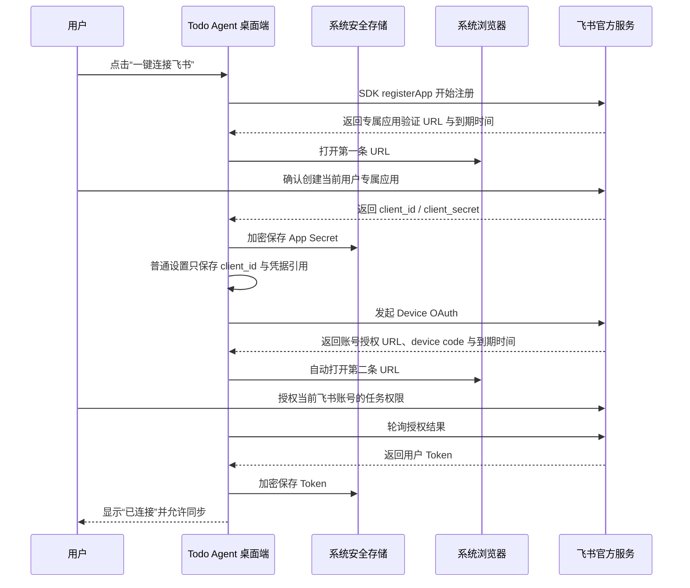

# 飞书零服务器连接方案

> 状态快照：2026-08-09 
> 当前结论：源码、类型化 IPC 和 Mock 自动化测试已打通；尚未使用真实飞书账号完成浏览器授权与 Task v2 读写验收。

## 1. 默认方案

Todo Agent 默认使用 `personal-direct`：通过飞书官方 Node SDK 为当前用户一键创建专属应用，再通过 OAuth 2.0 Device Authorization Grant 授权该账号。整个流程不需要 Todo Agent 自建 Relay、业务服务器、域名、产品账号或数据库。

“零服务器”只表示没有 Todo Agent 自营的中转服务。客户端仍会通过 HTTPS 直接访问飞书官方账号和 OpenAPI 服务；它也不表示“没有 App Secret”。每个用户的专属 `client_secret` 与 Token 只在本机系统安全存储中持久化，不写入普通设置、日志或导出。

## 2. 两阶段流程

阶段一通过 `addons` 显式预填以下用户权限：

- `task:task:read`
- `task:task:write`
- `offline_access`

创建时固定使用 `createOnly: true`，避免误选并改写已有飞书应用；`preset: false` 从官方最小基座开始，但飞书平台仍可能保留基座能力，真实账号验收必须以最终确认页和应用后台为准。第二阶段 Device OAuth 也会包含 `offline_access`，用于后台刷新用户 Token。

用户重新授权时，如果本机仍有有效的专属 App ID 和安全凭据引用，客户端复用该应用并直接进入第二阶段，不重复创建应用。

### 2.1 复用已有应用

如果用户已经有通过审核或已发布的飞书应用，可选择 `existing-direct`。用户只需填写该应用的 App ID 与 App Secret；客户端会跳过应用注册，直接使用同一套 Device OAuth 在系统浏览器授权账号。这个路径同样不需要 Todo Agent Relay 或回调域名。

App Secret 会立即进入系统安全存储，普通设置、IPC、日志和导出只保留凭据引用；发起 Device OAuth 和刷新 Token 时，Secret 只在 Electron 主进程内存中短暂使用。已有应用仍须在飞书后台启用相应能力并具备 `task:task:read`、`task:task:write`、`offline_access`，应用审核或发布状态本身不等于这些权限已经可用。

## 3. 连接方式定位

| 方式 | 产品定位 | 是否需要 Todo Agent 服务器 | 凭据策略 | 适用场景 |
| ---- | -------- | -------------------------- | -------- | -------- |
| 一键连接 `personal-direct` | 默认、推荐 | 否 | 每位用户独立 App Secret 与 Token，本机安全存储 | 个人和轻量使用 |
| 已有应用直连 `existing-direct` | 推荐降级路径 | 否 | 用户提供 App ID/Secret；Secret 与 Token 本机安全存储 | 已有审核/发布应用，或租户禁止创建新应用 |
| 本机回调 `local-development` | 兼容/开发入口 | 否 | 用户提供 App ID/Secret，本机安全存储并显示风险确认 | 调试传统回调 OAuth |
| OAuth Relay `relay` | 兼容/高级方案 | 是，由使用方提供可信 HTTPS Relay | 公共 App Secret 留在 Relay | 已有 Relay、集中治理或不允许本机持有 Secret 的环境 |

Relay 不是默认发布前置条件，当前仓库也不提供公共 Relay 服务。保留 Relay 协议是为了兼容已有部署和未来的集中治理需求，不能在设置中填入模型 API 地址或任意 HTTP 服务冒充 Relay。

如果租户策略禁止普通成员创建自建应用，默认流程可能要求管理员批准。这属于真实租户外部门槛；可改用管理员提供的已有应用，或由使用方部署 Relay，但客户端不能绕过租户安全策略。

## 4. 安全与状态规则

- 渲染进程只获得验证 URL、到期时间、连接步骤和脱敏错误，不获得 App Secret、device code 或 Token。
- 主进程收到专属 Secret 后立即交给系统安全存储；持久配置只保存凭据 ID。
- 状态明确区分“创建专属应用”和“授权飞书账号”，用户可在任一阶段取消。
- 注册取消、用户拒绝、链接过期、网络错误和无效响应映射为稳定的中文错误；飞书原始响应和密钥不跨 IPC。
- 第一阶段只创建连接应用，不代表账号已连接；只有第二阶段取得并安全保存用户 Token 后才显示 `connected`。
- 断开连接、重新授权和同步失败不会自动上传本地任务；私人 Today、排序、时间块和专注记录永不写回飞书。

## 5. 当前验证范围

截至 2026-08-09，自动化测试已验证：

- 官方 `registerApp` 的 `createOnly`、显式用户权限、验证 URL、到期时间、结果映射、取消和失败传播。
- Device OAuth 的官方端点、请求结构、`offline_access`、pending/slow-down 轮询、提前取消、超时和 Token 响应解析。
- 桌面控制器的两阶段编排、专属 Secret 安全写入、公开状态不泄密、配置持久化回调、自动打开第二条 URL 和最终连接状态。
- `personal-direct` 运行时从安全凭据引用读取 App Secret、将 Token 写回安全存储，以及关闭时取消轮询。
- `existing-direct` 跳过注册、从安全凭据引用取用已有应用 Secret，并复用 Device OAuth；不会启动本机回调服务器。
- Relay 和本机回调开发路径仍有回归测试，未被默认方案删除。

仓库当前 Vitest 基线为 **36 个测试文件、273/273 项通过**。覆盖还包括应用身份切换时的 Secret/Token 隔离、旧连接立即停止、Device OAuth 实际到期时间，以及缺少 `task:task:write` 或 `offline_access` 时拒绝连接。这些测试使用 SDK 替身或 Mock HTTP 响应，没有证明真实飞书账号、租户策略和 Task v2 权限已经可用。

## 6. 真实账号验收门槛

在真实验收完成前，只能表述为“零服务器连接流程已实现并通过 Mock 自动化，等待真实飞书账号验收”。至少还要完成：

1. 使用允许创建自建应用的真实飞书账号打开第一条 URL，确认应用实际创建；显式用户权限与预期一致，并记录飞书最小基座实际附带的能力。
2. 确认第二条 Device URL 自动打开；完成授权后 Token 可获取、刷新、撤销和重新授权。
3. 重启应用后复用安全存储中的专属应用，不重复创建；重新授权直接进入账号授权阶段。
4. 逐项验证标题、描述、开始/截止、完成/重开、创建和删除的 Task v2 读写。
5. 验证无权限、链接过期、用户拒绝、断网、限流、Token 失效和远端删除的恢复路径。
6. 使用不同角色验证单负责人、会签、或签、关注人和只读成员能力矩阵。
7. 验证禁止普通成员创建应用的租户，确认管理员批准或 `existing-direct` 降级文案真实可用；使用一款已审核/发布应用验证权限、Token 刷新和重新授权。
8. 如准备公开支持 Relay，再单独用真实 HTTPS Relay 验证其授权、刷新、撤权和密钥隔离；这不是默认一键连接的门槛。

## 7. 相关文档

- [产品需求文档](./PRD.md)
- [技术架构](./TECHNICAL_ARCHITECTURE.md)
- [页面信息架构与核心流程](./UX_INFORMATION_ARCHITECTURE.md)
- [实施状态与验收说明](./IMPLEMENTATION_STATUS.md)
