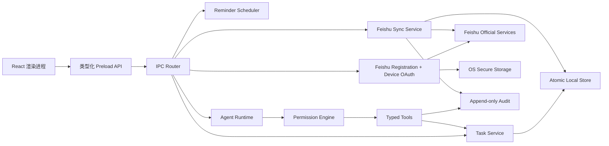

# Todo Agent 技术架构 v0.1

> 状态：实施基线；随着代码与验收证据同步更新。<br>
> 对应需求：[PRD.md](./PRD.md)<br>
> 首发实现：Electron + React + TypeScript，macOS / Windows 共用业务层。

## 1. 架构目标

1. 本地任务、提醒和 Today 在无账号、无网络、无 AI 时完整可用。
2. 渲染进程不持有飞书或模型密钥，也不能直接访问文件系统和命令执行。
3. 飞书同步、Agent 工具和权限判断都由主进程的确定性服务执行。
4. 所有外部写入先写本地事实和持久队列，再异步收敛。
5. macOS 与 Windows 共享数据语义，只在系统窗口、托盘、快捷键和权限入口上适配。

## 2. 进程边界



- Renderer：只负责展示、键盘交互和结构化用户输入。
- Preload：只暴露白名单方法，不暴露通用 IPC、Node 或 Electron 对象。
- Main：持有本地数据、系统能力、凭据、同步和 Agent 运行时。
- Tool sandbox：文件、终端、网页和截图使用独立范围契约，不能访问权限库、凭据或审计存储。

## 3. 本地数据

- 用户数据目录保存版本化状态文件、操作日志和恢复备份。
- 保存采用临时文件写入、同步落盘、原子替换；成功后保留上一版本备份。
- 每次修改生成 operation ID、before/after 差异和撤销记录。
- 飞书写入进入持久同步队列；任务本体立即显示 `pending`，队列跨重启恢复。
- 模型 API Key、飞书专属 App Secret 和用户 Token 使用 Electron `safeStorage` 加密后保存；普通设置只保存凭据引用，无法使用系统安全存储时不允许持久保存明文。
- 数据可迁移分为两条路径：`DataPortabilityService.exportJson` 生成可恢复的 JSON（仍按用户选择做脱敏），`exportMarkdown` 只投影任务、项目和清单为人类可读清单，默认 `private` 脱敏并明确不包含草稿、撤销操作、设置、权限审计、凭据、附件本地路径或文件内容；用户可显式开启 `include.operations`，追加只读任务事件摘要（时间、操作类型、任务标识、字段名与撤销标记），不输出 before/after 快照；桌面控制器通过同目录临时文件 + 原子替换写入 `.md` / `.markdown`。
- Todo Pet 档案由 `PetDataPortabilityService` 使用独立 `.todo-pet.json` 格式迁移，稳定状态通过 `PetService.portableSnapshot` / `replacePortableSnapshot` 读取和写入。导入先生成带 digest 的预览，仅支持“保留本机”或“覆盖本机”；覆盖不信任导入 revision，沿用本机 mutation 队列递增修订号，并保留现有运行中的 focus。备份只包含成长、外观、库存、弹性习惯、本周同行目标、冒险、小游戏、日记、记忆、主动消息和 focusHistory，不写入凭据、localPath、任务或飞书映射；宠物档案写入独立原子文件，不参与任务/设置/审计事务。
- 弹性习惯由 `PetService` 与 `PetState.habits` 统一持久化，默认提供喝水、伸展和收尾三项，最多 12 项；IPC 只允许 15–1440 分钟间隔和 1–80/240 字段长度，完成、稍后、暂停/恢复、编辑与删除都走同一原子 mutation。渲染层仅在首次发现旧 `todoAgentElasticHabits` localStorage 数据时迁移一次，并在所有写入成功后记录迁移标记；习惯不创建 Task、不产生 PetReward、不进入 Feishu payload 或模型上下文，且随 `.todo-pet.json` 一并导出。旧 v1 档案缺少 `habits` 时由 normalizer 补默认值。
- 每周同行目标由 `PetService` 与 `PetState.goals` 统一持久化，最多 3 项；IPC 校验名称、指标、整数目标和合法的 Monday-first 周日期范围，支持新增、编辑、暂停/恢复与移除。`src/renderer/pet-goals.ts` 只从同一份任务、`focusHistory` 和 `habits` 快照投影完成任务次数、专注分钟或习惯照顾次数，进度不写入第二份计数、不创建 Task、不进入 Feishu payload 或模型上下文。目标随 `.todo-pet.json` 导出；旧档案缺少 `goals` 时由 normalizer 补空数组。

## 4. 窗口与系统入口

- Main：Today、Agent、同步与设置。
- 周视图项目健康由 src/renderer/project-health.ts 纯函数从任务快照投影生成：依赖、逾期、排程和容量只用于解释，不写回任务；本周容量小时和每周 Check-in 记录属于本地偏好/仪式数据，使用带周起始日校验的 localStorage，跨周不会误继承。
- 工作周期由 src/renderer/work-cycles.ts 纯函数从同一任务快照投影生成：以 Monday-first 为边界支持 1 周 / 2 周，容量由本地每周可投入小时缩放；只统计已有 `plannedDate`、开始时间或时间块的开放任务作为已安排负载，并单独列出无日期/待排候选。该模块不新增 Task 字段、不创建 IPC、不进入 Feishu payload，前后周期与周期长度只保存在 renderer localStorage。
- 晨间简报的“只剩 2 小时方案”直接调用 `src/shared/daily-planner.ts` 的 `suggestDailyPlan`，传入 120 分钟容量和最多 3 项上限；它只从当前开放任务快照生成候选与 `primaryReason`，不写入任务、不创建 operation。用户点击确认后才进入已有 `DailyPlanSheet` 的预览、原子应用和撤销流程。
- 晨间“三步开始今天”由 `src/renderer/MorningKickoffCard.tsx` 维护临时 UI 状态：最多 3 个任务 ID、容量分钟数和 `focusFirst` 意图。它不新增 IPC 或持久化字段；“先看规划”把 `MorningKickoffPreset` 作为初始值传给既有 `DailyPlanSheet`，用户仍需在规划弹窗中调整并确认；“先专注”复用 `TaskController.startFocus`，失败只显示本地反馈，不改变任务或飞书边界。
- `AppSettings.planning.urgencyWeights` 是本地可迁移偏好；`src/renderer/pet-companion.ts` 将截止、Today、优先级和短任务映射为可解释的确定性分数，`App.tsx` 传入 Todo Pet 的下一步建议。设置服务将每项限制在 0–100，数据导入允许缺省并回退默认；权重不进入 Task、operation 或 Feishu payload。
- `src/renderer/companion-presets.ts` 只组合已有 `pet`、`persona` 和 `focus` 设置，提供四种可识别策略与“自定义”检测；选择模板仍通过普通 SettingsService 持久化，不新增任务字段、操作日志或同步 payload。
- 今日规划同样将 `DailyPlanConstraints`（本地可用起止时段、过渡 `bufferMinutes`、`minimumBlockMinutes`）传给 `suggestDailyPlan`；规划器返回 `effectiveCapacityMinutes`、`availableWindowMinutes` 和每项的 `belowMinimumBlock` / `short-block` 原因。它只改变建议排序与解释，不进入 `TaskService.applyTodayPlan` 的飞书 payload；用户仍可在 `DailyPlanSheet` 中手动加入短任务并一次确认。
- `src/shared/daily-schedule.ts` 由 `DailyPlanSheet` 调用生成确认前的只读时间块预览：当天已有 `timeBlock` / 开始时间的任务固定在原位，其余任务按选中顺序填入可用时段并留出过渡缓冲；重叠、超出窗口和无空档项作为显式冲突返回。该纯函数不修改 Task、不创建 operation、不增加 IPC，也不进入 Feishu 写回 payload，用户确认后仍只应用 Today 私人计划字段。
- `src/shared/multi-day-schedule.ts` 在当天排不下时生成未来 5 个工作日的只读顺延投影：保留固定时间块、跳过周末弹性容量、在截止日期后停止候选，并返回 `past-deadline` / `no-capacity` / `horizon` 原因。它只接受当前任务快照和规划约束，不写 `plannedDate` / `timeBlock`，不创建 IPC 或 operation，UI 也不把预览结果当成已保存事实。
- 日终回顾的“安排明天”复用 `DailyPlanSheet`，由 renderer 传入目标日期与相对标签；规划数据仍读取同一 open/completed 快照，确认后调用现有 `tasks:apply-today-plan` 原子事务。TaskService 允许今天或未来本地日期、拒绝已经过去的日期；事务只改 `plannedDate`、`privateOrder` 和用户确认的 `estimatedMinutes`，operation 仍可整体撤销，Feishu adapter 不会收到这些私人字段。
- `src/renderer/InboxTriageSheet.tsx` 是暂存的渐进式整理视图：队列由当前 controller 快照中“开放且没有 `plannedDate` / `projectId` / `listId`”的任务投影，并用本地 `processedIds` 管理本轮“稍后”与已处理项；今天/明天调用 `tasks.update` 的私人 `plannedDate`，完成调用 `toggleComplete`，打开详情只选择原任务，因而不会复制 Inbox 数据或绕过普通同步/权限路径。
- Todo Pet 回顾由 `src/renderer/pet-review.ts` 纯函数生成逾期、依赖阻塞与待排时间三类去重队列；`src/renderer/pet-review-session.ts` 将用户主动开始的会话快照成稳定顺序并附带原因，`PetReviewSession` 逐项调用既有 TaskController 的完成、安排今天或开始专注方法。会话是临时 UI 状态，不新增任务副本、operation 协议或隐式写操作；错误留在当前项，稍后只推进会话指针。
- 任务依赖由 TaskService 在新增和编辑时做有向图循环校验；renderer 的任务详情使用原生多选维护前置任务，缺失的远端 ID 不被静默丢弃而继续作为 blocked 信号。依赖字段属于私人计划层，飞书任务的依赖编辑不会进入共享写回载荷。
- `src/renderer/dependency-chain.ts` 从当前任务快照投影前置 / 当前 / 后续关系、缺失 ID 和循环信号；TaskInspector 只提供可点击导航，不修改 Task、operation 或 Feishu payload。
- 任务详情链接复用 Task.links 私人字段；渲染层添加前以 URL 构造器限制为 http/https，打开仍经过白名单 shell.openExternal，删除通过普通任务更新记录撤销操作，不进入飞书共享写回。
- 任务详情自定义字段复用 Task.customFields 私人字段；renderer 仅接受不超过 40 字的键和 500 字的值，并将文本、数字、日期、http/https 链接和勾选转换为受限 JsonValue；按键覆盖或删除通过普通任务更新持久化，FeishuTaskAdapter 保持该字段本地，不进入共享写回载荷。
- 任务详情历史复用 LocalAppState.operations：`tasks:history` 在主进程按 taskId 过滤最近操作，仅比较用户可识别字段并返回 operationId、类型、时间、撤销时间和字段名称；before/after 快照、私人正文、附件路径、同步内部字段不穿过 IPC。这样历史与 undo 共用同一事务日志，不引入第二份状态；同步拉取产生的远端变化仍由任务内容、版本和 FeishuStatus 呈现。
- 任务讨论复用 `Task.comments` 私人字段，最多 100 条、每条正文最多 10000 字，并在 TaskService 事务中校验唯一 ID、作者枚举和时间戳。它通过普通 `tasks:update` 记录操作，因此可撤销；`patchHasRemoteImpact` 与 Feishu 共享字段 allow-list 都排除 comments，远端拉取也不会覆盖；导出完整包可保留讨论，private/strict 脱敏会清空，Agent 只有在 `modelDataScope.notes`（且飞书任务同时允许 `feishuContent`）时获得不含评论 ID 的正文摘要。
- 研究卡复用 `Task.researchCards` 私人字段，每项包含标题、可选安全 http/https 来源、摘要、行动项和捕获时间，TaskService 限制每任务 20 张、每卡 20 条行动项并做唯一 ID、长度与 URL 校验。`FeishuTaskAdapter` 不读取该字段，普通更新仍可撤销但不会排队远端写入；完整导出保留卡片，private/strict 脱敏清空。Agent 通过独立的 `task_add_research_card` R1 工具添加卡片，读取仍受 `modelDataScope.notes` 与 `feishuContent` 约束。
- Agent 任务拆分使用 `task_split` R2 工具：参数严格限制为 2–7 个唯一标题、每项最多 5,000 字备注、5–720 分钟估时和标准优先级；审批预览包含父任务、步骤、预计时长和 `remoteWrite=false`。执行时复用 TaskService 的普通创建事务，为每个子任务写入本地 `parentId`、项目/清单/私人计划继承关系和 `sync=local`，返回每项任务与 operation ID；父任务和 Feishu 队列不被修改，取消或部分失败会返回已处理索引。
- 宠物日记的 `PetDiaryEntry.taskIds` 是可选的本地关系字段。生成日记时从当天已完成任务快照写入去重后的 ID，渲染层仅用当前任务快照解析标题并导航；旧日记没有该字段时按无关联兼容。它不复制任务、不进入 Agent 默认数据范围，也不参与 FeishuTaskAdapter 或任何远端 payload。
- 任务详情的“写入宠物日记”调用 `pet:diary-from-task`，主进程重新读取任务后把标题、状态和当前专注事实交给 `PetService.createDiaryFromTask`；服务在宠物状态文件的一次原子事务内写入 `generation=user` 条目和单一 `taskIds` 关系，重复点击同一未编辑条目复用原 ID。任务备注、附件和同步字段不会被复制，日记仍是本地关系层。
- 批量任务动作通过 `tasks:apply-bulk-action` 暴露为受限的判别联合（complete / reopen / move-to-today / trash / restore）。渲染层先收集精确任务 ID 和 `updatedAt` 基线，预览确认后主进程在一次 LocalStore 事务中先验证全部目标、角色、会签、回收站状态和基线，再写入一个 `bulk` operation；完成循环任务时生成的下一次任务也纳入同一 operation。普通任务和飞书任务沿用原有 `applyPatch` / `markSync` 边界，Today 安排只写私人计划字段；撤销复用快照冲突保护，不能把后续本地编辑或远端拉取覆盖掉。
- 全局任务文本搜索只在主进程对已保存字段做确定性匹配，除标题/备注/来源外包含附件名称与 MIME、链接名称/地址、自定义字段键值、研究卡标题/摘要/行动项与来源；不会读取本地附件正文，也不会因搜索把私人上下文加入飞书写回或 Agent 数据范围。
- 保存视图由 `src/renderer/smart-views.ts` 以版本兼容的本地 JSON 保存；除优先级、项目和来源外，v1.33 增加精确标签与日期范围（逾期、今天、未来 7 天、无日期），v1.41 增加手动情境条件。读取旧视图时补齐 `tag=all`、`context=all` 与 `dateFilter=any`，过滤只对当前任务快照做确定性投影，不修改任务、不增加同步载荷，也不把筛选条件发送给 Agent。
- Todo Pet 通过 `src/renderer/pet-smart-view.ts` 复用保存视图定义，在“全部”任务面板对开放任务做纯函数过滤与稳定排序；选择器监听跨窗口 `storage` 事件，主窗口新增/删除视图后宠物可更新。失效视图回退全部任务，过滤器只读 renderer 快照，不进入 TaskService、撤销日志或 Feishu 写回。
- 任务 `contexts` 是最多 20 个、每项 1–40 字的本地字符串数组；TaskService 会折叠空白并按不区分大小写拒绝重复值，搜索与 `TaskFilter.contexts` 支持 any/all 匹配。渲染层在任务详情和新建任务中用逗号输入，并在行内显示有限数量的上下文胶囊。FeishuTaskAdapter 的共享字段白名单排除 contexts，因此新增、编辑、撤销、远端拉取都不会把它写回或覆盖；导入校验同样限制长度和重复值。
- v1.35 为保存视图增加 `sort`（`manual` / `priority` / `due` / `title` / `created`）。`readSmartViews` 会把旧视图迁移为 `manual`；`sortSmartViewTasks` 使用稳定排序，不修改 controller 快照，Today 只有 `manual` 才暴露拖动排序。排序设置仅保存在 renderer 本地视图 JSON，不进入 TaskService、撤销日志或 Feishu 写回。
- 子任务进度由 `src/renderer/subtask-progress.ts` 从当前任务快照按 `parentId/status/deletedAt` 纯函数投影，父任务行只显示完成数/总数，详情用原生 `progressbar` 暴露 `aria-valuenow`。它不新增持久化字段、不参与 FeishuTaskAdapter 共享写回；详情内完成子任务使用保留父任务选择的 mutation 选项，避免操作后跳出上下文，也明确不自动完成父任务。
- 任务附件由两类私人上下文组成：renderer 可添加 http/https 外部引用，也可请求主进程系统文件选择器。主进程把选中文件复制到 `userData/attachments`（单文件 25 MiB、单批 100 MiB/20 个上限），使用不透明 ID、0600 文件权限，并在打开、预览、删除时再次校验目录边界、文件前缀和真实路径，拒绝路径穿越与逃逸符号链接。`tasks:preview-attachment` 只允许主进程读取本地副本，文本预览上限 512 KiB，PNG/JPEG/GIF/WebP 预览上限 4 MiB，PDF、Office、压缩包和外部 URL 不自动读取并回退系统打开；响应只返回脱离路径的文本或 data URL。附件元数据不进入 FeishuTaskAdapter 共享写回，数据导出会剥离 `localPath`，本地文件内容不会上传或导出。
- 项目看板由 src/renderer/project-board.ts 纯函数从同一任务快照投影三列；项目筛选只读取 `projectId`，完成/重开通过现有 TaskService 更新并保留撤销，blocked 列由 `dependencyIds` 和前置状态计算，不能被 UI 直接写成假阻塞。
- 项目总览由 `src/renderer/ProjectPage.tsx` 从 open + completed 两个既有任务快照按 `projectId` 投影；逾期使用任务截止事实，阻塞跨项目查找同一依赖 ID，点击任务沿用现有导航与 inspector。项目定义持久化在 `LocalAppState.projects`，由 `TaskService` 统一做名称、颜色、归档和删除校验；删除项目与解除任务关联在同一 LocalStore 事务内完成，关联字段仍是私人上下文，不进入 FeishuTaskAdapter 的共享写回。
- 项目实体通过 `projects:list/create/update/delete` 类型化 IPC 暴露给渲染层。旧状态文件缺少 `projects` 时由 LocalStore 在内存中迁移为空对象；数据导出/导入包含项目元数据，复制策略为冲突项目生成新 ID 并同时重映射任务及撤销快照中的 `projectId`，避免复制后任务指向原项目。
- 清单实体通过 `lists:list/create/update/delete` 类型化 IPC 暴露给渲染层。旧状态文件缺少 `lists` 时由 LocalStore 在内存中迁移为空对象；数据导出/导入包含清单元数据，复制策略为冲突清单生成新 ID 并同时重映射任务及撤销快照中的 `listId`，避免复制后任务指向原清单。删除清单与解除任务关联在同一 LocalStore 事务内完成，且不产生可恢复的任务操作。
- Quick Capture：无边框、快捷键呼出、失焦可恢复草稿；解析预览后可选择普通任务、无日期/项目/提醒的本地暂存或 Todo Pet 日记。任务路径复用现有 TaskService 与飞书写入边界，暂存路径只创建本地任务并清除排程字段，日记路径通过 `pet:diary-from-capture` 受限 IPC 写入标题与用户原文，不访问任务或凭据；可选 `captureId` 在 PetService 内幂等重试。Todo Pet 任务栏直接调用同一 `capture:parse` IPC，复用日期、标签、情境、时长、循环与 `p1`–`p4` 优先级解析，但强制组装 `source: local`，不从宠物小窗隐式触发飞书写入；解析服务不可用时回退原始标题。
- 命令面板：`src/renderer/CommandPalette.tsx` 是无副作用的可搜索命令视图；MainWindow 只提供已存在的导航、快速捕获、今日规划、Agent、显示宠物、设置和飞书同步回调。`⌘/Ctrl+K` 打开面板，弹窗状态会隔离返回、新建等全局快捷键；命令面板本身不持有任务快照、不新增 IPC 写入协议，所有任务和同步动作仍走原控制器与权限边界。
- Todo Pet：唯一桌面悬浮窗口；透明不规则命中区、可拖动、置顶、多显示器，并支持紧凑、悬停预览、展开、专注和安静状态。
- 专注守护：`FocusSettings.shieldMode` 与 `shieldApplications` 只保存在本地设置；`FloatingWindow` 在专注阶段按低频间隔调用已有 `shell.readActiveWindow`，只使用脱离标题的 `appName` 做大小写不敏感匹配。`gentle` 仅显示可折叠气泡，`pause` 复用既有 Pet/Task 专注暂停 API；不持久化窗口标题或内容，不关闭、阻挡、控制外部应用，也不抢夺焦点，默认关闭并随隐私/会议/全屏/安静策略收敛。
- Boss Mode 复用 `src/shared/boss-mode.ts` 的纯设置投影：一次 `settings.replace` 同时将 `pet.meetingMode` 置为 `true`、隐藏 `floating.enabled`，退出时反向恢复；宠物右键菜单和系统托盘调用同一投影，托盘的退出入口不依赖悬浮窗口存在。该模式只抑制宠物主动消息，不取消任务、专注、飞书同步或系统安全通知，也不新增任务字段或 IPC。
- 本地日历由 `src/shared/calendar-events.ts` 提供 provider-neutral 的 `CalendarEvent` / `CalendarBusyBlock`，解析器只接受上限 2 MiB 的 `.ics` 文本，展开折行、过滤取消/透明事件、处理本地/UTC/TZID、全天和跨午夜边界，并以稳定 ID 去重；事件 `DESCRIPTION` 只保留最多 4,000 个字符，供本地行动项预览使用；`calendarBusyBlocksForSlot` 将已裁剪的忙碌块确定性投影到半小时时间格。`src/renderer/calendar-store.ts` 仅将最多 500 条事件写入 renderer 本地缓存。`TimelinePage` 显示当天只读议程并在时间格绘制不可交互的会议区，`DailyPlanSheet` 用 `calendarBusyMinutesForDate` 扣除可用容量，并把忙碌块加入只读保留区；导入、清空和撤销不新增任务、IPC、飞书字段或外部日历写入。
- `src/shared/calendar-follow-up.ts` 从单个本地 `CalendarEvent` 纯函数生成会后跟进草稿（标题、事件日期和来源/时间上下文），不写入任何状态；`TimelinePage` 的事件卡通过 `onCreateFollowUp` 打开 `NewTaskSheet`，由用户继续编辑并确认后才复用既有 `TaskController.create` 创建本地任务。草稿不携带外部事件 ID、参会人或凭据，不写回日历或飞书。
- `src/shared/calendar-action-items.ts` 从 `CalendarEvent.description` 纯函数提取显式行动项：支持“行动项/待办/下一步/action item/next step”前缀、清单标记和强动作动词，去重、截断并最多返回 8 项；每项仅包含本地草稿标题、会议上下文备注和计划日期。`CalendarActionItemsSheet` 在 renderer 中逐项勾选/编辑后，复用 `TaskController.create` 顺序创建 `source: local` 任务；解析无模型、创建前需确认，部分失败保留预览并明确已创建数量，不写入日历、飞书或外部事件。
- `src/renderer/morning-calendar.ts` 从同一日历缓存投影 Today 早报所需的当天事件、裁剪后的忙碌块和占用分钟数；`MorningBrief` 只渲染脱离 provider 的摘要，打开时间线只触发已有导航，不把日历内容扩展到 AI 请求或任务控制器。
- `TimelinePage` 在周视图复用 `calendarEventsForDate` / `calendarBusyBlocksForDate` 对 Monday-first 七天做只读聚合，按日期和整周显示事件数、忙碌分钟；这些数字只来自 renderer 内存缓存，点击日期仍走既有日视图，不创建 operation、不写 Task 或外部日历。
- `src/renderer/morning-rollover.ts` 从全部开放任务投影较早日期的未完成私人 Today 计划，按优先级、截止时间和稳定顺序最多返回 3 项；`MorningBrief` 只提供建议与已有 `moveToToday` / 导航入口，用户确认后才写入私人 `plannedDate`，不创建新任务、不改变截止日期，也不扩展 Feishu payload。
- `src/renderer/focus-insights.ts` 从任务 `focusSessions` 及兼容的聚合专注字段投影一周节奏；`TimelinePage` 只读展示每日柱状图、总投入、专注段、平均时长和投入最多任务，不修改 `Task`、operation 或 Feishu payload。
- 同一 `focus-insights.ts` 还以任务 `estimatedMinutes` 和本周实际专注秒数投影 `timeAccounting`：汇总预计/实际分钟、偏差和最多 4 项偏差任务；仅纳入本周有计划或投入、且填写预计时长的未删除任务，`TimelinePage` 提供回到原任务的只读复盘入口，不创建 operation、不改变宠物档案或 Feishu payload。
- `src/renderer/pet-task-drop-zones.ts` 只定义“专注 / 完成 / 稍后”三种任务搬运目标；`FloatingWindow` 在任务卡原生拖拽期间显示目标区，放下后复用现有 `startPetFocus`、`toggleTaskFromPet` 或 `heldTaskId` 气泡，不创建第二份任务。目标区只负责交互投影，权限、错误处理、撤销与飞书同步仍由原任务控制器和服务承接。
- Todo Pet 动作包：渲染进程只接受版本化 JSON 声明，经过字段白名单、动作白名单、长度和唯一性校验后写入本地设置；动作包只能引用内置 `PetIdleAction`，不执行脚本、网络请求、文件读写或动态代码。
- 工作流模板：渲染进程只保存版本化模板 JSON；模板步骤仅允许任务标题、备注、标签、优先级、预计时长和有限的相对日期，变量只支持 `title/date/now`。快速捕获先生成确定性预览，再逐项写入本地或飞书；不会执行模板脚本、后台定时器或隐式外部调用。Quick Capture 解析 `@情境` 与 `情境：情境` 为本地 contexts，并把解析结果作为可编辑 chip 展示；同时把 `预计 45 分钟`、`用时 1 小时`、`30m/1h` 标准化为 5–720 分钟的本地 `estimatedMinutes`，把 `每天`、`每个工作日`、`每周一/三/五`、`每月15日` 和 `每隔 2 周` 转成受限的本地 `RecurrenceRule`，均在保存前显示 chip。解析不触发定位或后台监听；模板批量创建仍使用各步骤自己的估时定义，快速捕获循环只写入非模板本地任务。
- 可执行下一步建议由 `src/renderer/pet-companion.ts` 的 `recommendNextTask` 纯函数生成：只读取当前任务快照，跳过完成、删除和未满足前置依赖的任务，按逾期、今天计划/截止、优先级、私有顺序和稳定 ID 排序，返回 `taskId`、标题与简短原因。主动气泡的“开始专注 / 查看任务”只调用既有入口，不写任务字段、不创建 operation、不进入 Feishu payload；`privacyMode` 会在生成文案前移除任务引用。
- 提醒防疲劳：`NotificationSettings.dailyTaskReminderLimit` 控制普通任务通知的本地日预算（`0` 为不限，默认 `8`）；`taskIgnoreBackoffEnabled` 开启后，同一任务提醒被关闭两次会被降频；`taskReminderMinIntervalMinutes` 控制不同任务之间的最小间隔；`taskReminderSourceMode` 可独立限制本地 / 飞书来源，`taskReminderProjectMode` 对已有 `projectId` 提供最多 100 个项目例外，项目策略优先。设置页的批量编辑器使用同一映射，一次对最多 100 个选中项目写入或删除例外，不触碰任务快照和飞书载荷。调度器把实际任务横幅记录在提醒运行状态中，跨重启继续计数；晨报、同步风险和 Agent 审批不消耗普通任务预算，安静时段和临时静音仍优先。Todo Pet 的主动消息由 `PetService` 按 `pet.proactiveDailyLimit` 在主进程做最终预算校验，渲染层只做提前隐藏的体验优化。
- 上下文捕获：剪贴板、当前窗口和选中文本都走显式 Preload 白名单方法；选中文本只在用户动作后向前台应用发送一次复制指令，读取有上限的纯文本，尽量恢复原剪贴板格式，失败时降级为不可用，不建立后台监听。
- Tray/Menu bar：显示同步、Agent、全权限和停止入口。
- 单实例锁保证只有一个写入进程；第二次启动聚焦已有窗口。

## 5. 同步

同步适配器统一实现 `connect / pull / push / resolveConflict / disconnect`。

默认连接模式为 `personal-direct`，不依赖 Todo Agent 后端：主进程调用飞书官方 SDK `registerApp` 获取第一条验证 URL；用户确认后将每用户独立 App Secret 写入系统安全存储；随后发起 Device OAuth 并让系统浏览器自动打开第二条账号授权 URL；只有用户 Token 安全落库后才发布 `connected`。渲染进程只看到 URL、到期时间、阶段和脱敏错误。

`personal-direct` 创建时使用 `createOnly: true`，并显式预填用户权限 `task:task:read`、`task:task:write`、`offline_access`；飞书最小基座实际附带能力仍以真实确认页为准。已有专属凭据时重新授权直接复用应用。`existing-direct` 接受已有应用的 App ID 与安全凭据引用，跳过注册并进入同一 Device OAuth 运行时，不启动回调服务器；Secret 仅由主进程从系统安全存储取用。`relay` 保留为已有 HTTPS Relay/集中治理的兼容模式，`local-development` 只保留传统本机回调调试路径；它们都不是默认零服务器流程的依赖。详细流程与真实账号门禁见 [FEISHU_CONNECTION.md](./FEISHU_CONNECTION.md)。

- 本地任务 ID 永久稳定，飞书 ID 只是外部映射。
- 全量拉取先读取“我负责”任务，再枚举 `task:tasklist:read` 授权范围内的清单并去重补齐；缺少该权限时安全降级并在同步状态中提示，不将列表缺失当作远端删除。
- 远端版本参与三方冲突判定并在写入前重新拉取；当前飞书 Task v2 更新接口没有可依赖的条件版本参数，因此真实租户发布门禁还需验证写后确认与并发窗口，不能宣称数据库级 CAS。
- 私人计划、私人排序、时间块和专注状态永不出现在远端写入 payload。
- 网络、限流和临时错误指数退避；认证错误暂停队列并要求重新授权。
- 无真实租户时使用协议级 Mock Server 覆盖队列、冲突、幂等和恢复；发布前仍须真实租户验收。

## 6. Agent 与权限

Agent 使用 OpenAI-compatible Chat Completions 工具协议。模型只产生类型化提案，不能直接写数据。

任务列表的单项和批量 Agent 入口由 renderer 的纯函数 `buildTaskAgentPrompt` / `buildBulkTaskAgentPrompt` 生成草稿上下文（任务标题、稳定本地 ID、状态和来源）。批量上下文最多内嵌 20 项，避免选择大量任务时形成无界数据导出；入口只调用已有的 `askAgent` 导航与草稿消费路径，不新增任务写入或绕过权限。用户发送后仍从任务工具查询详情，并经过既有数据范围、风险预览、确认、审计和撤销链。

筛选面板的一句话入口使用 `parseSmartViewQuery` 做本地确定性解析。解析器只从当前快照已有的项目、标签和情境候选中匹配，输出完整 `SmartViewQueryFilters` 供 UI 预览；未知值、同类冲突、空语句和超长语句 fail-closed。点击“套用”才调用现有筛选状态与 `onSourceChange`，不创建任务、不调用模型、不改变持久化任务事实。

模型连接由主进程按设置创建：主模型、本地备用模型和 local-only 三种路由共享同一权限与审计链。备用切换只接受网络、408、429 和 5xx 这类可重试错误，并且要求尚未发出流式文本；一旦已有内容或出现参数/权限错误，原错误直接返回，避免重复工具执行。两套连接的凭据引用独立保存，模型数据范围不因切换而扩大。

模型用量与费用预算由主进程的 `ModelUsageBudgetService` 以本地日历日原子持久化；设置页可分别填写主模型和备用/本地模型的输入、输出美元单价，并设置每日费用硬上限。费用只按提供方回报的 prompt/completion token 计算，使用量文件不保存提示词、回复、端点、模型名或凭据引用。启用费用上限后，如果提供方没有回报可计费的 token 维度，服务会拒绝后续新运行而不猜测输入/输出拆分；价格未配置或上限为 0 时只展示已知状态、不执行费用拦截。

短期 Agent 会话由 renderer 的 `agent-conversation-store` 以受限 JSON 保存在本机浏览器存储中（每个会话最多 50 条非流式消息，并限制单条与总字符数；最多保留 8 个会话）；它不进入主进程数据库、飞书载荷、宠物关系记忆或凭据导出。Agent 页面提供切换、按标题/正文搜索、重命名、置顶、删除、新建、清除当前会话和 Markdown 导出，标题和置顶排序只在本机执行，恢复的消息仍由 `modelDataScope.chatHistory` 决定是否送入模型；关闭该范围只保留界面回顾，不会阻止任务事实和权限链运行。

```text
用户请求 → 本地确定性检索 → 模型工具提案 → Schema 校验
→ 权限引擎 → 差异预览 / 授权 → 执行 → 审计 → 可撤销结果
```

- R0：只读，自动。
- R1：单条本地可逆，自动执行并提供撤销。
- R2：外部或批量，标准模式先预览确认。
- R3：删除、提交、终端、截图等高风险，标准模式只允许本次。
- R4：密钥、审计、权限库、自行扩权、支付等永久拒绝。
- 全权限只能从本机设置开启，并保存精确范围、期限和本机验证结果；它不会扩大模型数据范围。
- 网页、HTTP 与网络命令输出视为不可信研究材料；同一轮一旦读取这类材料，写入、命令和外部动作会在权限判断前暂停，必须由用户下一轮明确确认。
- 模型数据范围在本地裁剪；关闭任务元数据后只暴露不透明 ID，当前附件内容一律不进入模型。
- “停止 Agent”使用 AbortController 阻止新调用、取消可取消工作并保留已发生外部影响的真实终态。

## 7. 测试门禁

1. 单元：任务排序、循环、撤销、日期语义、队列、冲突、权限范围、路径逃逸、提示注入。
2. 集成：持久化重启、提醒去重、Mock 飞书、专属应用注册、Device OAuth 两阶段编排、Mock 模型、工具审计和停止。
3. Electron E2E：三窗口、快捷键替代入口、托盘、深浅色、键盘路径。
4. 安装验收：macOS 当前设备安装与打开；Windows 生成 x64 包并在对应测试机补签名验收。
5. 外部凭据门禁：飞书真实租户、多角色、多负责人；OpenAI-compatible 有效 Key；Apple/Windows 签名与公证。

## 8. 已知发布边界

- 当前电脑可生成并安装本地 unsigned / ad-hoc macOS 构建；正式分发仍需要 Apple Developer ID 与 notarization 凭据。
- 飞书零服务器注册与 Device OAuth 已完成协议、Mock 和 UI 编排验收，双向同步已有协议级测试；尚未实际打开真实账号的两条授权 URL。真实租户的应用创建策略、Token 生命周期、字段能力与多角色语义必须使用用户或测试租户补验。
- Windows 行为通过共用逻辑和 Windows 构建产物验证；托盘、通知、安装升级和多显示器最终验收需要 Windows 机器。
