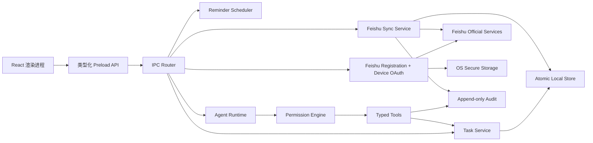

# Todo Agent 技术架构 v0.1

> 状态：实施基线；随着代码与验收证据同步更新。<br>
> 对应需求：[PRD.md](./PRD.md)<br>
> 首发实现：Electron + React + TypeScript，macOS / Windows 共用业务层。

## 1. 架构目标

1. 本地任务、提醒和 Today 在无账号、无网络、无 AI 时完整可用。
2. 渲染进程不持有飞书或模型密钥，也不能直接访问文件系统和命令执行。
3. 飞书同步、Agent 工具和权限判断都由主进程的确定性服务执行。
4. 所有外部写入先写本地事实和持久队列，再异步收敛。
5. macOS 与 Windows 共享数据语义，只在系统窗口、托盘、快捷键和权限入口上适配。

## 2. 进程边界



- Renderer：只负责展示、键盘交互和结构化用户输入。
- Preload：只暴露白名单方法，不暴露通用 IPC、Node 或 Electron 对象。
- Main：持有本地数据、系统能力、凭据、同步和 Agent 运行时。
- Tool sandbox：文件、终端、网页和截图使用独立范围契约，不能访问权限库、凭据或审计存储。

## 3. 本地数据

- 用户数据目录保存版本化状态文件、操作日志和恢复备份。
- 保存采用临时文件写入、同步落盘、原子替换；成功后保留上一版本备份。
- 每次修改生成 operation ID、before/after 差异和撤销记录。
- 飞书写入进入持久同步队列；任务本体立即显示 `pending`，队列跨重启恢复。
- 模型 API Key、飞书专属 App Secret 和用户 Token 使用 Electron `safeStorage` 加密后保存；普通设置只保存凭据引用，无法使用系统安全存储时不允许持久保存明文。

## 4. 窗口与系统入口

- Main：Today、Agent、同步与设置。
- Quick Capture：无边框、快捷键呼出、失焦可恢复草稿。
- Floating：透明、可拖动、置顶策略、胶囊 / 球 / 迷你面板三态。
- Tray/Menu bar：显示同步、Agent、全权限和停止入口。
- 单实例锁保证只有一个写入进程；第二次启动聚焦已有窗口。

## 5. 同步

同步适配器统一实现 `connect / pull / push / resolveConflict / disconnect`。

默认连接模式为 `personal-direct`，不依赖 Todo Agent 后端：主进程调用飞书官方 SDK `registerApp` 获取第一条验证 URL；用户确认后将每用户独立 App Secret 写入系统安全存储；随后发起 Device OAuth 并让系统浏览器自动打开第二条账号授权 URL；只有用户 Token 安全落库后才发布 `connected`。渲染进程只看到 URL、到期时间、阶段和脱敏错误。

`personal-direct` 创建时使用 `createOnly: true`，并显式预填用户权限 `task:task:read`、`task:task:write`、`offline_access`；飞书最小基座实际附带能力仍以真实确认页为准。已有专属凭据时重新授权直接复用应用。`existing-direct` 接受已有应用的 App ID 与安全凭据引用，跳过注册并进入同一 Device OAuth 运行时，不启动回调服务器；Secret 仅由主进程从系统安全存储取用。`relay` 保留为已有 HTTPS Relay/集中治理的兼容模式，`local-development` 只保留传统本机回调调试路径；它们都不是默认零服务器流程的依赖。详细流程与真实账号门禁见 [FEISHU_CONNECTION.md](./FEISHU_CONNECTION.md)。

- 本地任务 ID 永久稳定，飞书 ID 只是外部映射。
- 远端版本参与三方冲突判定并在写入前重新拉取；当前飞书 Task v2 更新接口没有可依赖的条件版本参数，因此真实租户发布门禁还需验证写后确认与并发窗口，不能宣称数据库级 CAS。
- 私人计划、私人排序、时间块和专注状态永不出现在远端写入 payload。
- 网络、限流和临时错误指数退避；认证错误暂停队列并要求重新授权。
- 无真实租户时使用协议级 Mock Server 覆盖队列、冲突、幂等和恢复；发布前仍须真实租户验收。

## 6. Agent 与权限

Agent 使用 OpenAI-compatible Chat Completions 工具协议。模型只产生类型化提案，不能直接写数据。

```text
用户请求 → 本地确定性检索 → 模型工具提案 → Schema 校验
→ 权限引擎 → 差异预览 / 授权 → 执行 → 审计 → 可撤销结果
```

- R0：只读，自动。
- R1：单条本地可逆，自动执行并提供撤销。
- R2：外部或批量，标准模式先预览确认。
- R3：删除、提交、终端、截图等高风险，标准模式只允许本次。
- R4：密钥、审计、权限库、自行扩权、支付等永久拒绝。
- 全权限只能从本机设置开启，并保存精确范围、期限和本机验证结果；它不会扩大模型数据范围。
- 网页、HTTP 与网络命令输出视为不可信研究材料；同一轮一旦读取这类材料，写入、命令和外部动作会在权限判断前暂停，必须由用户下一轮明确确认。
- 模型数据范围在本地裁剪；关闭任务元数据后只暴露不透明 ID，当前附件内容一律不进入模型。
- “停止 Agent”使用 AbortController 阻止新调用、取消可取消工作并保留已发生外部影响的真实终态。

## 7. 测试门禁

1. 单元：任务排序、循环、撤销、日期语义、队列、冲突、权限范围、路径逃逸、提示注入。
2. 集成：持久化重启、提醒去重、Mock 飞书、专属应用注册、Device OAuth 两阶段编排、Mock 模型、工具审计和停止。
3. Electron E2E：三窗口、快捷键替代入口、托盘、深浅色、键盘路径。
4. 安装验收：macOS 当前设备安装与打开；Windows 生成 x64 包并在对应测试机补签名验收。
5. 外部凭据门禁：飞书真实租户、多角色、多负责人；OpenAI-compatible 有效 Key；Apple/Windows 签名与公证。

## 8. 已知发布边界

- 当前电脑可生成并安装本地 unsigned / ad-hoc macOS 构建；正式分发仍需要 Apple Developer ID 与 notarization 凭据。
- 飞书零服务器注册与 Device OAuth 已完成协议、Mock 和 UI 编排验收，双向同步已有协议级测试；尚未实际打开真实账号的两条授权 URL。真实租户的应用创建策略、Token 生命周期、字段能力与多角色语义必须使用用户或测试租户补验。
- Windows 行为通过共用逻辑和 Windows 构建产物验证；托盘、通知、安装升级和多显示器最终验收需要 Windows 机器。
