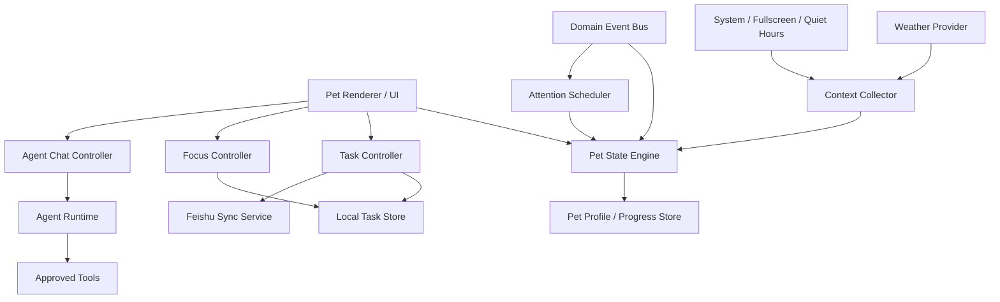

# Todo Pet 实现规范与验收标准

> 文档状态：Draft v0.1<br>
> 更新日期：2026-08-14<br>
> 配套产品文档：[TODO_PET_PRODUCT_DESIGN.md](./TODO_PET_PRODUCT_DESIGN.md)<br>
> 目标读者：负责实现 Todo Pet 的 AI、工程师与测试人员

## 1. 实现目标

本文档把统一 PRD 和 Todo Pet 产品设计转换为可实现、可测试的工程合同。实现者必须遵守以下优先级：

1. 用户明确要求与最新确认。
2. Todo Agent 统一 [PRD.md](./PRD.md)。
3. Todo Pet 产品设计文档。
4. 本实现规范。
5. 实现者自行补充的合理默认值。

如果代码现状与本文不一致，应先记录差异；除非存在数据安全风险，不应擅自删除现有能力。

## 2. 当前产品假设

实现基于以下既有能力：

- Todo Agent 为 Windows / macOS Electron 桌面应用。
- 已存在主窗口、悬浮窗口和快速录入窗口。
- 悬浮窗口支持置顶、拖动、悬停展开、离开关闭和右键菜单。
- 展开窗口已支持全部任务、今日任务、Agent 对话和动态等内容。
- Agent 对话已支持 Markdown 和流式输出。
- 已存在本地任务、飞书任务、同步队列和即时同步能力。
- 已存在任务增删改查、回收站、提醒和应用设置。
- 已存在模型配置和桌面 Agent 权限体系。

实现前必须实际检查代码确认这些假设。若某项不存在，应把它作为前置任务实现，不得用模拟数据伪装完成。

## 3. 总体架构



### 3.1 必须独立的模块

| 模块 | 职责 |
|---|---|
| PetWindowManager | 创建、定位、置顶、拖动、缩放和恢复宠物窗口 |
| PetStateEngine | 根据业务事件和上下文确定当前动作、情绪和表现 |
| PetAnimationRenderer | 渲染角色、状态、过渡和降级静态图 |
| PetContextCollector | 汇总任务、番茄、天气、系统勿扰和交互状态 |
| PetAttentionScheduler | 决定主动提醒是否允许、何时显示和使用哪个等级 |
| FocusService | 番茄钟、正计时、休息、持久化和恢复 |
| PetProgressionService | 奖励、属性、成长、库存和解锁 |
| PetDiaryService | 本地模板日记与可选模型增强日记 |
| PetMemoryService | 用户偏好、关系记忆、查看和删除 |
| PetAgentBridge | 把宠物对话接入现有 Agent 和权限确认体系 |
| WeatherService | 城市、权限、缓存、严重天气和来源时间 |
| PetEventLog | 可审计事件和调试日志，不保存不必要敏感正文 |

模块可以在同一进程中实现，但职责和测试边界必须分离。

## 4. 决策边界：本地规则与大模型

| 能力 | 默认执行者 | 大模型是否必需 |
|---|---|---|
| 待机、走动、睡觉、抚摸 | 本地状态机 | 否 |
| 窗口拖动、位置恢复、置顶 | 桌面层 | 否 |
| 番茄计时和休息 | FocusService | 否 |
| 截止时间提醒 | 本地调度器 | 否 |
| 天气服装 | WeatherService + 规则 | 否 |
| 飞书同步图标 | 同步服务真实状态 | 否 |
| 任务标题展示和完成 | TaskController | 否 |
| 任务粗分类 | 本地关键词规则 | 否 |
| 任务细分类和动画建议 | Agent，可选 | 是，可降级 |
| 宠物随机短句 | 预设内容库优先 | 否 |
| 个性化主动聊天 | Agent | 是 |
| 批量重新规划 | Agent + 工具确认 | 是 |
| 宠物日记 | 本地模板；模型增强可选 | 否 |
| 网页研究、文件和终端 | Agent 工具 | 是 |

禁止为了决定每一帧、每个待机动作或普通气泡而调用大模型。

## 5. 功能开关与迁移

### 5.1 功能开关

新增设置：

```ts
interface PetFeatureFlags {
  petAgentEnabled: boolean;
  petProgressionEnabled: boolean;
  petDiaryEnabled: boolean;
  petWeatherEnabled: boolean;
  petExperimentalDesktopPhysics: boolean;
}
```

要求：

- Todo Pet 是唯一桌面悬浮形态，发布版不提供旧悬浮球或胶囊入口。
- 新用户在首次引导中完成领养或直接使用默认宠物。
- 用户隐藏或关闭桌面宠物后保留宠物档案，不删除进度。
- 提供单独的“删除宠物档案与记忆”操作并二次确认。

### 5.2 数据迁移

- 旧悬浮球或胶囊位置作为宠物首次位置。
- 旧悬浮窗口上次选中入口映射到新导航。
- 原 hover 延迟、透明度、置顶和隐私设置继续生效。
- 迁移必须幂等；应用重复启动不能重复创建宠物或奖励。
- 迁移失败时不得覆盖旧数据；使用默认静态宠物和安全位置，并提供恢复或导出入口。

## 6. 窗口状态机

### 6.1 窗口形态

```ts
type PetWindowMode =
  | "hidden"
  | "compact"
  | "peek"
  | "expanded"
  | "focus-compact"
  | "quiet";
```

### 6.2 展开来源

```ts
type PetExpansionTrigger =
  | "click"
  | "hover"
  | "keyboard"
  | "notification"
  | "system-restore";
```

### 6.3 核心规则

- 首次启动进入 `compact`。
- 鼠标持续停留达到配置延迟后：`compact -> peek`，记录 trigger=`hover`。
- trigger=`hover` 的 `peek` 在鼠标离开整个交互区域后自动回到 `compact`。
- trigger=`click` 或 `keyboard` 的 `expanded` 不因鼠标离开而关闭。
- 单击宠物：`compact/peek -> expanded`。
- 双击宠物：打开主页面；不能同时残留一次单击造成的错误展开。
- 开始番茄钟后：紧凑形态使用 `focus-compact`。
- 静默策略生效时：进入 `quiet`，保留必要截止和计时能力。
- 隐藏或退出前保存位置、尺寸、入口和交互状态。

### 6.4 导航状态

```ts
type PetTab = "all" | "today" | "focus" | "chat" | "home";
```

- 第一次打开默认 `all`。
- 每次切换立即保存。
- 折叠、展开、窗口重建和应用重启后恢复。
- 已保存值非法时回退 `all`。
- `all` 显示全部未完成且未删除任务。
- `today` 使用 Todo Agent 现有“今天”语义，不自行重写过滤规则。

## 7. 宠物表现状态机

### 7.1 动作状态

```ts
type PetActivity =
  | "idle"
  | "look-at-pointer"
  | "walk"
  | "sit"
  | "sleep"
  | "petted"
  | "picked-up"
  | "focus-generic"
  | "focus-read"
  | "focus-write"
  | "focus-code"
  | "focus-research"
  | "focus-organize"
  | "focus-exercise"
  | "break-stretch"
  | "break-water"
  | "celebrate"
  | "remind-task"
  | "syncing"
  | "sync-success"
  | "sync-error"
  | "agent-thinking"
  | "agent-streaming"
  | "agent-awaiting-confirmation"
  | "offline"
  | "weather-rain"
  | "weather-cold"
  | "weather-snow"
  | "weather-wind";
```

### 7.2 情绪状态

```ts
type PetEmotion =
  | "neutral"
  | "calm"
  | "happy"
  | "curious"
  | "excited"
  | "concerned"
  | "tired";
```

情绪只改变表现，不修改任务数据和权限判断。

### 7.3 状态优先级

从高到低：

1. 安全和用户控制：隐藏、拖动、关闭、减少动画。
2. Agent 等待确认。
3. 番茄钟结束、用户明确提醒、严重天气。
4. 当前番茄专注或休息。
5. 飞书同步错误。
6. 临近截止任务。
7. 用户直接互动：抚摸、点击、拖起。
8. 普通天气表现。
9. 随机待机动作。

低优先级状态不能打断高优先级状态；高优先级结束后重新计算当前状态，不机械恢复过期动画。

### 7.4 动画时长规则

- 持续状态：focus、sleep、offline、syncing，可循环。
- 一次性状态：petted、celebrate、sync-success，播放后回到重新计算状态。
- 普通待机动作 4–12 秒后切换，时间带随机抖动。
- 不得连续快速切换造成闪烁。
- 同一庆祝动作默认 60 秒内不重复。

## 8. 上下文模型

```ts
interface PetContextSnapshot {
  now: string;
  timezone: string;
  appForeground: boolean;
  userIdleSeconds: number;
  recentKeyboardActivity: boolean;
  recentPointerActivity: boolean;
  fullscreenActive: boolean;
  screenSharingActive: boolean | "unknown";
  meetingActive: boolean | "unknown";
  systemDoNotDisturb: boolean | "unknown";
  withinQuietHours: boolean;
  onBattery: boolean | "unknown";
  lowPowerMode: boolean | "unknown";
  selectedTab: PetTab;
  activeTaskId?: string;
  visibleTodayTaskId?: string;
  focusSessionId?: string;
  agentState: "idle" | "thinking" | "streaming" | "confirming" | "error";
  feishuState: "idle" | "syncing" | "success" | "error" | "unconfigured";
  weather?: WeatherSnapshot;
}
```

上下文快照由本地服务生成。模型只接收完成当前请求所需的最小字段。

## 9. 领域事件

所有事件包含 `id`、`type`、`occurredAt`、`source` 和可选 `payload`。事件处理必须支持去重。

### 9.1 应用事件

- `app.started`
- `app.ready`
- `app.quitting`
- `window.main.opened`
- `window.pet.moved`
- `window.pet.expanded`
- `window.pet.collapsed`
- `system.display.changed`
- `system.fullscreen.changed`
- `system.power.changed`

### 9.2 任务事件

- `task.created`
- `task.updated`
- `task.completed`
- `task.reopened`
- `task.trashed`
- `task.restored`
- `task.dueSoon`
- `task.overdue`
- `task.selection.changed`

### 9.3 专注事件

- `focus.started`
- `focus.paused`
- `focus.resumed`
- `focus.interrupted`
- `focus.completed`
- `focus.breakStarted`
- `focus.breakCompleted`
- `focus.cancelled`

### 9.4 同步事件

- `sync.feishu.started`
- `sync.feishu.succeeded`
- `sync.feishu.failed`
- `sync.feishu.conflict`

### 9.5 Agent 事件

- `agent.message.started`
- `agent.message.delta`
- `agent.message.completed`
- `agent.message.failed`
- `agent.confirmation.requested`
- `agent.confirmation.resolved`
- `agent.stopped`

### 9.6 宠物事件

- `pet.adopted`
- `pet.petted`
- `pet.fed`
- `pet.reward.granted`
- `pet.item.unlocked`
- `pet.level.changed`
- `pet.diary.generated`
- `pet.nudge.shown`
- `pet.nudge.dismissed`
- `pet.quietMode.changed`

## 10. 数据模型

以下接口描述语义，具体持久化可映射到现有数据库风格。

### 10.1 宠物档案

```ts
interface PetProfile {
  id: string;
  speciesId: string;
  name: string;
  adoptedAt: string;
  appearance: PetAppearance;
  personality: PetPersonality;
  progression: PetProgression;
  createdAt: string;
  updatedAt: string;
}

interface PetAppearance {
  colorVariant: string;
  outfitItemIds: string[];
  accessoryItemIds: string[];
  activeIdleSetId: string;
  scale: number;
}

interface PetPersonality {
  preset: "gentle" | "energetic" | "calm" | "playful" | "witty" | "quiet";
  proactivity: number;      // 0..100
  humor: number;           // 0..100
  strictness: number;      // 0..100
  verbosity: number;       // 0..100
  emojiUsage: number;      // 0..100
  preferredAddress?: string;
  customIdentityPrompt?: string;
}

interface PetProgression {
  stage: "new" | "familiar" | "companion" | "bonded";
  level: number;
  experience: number;
  bond: number;
  curiosity: number;
  knowledge: number;
  vitality: number;
  craft: number;
  courage: number;
}
```

### 10.2 设置

```ts
interface PetSettings {
  enabled: boolean;
  alwaysOnTop: boolean;
  lockedPosition: boolean;
  hoverExpandDelayMs: number;
  autoCollapseHoverPreview: boolean;
  selectedTab: PetTab;
  privacyMode: boolean;
  hideDuringFullscreen: boolean;
  hideDuringScreenShare: boolean;
  reduceMotion: boolean;
  idleFrameRate: 0 | 10 | 15 | 30;
  activeFrameRate: 15 | 30 | 60;
  soundEnabled: boolean;
  petSoundVolume: number;
  timerSoundVolume: number;
  ambientSoundVolume: number;
  proactiveNudgesEnabled: boolean;
  maxAmbientChatsPerDay: number;
  quietHours: QuietHours;
  weather: PetWeatherSettings;
  longTermMemoryEnabled: boolean;
  telemetryEnabled: boolean;
}

interface QuietHours {
  enabled: boolean;
  startLocalTime: string; // HH:mm
  endLocalTime: string;
  allowCriticalTaskReminders: boolean;
  allowSevereWeather: boolean;
}
```

### 10.3 窗口位置

```ts
interface PetWindowPlacement {
  displayId: string;
  xRatio: number;
  yRatio: number;
  edge?: "left" | "right" | "top" | "bottom";
  updatedAt: string;
}
```

使用相对坐标存储，并在恢复时限制到显示器工作区内。

### 10.4 番茄钟

```ts
type FocusSessionState =
  | "running"
  | "paused"
  | "completed"
  | "cancelled"
  | "interrupted";

interface PetFocusSession {
  id: string;
  taskId?: string;
  mode: "countdown" | "stopwatch";
  state: FocusSessionState;
  plannedFocusSeconds?: number;
  elapsedFocusSeconds: number;
  plannedBreakSeconds?: number;
  cycleIndex: number;
  totalCycles?: number;
  startedAt: string;
  pausedAt?: string;
  completedAt?: string;
  interruptionReason?: string;
  rewardGrantedAt?: string;
}
```

完成奖励通过 `rewardGrantedAt` 或独立幂等键防止重复发放。

### 10.5 奖励与库存

```ts
interface PetRewardLedgerEntry {
  id: string;
  idempotencyKey: string;
  reason: "task" | "focus" | "planning" | "review" | "healthy-break" | "manual";
  sourceEntityId?: string;
  experience: number;
  currency: number;
  attributeChanges: Partial<Record<keyof PetProgression, number>>;
  itemIds: string[];
  grantedAt: string;
}

interface PetInventoryItem {
  itemId: string;
  quantity: number;
  unlockedAt: string;
  equipped: boolean;
}
```

### 10.6 提醒

```ts
type PetNudgePriority = "ambient" | "light" | "important" | "critical";

interface PetNudge {
  id: string;
  type: string;
  priority: PetNudgePriority;
  title: string;
  body: string;
  reason: string;
  sourceEntityId?: string;
  actions: PetNudgeAction[];
  createdAt: string;
  expiresAt?: string;
  shownAt?: string;
  dismissedAt?: string;
  snoozedUntil?: string;
}

interface PetNudgeAction {
  id: string;
  label: string;
  intent: string;
  destructive?: boolean;
}
```

### 10.7 天气

```ts
interface WeatherSnapshot {
  provider: string;
  locationLabel: string;
  observedAt: string;
  fetchedAt: string;
  conditionCode: string;
  temperatureC?: number;
  minTemperatureC?: number;
  maxTemperatureC?: number;
  precipitationProbability?: number;
  windLevel?: string;
  airQualityIndex?: number;
  severeAlerts: WeatherAlert[];
  stale: boolean;
}

interface WeatherAlert {
  id: string;
  severity: "minor" | "moderate" | "severe" | "extreme";
  title: string;
  description?: string;
  startsAt?: string;
  endsAt?: string;
  sourceUrl?: string;
}
```

### 10.8 日记与记忆

```ts
interface PetDiaryEntry {
  id: string;
  localDate: string;
  mode: "template" | "model-enhanced";
  title: string;
  markdown: string;
  taskIds: string[];
  focusSessionIds: string[];
  earnedItemIds: string[];
  userEdited: boolean;
  generatedAt: string;
  updatedAt: string;
}

interface PetMemory {
  id: string;
  category: "preference" | "relationship";
  content: string;
  source: "user-explicit" | "user-approved" | "system-setting";
  createdAt: string;
  updatedAt: string;
  expiresAt?: string;
}
```

模型不得在无用户确认时直接写入 `relationship` 记忆。

## 11. 持久化建议

在现有存储中增加下列逻辑表或集合：

- `pet_profiles`
- `pet_settings`
- `pet_window_placements`
- `pet_focus_sessions`
- `pet_reward_ledger`
- `pet_inventory`
- `pet_nudges`
- `pet_diary_entries`
- `pet_memories`
- `pet_event_log`

要求：

- 使用 schema version。
- 所有迁移有向前升级测试。
- 奖励台账使用唯一幂等键。
- 日记和记忆支持级联删除，但任务删除不自动删除日记正文，除非正文包含敏感任务内容且用户选择同步清理。
- 窗口位置和运行时动画状态不进入云同步；档案、成长和日记可为未来跨端同步预留。

## 12. 桌面 API 与 IPC

沿用现有 `desktopApi` 风格，建议暴露：

```ts
interface PetDesktopApi {
  pet: {
    getProfile(): Promise<PetProfile | undefined>;
    adopt(input: AdoptPetInput): Promise<PetProfile>;
    updateProfile(patch: PetProfilePatch): Promise<PetProfile>;
    deleteProfile(input: { deleteDiary: boolean; deleteMemory: boolean }): Promise<void>;

    getSettings(): Promise<PetSettings>;
    updateSettings(patch: Partial<PetSettings>): Promise<PetSettings>;

    getRuntimeState(): Promise<PetRuntimeState>;
    interact(input: PetInteractionInput): Promise<PetInteractionResult>;
    move(input: PetMoveInput): Promise<void>;
    setWindowMode(mode: PetWindowMode): Promise<void>;

    listInventory(): Promise<PetInventoryItem[]>;
    equipItem(itemId: string): Promise<void>;
    unequipItem(itemId: string): Promise<void>;

    listDiary(input?: { from?: string; to?: string }): Promise<PetDiaryEntry[]>;
    generateDiary(input: { localDate: string; useModel: boolean }): Promise<PetDiaryEntry>;
    updateDiary(id: string, markdown: string): Promise<PetDiaryEntry>;
    deleteDiary(id: string): Promise<void>;

    listMemories(): Promise<PetMemory[]>;
    addMemory(input: AddPetMemoryInput): Promise<PetMemory>;
    updateMemory(id: string, content: string): Promise<PetMemory>;
    deleteMemory(id: string): Promise<void>;
    clearMemories(): Promise<void>;
  };

  focus: {
    getActive(): Promise<PetFocusSession | undefined>;
    start(input: StartFocusInput): Promise<PetFocusSession>;
    pause(id: string): Promise<PetFocusSession>;
    resume(id: string): Promise<PetFocusSession>;
    complete(id: string): Promise<PetFocusSession>;
    cancel(id: string, reason?: string): Promise<PetFocusSession>;
  };

  weather: {
    getSnapshot(): Promise<WeatherSnapshot | undefined>;
    refresh(): Promise<WeatherSnapshot>;
    updateLocation(input: WeatherLocationInput): Promise<void>;
  };
}
```

所有 IPC 调用必须沿用打包版可信 renderer 校验；Windows `file://` 路径和 macOS 路径均需回归测试。

## 13. UI 组件结构

建议组件树：

```text
PetWindow
├── PetStage
│   ├── PetCharacter
│   ├── PetStatusBadge
│   ├── FocusProgressRing
│   ├── PetSpeechBubble
│   └── PetContextMenu
├── PetPeekCard
└── PetExpandedPanel
    ├── PetHeader
    ├── PetTabs
    │   ├── AllTasksTab
    │   ├── TodayTasksTab
    │   ├── FocusTab
    │   ├── PetChatTab
    │   └── PetHomeTab
    ├── PetComposer
    └── PetConfirmationSheet
```

要求：

- `PetCharacter` 不拥有业务数据，只接收已解析状态。
- 任务标签复用现有 TaskController，不复制一套任务过滤逻辑。
- 对话复用现有 Agent 流式状态，不创建不同语义的第二套 Agent。
- `PetConfirmationSheet` 复用统一 Agent 风险确认模型。
- 面板内容可滚动，导航和输入区固定。

## 14. 动画资源规范

第一版允许使用 Rive、Lottie、Spine 或序列帧，但必须通过统一清单加载，业务代码不得绑定特定动画引擎。

```ts
interface PetAnimationManifest {
  schemaVersion: number;
  speciesId: string;
  defaultAnimation: string;
  animations: Record<string, {
    asset: string;
    loop: boolean;
    durationMs?: number;
    fallbackPose: string;
    reducedMotionPose?: string;
    hitRegions?: PetHitRegion[];
  }>;
}

interface PetHitRegion {
  id: "body" | "head" | "tail" | "accessory" | string;
  shape: "rect" | "ellipse" | "polygon";
  points: number[];
}
```

资源要求：

- 每个动画存在 fallback pose。
- 资源未加载时仍能显示静态宠物。
- reduced motion 使用静态姿态或淡入淡出。
- 宠物 hit region 不得覆盖整个透明窗口。
- 动画切换支持最小过渡，避免瞬间跳变。
- 内容包必须校验清单版本、资源大小和允许格式。

## 15. 今日任务轮播

### 15.1 数据源

- 使用 Today 视图中的未完成、未删除任务。
- 有正在专注的任务时固定显示该任务，停止轮播。
- 没有今日任务时显示“今天已清空”。
- 隐私模式显示“私人任务”，但操作仍对应正确任务 ID。

### 15.2 行为

- 默认每 3.6 秒切换下一项，可配置范围 2–15 秒。
- 垂直向上切换，新任务从下方进入。
- 鼠标进入宠物整体交互区域时暂停。
- 小窗展开、右键菜单打开、隐私提示或系统减少动态效果时暂停。
- 列表更新后尽量保持当前任务 ID；任务不存在时切到第一项。
- 完成按钮必须绑定当前实际显示的任务对象。

## 16. 番茄钟实现规则

### 16.1 时间权威

- 不能依赖递减内存计数作为唯一时间来源。
- 使用 `startedAt`、累计暂停时长和当前时间计算。
- 系统睡眠和唤醒后重新计算剩余时间。
- 时区变化不改变已开始番茄的实际持续时间。

### 16.2 恢复策略

- 应用正常重启后恢复运行或暂停状态。
- 应用在计划结束时间后重启：将会话标记为待用户确认完成，不自动无限计时。
- 崩溃恢复不能重复发奖励。
- 任务被删除时，番茄钟继续但解除任务关联，并提示用户。

### 16.3 通知

- 专注结束和休息结束使用系统通知作为后台保障。
- 小窗可见时仍避免重复声音。
- 点击系统通知打开宠物专注页，而非无条件打开主页面。

## 17. 任务与飞书集成

### 17.1 单一事实来源

- 本地任务数据库是 UI 立即反馈来源。
- 飞书任务保留远端 ID、版本和同步状态。
- 宠物不能维护独立任务副本。

### 17.2 即时同步

以下操作若目标为飞书任务，应在本地成功后立即触发一次同步：

- 创建。
- 标记完成或恢复未完成。
- 修改标题、时间、项目、备注或其他支持字段。
- 删除或恢复（根据飞书 API 能力）。

即时同步失败：

- 保留本地变更和待同步状态。
- 宠物显示同步错误动作或徽标。
- 提供重试、查看原因和打开同步问题页。
- 不回滚用户刚完成的勾选，除非发生不可解决冲突并由用户选择。

### 17.3 列表一致性

- 所有任务变化事件使相关 tab 刷新。
- 任务移入回收站后，非回收站视图清理陈旧选择。
- 恢复后，回收站视图清理陈旧选择。
- 任务从 Today 移到未来日期时，可保留编辑器，避免多字段编辑中断。

## 18. Agent 工具与确认矩阵

### 18.1 低风险，可直接执行

- 查询任务。
- 查询番茄状态。
- 查询天气和同步状态。
- 打开 Todo Agent 内部页面。
- 生成拟定计划但不写入。

### 18.2 中风险，默认预览后执行

- 新建单个任务。
- 修改单个任务。
- 完成或恢复单个明确任务。
- 开始番茄钟。
- 添加显式用户偏好记忆。

用户可在设置中选择对明确单任务操作免确认。

### 18.3 高风险，必须确认

- 批量修改、完成、删除或恢复任务。
- 删除任务或清空回收站。
- 向飞书写入大量任务。
- 文件修改、终端命令和系统设置操作。
- 发送消息、发布内容或产生外部影响的操作。
- 写入模型推断的长期关系记忆。
- 开启精确位置、屏幕、摄像头或麦克风权限。

### 18.4 全部权限模式

- 只能由用户在设置或明确确认中开启。
- 宠物窗口持续显示明显标识。
- 一键关闭。
- 仍不得绕过操作系统权限和法律安全边界。
- 所有实际执行写入可查看日志。

## 19. Agent 对话协议

### 19.1 上下文注入

默认只注入：

- 宠物名称和人格摘要。
- 当前时间与时区。
- 当前 tab。
- 当前选中任务 ID 和安全摘要。
- 当前番茄状态。
- 用户允许的偏好和关系记忆。
- 可用工具和确认规则。

不得默认注入全部任务备注、附件正文、剪贴板或屏幕内容。

### 19.2 回复结构

Agent 输出分为：

- 用户可见 Markdown 文本。
- 可选工具调用。
- 工具执行状态。
- 需要确认的操作摘要。
- 最终结果。

宠物动画根据结构化执行状态变化，而不是分析模型自然语言猜测状态。

### 19.3 停止与错误

- 用户点击停止后取消流式请求和未开始工具。
- 已经完成的外部操作不能假装撤销。
- 工具失败时说明具体失败项，不把部分成功描述为全部成功。
- 对话重试不能重复执行已成功工具，使用调用幂等键。

## 20. 主动提醒调度算法

### 20.1 处理顺序

```text
候选提醒产生
  -> 数据是否仍然有效
  -> 是否过期或已处理
  -> 是否命中硬性静默条件
  -> 优先级是否允许突破静默
  -> 同类冷却是否结束
  -> 当日注意力预算是否足够
  -> 当前 UI 是否能以外围方式表达
  -> 选择 L0/L1/L2/L3 呈现
  -> 记录展示和用户响应
```

### 20.2 硬性门禁示例

```ts
function canPresentNudge(nudge: PetNudge, context: PetContextSnapshot): boolean {
  if (nudge.expiresAt && Date.parse(nudge.expiresAt) <= Date.now()) return false;
  if (context.focusSessionId && nudge.priority === "ambient") return false;
  if (context.fullscreenActive && nudge.priority !== "critical") return false;
  if (context.screenSharingActive === true && nudge.priority !== "critical") return false;
  if (context.withinQuietHours && !quietHoursAllow(nudge)) return false;
  if (context.systemDoNotDisturb === true && nudge.priority !== "critical") return false;
  return true;
}
```

### 20.3 预算

- `ambient` 主动聊天：默认每天 2 次。
- `light` 任务或健康提醒：同类至少 2 小时冷却。
- `important` 截止和同步失败：按事件去重，不受随机聊天预算限制。
- `critical`：仅严重天气和用户明确强提醒。
- 关闭或忽略结果用于降低频率，不用于降低宠物亲密度。

## 21. 奖励规则

### 21.1 原则

- 不扣除已有经验、物品或亲密度。
- 不奖励简单重复切换完成/未完成。
- 同一任务在短时间内只获得一次主要完成奖励。
- 飞书和本地同一任务不能双重奖励。
- 番茄中断记录真实时长，但不发完整奖励。
- 健康休息也可获得少量活力奖励。

### 21.2 建议公式

```text
专注经验 = min(专注分钟, 120) × 基础系数
任务经验 = 难度系数 × 完成奖励 × 去重系数
每日经验上限 = 基础上限 + 首次完成不同任务类型的多样性奖励
```

难度来源优先级：用户显式难度 > 任务优先级映射 > 统一默认值。

模型推断难度不能直接影响高价值奖励，除非用户确认。

## 22. 宠物日记生成

### 22.1 本地模板模式

必须始终可用，输入：

- 当地日期。
- 完成任务数量和脱敏分类。
- 专注总时长与轮数。
- 获得奖励和成长。
- 明天临近截止任务数量。

输出 Markdown，不发送任何数据到模型。

### 22.2 模型增强模式

- 用户明确开启。
- 发送前展示数据范围设置。
- 默认只发送标题和统计，不发送备注、附件和文件内容。
- 模型只能改写故事表达，不能改变事实字段。
- 生成后与结构化事实对比，检测虚构的任务完成数量和时长。

## 23. 天气实现

- Weather Provider 使用抽象接口，避免绑定单一供应商。
- 手动城市为默认位置方案。
- 精确位置单独申请系统权限。
- 普通天气建议缓存 30–60 分钟。
- 严重天气根据供应商要求缩短刷新，但避免持续轮询。
- 离线使用最近快照并标记 stale。
- 气泡和详情显示 provider 与更新时间。
- 模型只负责自然语言表达，不负责生成天气数值或告警等级。

## 24. 拖放安全

- 拖入内容先识别类型和大小。
- 文件不自动读取全文。
- URL 不自动访问登录态页面。
- 可执行文件、脚本和超大文件默认仅创建任务附件建议，不执行。
- 预览中显示将要发送给模型或工具的数据范围。
- 用户取消后不保留临时文件副本。

## 25. 隐私模式

开启后：

- 紧凑宠物不显示任务标题。
- 小窗任务标题可显示“私人任务”或按用户设置模糊。
- 通知不包含任务正文。
- 屏幕共享时自动开启的隐私模式在共享结束后恢复之前状态。
- Agent 对话正文不出现在系统通知或悬停气泡。
- 宠物动作可以表达任务类型，但提供“隐藏类型”选项。

## 26. 性能预算

建议首版目标：

- 待机时不持续高频重渲染完整面板。
- 紧凑宠物待机默认 10–15 FPS；交互和短动画 30 FPS。
- reduced motion 模式 0–10 FPS 或静态图。
- 不可见窗口暂停动画。
- 动画资源按角色懒加载，小窝和装扮资源按需加载。
- 天气、任务和 Agent 状态通过事件更新，不使用高频轮询。
- 大模型主动交流不得使用常驻推理循环。
- 低电量和系统节能模式自动降级粒子、阴影和帧率。

具体 CPU 和内存门槛应基于当前 Todo Agent 基线测量后确定，并作为发布阻断指标。

## 27. 日志与可观测性

### 27.1 必须记录

- 宠物窗口创建、销毁和恢复失败。
- 状态机转换与触发事件类型。
- 番茄钟开始、恢复和完成。
- 提醒候选、被门禁阻止、实际展示和用户响应。
- 飞书同步状态，不记录 Secret。
- Agent 工具调用类型、确认结果和错误。
- 动画资源加载和 fallback。

### 27.2 不应默认记录

- 完整任务备注。
- Agent 完整对话正文。
- 文件内容。
- 剪贴板内容。
- 精确位置坐标。
- API Key、App ID Secret 和 OAuth Token。

提供“导出诊断包”，默认脱敏。

## 28. 测试策略

### 28.1 单元测试

- 窗口状态转换。
- hover 展开和 mouseleave 关闭。
- 单击、双击和拖动互斥。
- PetStateEngine 优先级。
- 提醒门禁、冷却和每日预算。
- 番茄钟睡眠/唤醒和重启恢复。
- 奖励幂等与防刷。
- Today 轮播和当前操作任务一致性。
- 天气 stale 和严重告警规则。
- 记忆写入确认和删除。
- Windows / macOS renderer 信任路径。

### 28.2 组件测试

- 五个 tab 首次默认和焦点记忆。
- 任务列表滚动、完成和刷新。
- 对话 Markdown、流式增量、停止和长内容滚动。
- 番茄进度、暂停、完成和休息。
- 隐私模式。
- reduced motion。
- Agent 确认面板。
- 动画资源失败 fallback。

### 28.3 端到端测试

- 首次启用宠物并重启应用。
- 拖到副屏、拔掉副屏后回到主屏。
- 悬停一秒展开，离开关闭。
- 单击展开保持，离开不关闭。
- 双击打开主页面。
- 从宠物新建本地和飞书任务。
- 完成飞书任务并验证同步请求触发。
- 今日任务自动轮播、悬停暂停。
- 开始番茄、重启、恢复并发放一次奖励。
- Agent 查询、新建、修改、完成、删除确认和恢复任务。
- 模型、飞书、天气断网降级。
- 全屏和屏幕共享不显示敏感内容。

### 28.4 真实打包测试

必须分别在以下环境验证，不得只依赖开发服务器：

- Windows 11 x64 安装版。
- Windows 11 x64 免安装版。
- macOS Apple Silicon DMG 安装版。
- 若支持 Intel，再验证 macOS x64。

重点验证：透明窗口、置顶、拖动、IPC、开机启动、系统通知、多显示器、全屏、睡眠/唤醒和文件拖放。

## 29. 核心验收场景

### 场景 A：首次与后续焦点

```gherkin
Given 用户第一次使用 Todo Pet 或完成旧悬浮形态迁移
When 用户单击宠物展开小窗
Then 默认选中“全部”

When 用户切换到“今天”并折叠小窗
And 再次展开或重启应用
Then 仍然选中“今天”
```

### 场景 B：悬停行为

```gherkin
Given 宠物处于紧凑状态
When 鼠标持续停留达到设置延迟
Then 出现悬停预览

When 鼠标离开宠物和预览区域
Then 预览自动关闭

When 用户通过单击打开完整小窗
And 鼠标离开
Then 完整小窗保持打开
```

### 场景 C：今日轮播

```gherkin
Given 今天有两个以上未完成任务
When 宠物处于紧凑状态
Then 标题按配置间隔向上轮播

When 鼠标停留在宠物区域
Then 轮播暂停

When 用户点击完成
Then 只完成当前可见标题对应的任务
```

### 场景 D：番茄钟

```gherkin
Given 用户选择一个任务并开始 25 分钟专注
Then 宠物进入该任务类型的专注动画
And 紧凑视图显示进度

When 应用重启
Then 番茄钟按实际时间恢复
And 完成后只发放一次奖励
```

### 场景 E：飞书即时同步

```gherkin
Given 一个已连接的飞书任务
When 用户从宠物窗口将其标记完成
Then UI 立即显示完成
And 立即触发飞书同步

When 同步失败
Then 任务显示待同步或错误状态
And 宠物提供重试与查看原因
And 不把失败描述为成功
```

### 场景 F：Agent 删除

```gherkin
Given 用户要求批量删除任务
When Agent 已解析目标
Then 展示目标清单和影响
And 等待人工确认

When 用户拒绝
Then 不执行任何删除
```

### 场景 G：安静与全屏

```gherkin
Given 用户正在全屏演示
When 产生普通陪伴对话或喝水提醒
Then 不显示气泡或声音

When 产生用户明确设置的紧急提醒
Then 按用户允许的最高等级显示
And 不泄露任务正文
```

## 30. 分阶段实现顺序

### 阶段 0：代码审计与基线

- 找到现有悬浮窗口、任务控制器、Agent、设置和飞书同步入口。
- 运行现有类型检查、单元测试和 E2E。
- 记录现有窗口行为和性能基线。
- 增加旧悬浮数据到 Todo Pet 的幂等迁移，并移除旧形态的用户入口。

### 阶段 1：宠物壳与兼容

- PetWindowManager。
- 静态宠物和基础动画 manifest。
- 置顶、拖动、位置恢复、多显示器。
- 单击、双击、hover、mouseleave 和右键。
- reduced motion 和 fallback。

### 阶段 2：任务与导航

- 五个 tab。
- 首次默认全部和焦点持久化。
- Today 轮播和悬停暂停。
- 任务完成、新建和列表刷新。
- 飞书同步状态。

### 阶段 3：番茄钟

- FocusService 和持久化。
- 任务绑定、动画、进度、暂停和休息。
- 系统通知和崩溃恢复。
- 奖励幂等基础。

### 阶段 4：Agent 化身

- 复用流式 Markdown 对话。
- Agent 状态驱动宠物动作。
- 任务 CRUD 和确认面板。
- 模型不可用降级。

### 阶段 5：主动提醒与天气

- AttentionScheduler。
- 早晨简报、截止、休息和同步提醒。
- 安静、全屏、屏幕共享门禁。
- WeatherService、缓存和天气动作。

### 阶段 6：成长、小窝和日记

- Profile、Progression、Reward Ledger、Inventory。
- 装扮和小窝最小版本。
- 本地模板日记。
- 可选模型增强和记忆控制。

### 阶段 7：打包验收与发布

- Windows / macOS 真实包测试。
- 性能、权限、无障碍和隐私审计。
- 灰度开启功能开关。
- 更新 PRD、README、截图和 Release Notes。

每个阶段都必须保持可运行、可测试和可回滚，不能等全部功能完成后才首次打包。

## 31. Definition of Done

一个 Todo Pet 功能只有同时满足以下条件才算完成：

- 产品行为符合产品文档和本规范。
- 模型不可用时基础功能可用。
- Windows 和 macOS 打包版真实验证。
- 发布路径中不再存在可切换的旧悬浮球或胶囊形态。
- 没有复制并分叉任务业务规则。
- 所有写操作具有正确权限和确认。
- 飞书操作具有可见同步状态。
- 数据迁移幂等且可回退。
- 单元、组件和 E2E 覆盖新增关键路径。
- reduced motion、键盘和隐私模式可用。
- 待机性能相对基线没有不可接受回退。
- 日志不包含 Secret、Token、精确位置或不必要正文。
- 文档、设置说明和发布说明已更新。

## 32. 实现者不得自行更改的关键决策

- 宠物不会死亡，也不会因为用户离线而衰退。
- 用户首次展开默认“全部”，以后记住最后焦点。
- 今日任务上下轮播，鼠标停留时暂停。
- hover 触发的展开在鼠标离开后关闭；点击触发的不关闭。
- 宠物始终置顶和自由拖动由用户控制。
- 小窗内直接完成 Agent 对话，不强制跳转主页面。
- 对话支持 Markdown、流式输出和长内容滚动。
- 飞书任务创建或修改后立即触发同步。
- 风险 Agent 操作默认需要确认。
- 主动交流受注意力预算和安静条件限制。
- 模型不能作为任务、天气、同步和计时的事实来源。

## 33. 推荐的首个实现任务拆分

后续交给 AI 实现时，建议一次只下达一个可验证任务：

1. 审计并输出 Todo Pet 与现有悬浮窗口的改造计划，不修改代码。
2. 加入功能开关和宠物静态壳，保留旧模式。
3. 完成宠物窗口状态机和交互测试。
4. 接入全部/今天及焦点记忆。
5. 接入 Today 轮播及回归测试。
6. 实现持久化番茄钟和真实打包测试。
7. 复用 Agent 对话和权限确认。
8. 实现主动提醒调度器。
9. 实现天气和生活提醒。
10. 实现成长、小窝和日记。
11. 做全量回归、打包、安装和 Release。

不要让实现 AI 一次性修改所有模块。每一步应先读取本规范、检查已有测试、实现、运行相关测试，再进入下一步。
