# 页面信息架构、核心流程与低保真线框图 v2.0

> 对应产品文档：[PRD.md](./PRD.md)<br>
> 范围：Windows/macOS P0 详细设计；P1/P2 扩展仅作显式标注<br>
> 目标：用于产品评审、交互设计和原型制作；视觉落地参见 [UI_VISUAL_DIRECTION.md](./UI_VISUAL_DIRECTION.md)

## 1. 设计目标

1. **随时可达**：在任意应用中快速记录、查看当前任务或询问 Agent。
2. **由浅入深**：Todo Pet 紧凑态 → 宠物展开小窗 → 完整应用，避免把完整功能塞入桌面窗口。
3. **任务优先**：Todo Pet 首次展开默认进入全部任务；Agent 是执行入口，不以聊天替代任务事实。
4. **来源清楚**：每条任务都显示本地或飞书来源，不能只靠颜色区分。
5. **操作可控**：外部、批量、高风险动作以结构化预览卡呈现。
6. **状态透明**：同步、离线、冲突、权限、Agent 执行状态都有明确入口。
7. **键盘友好**：所有主流程不依赖鼠标。

## 2. 产品表面

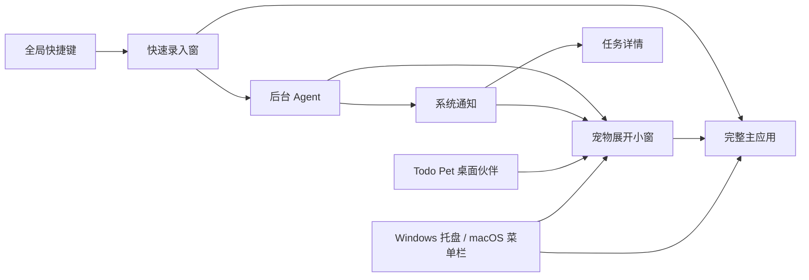

### 2.1 表面职责

| 表面 | 核心职责 | 不承载的内容 |
|---|---|---|
| 托盘/菜单栏 | 状态、快速入口、暂停提醒、停止 Agent | 复杂任务编辑 |
| 快速录入窗 | 一句话新建任务或发起 Agent 指令；日期、提醒、来源、情境、预计时长和循环先转成可编辑 chip | 长对话、完整详情 |
| Todo Pet 紧凑态 | 宠物状态、今日任务轮播、专注进度和轻提醒 | 多项目管理 |
| 宠物展开小窗 | 全部、今天、专注、聊聊和小窝 | 完整设置和复杂筛选 |
| 完整主应用 | 任务、Agent、同步、权限和设置 | — |
| 系统通知 | 到期动作、Agent 待批准、后台结果 | 长篇内容 |

## 3. 主应用信息架构

以下先列 P0 实际可见导航，再列未来扩展，避免把占位页面误认为首版承诺。

### 3.1 P0 实际可见导航

```text
应用
├── 任务
│   ├── 暂存
│   ├── 今天
│   ├── 即将到来
│   ├── 项目 / 清单
│   ├── 全部任务
│   ├── 已完成
│   └── 回收站
├── 来源
│   ├── 本地
│   └── 飞书
│       ├── 账号 / 租户
│       ├── 我负责的
│       ├── 任务清单
│       └── 同步问题
├── Agent
│   ├── 对话
│   ├── 待确认
│   ├── 后台任务
│   ├── 基础自动化
│   ├── Persona 与已保存偏好
│   └── 用量与费用
├── 规划
│   └── 时间线（日/周视图，拖动只改本地计划）
├── 动态
│   ├── 任务操作
│   ├── 飞书同步
│   ├── Agent 工具调用
│   └── 撤销与错误
├── 搜索
└── 设置
    ├── 通用
    │   └── 任务规划（截止 / Today / 优先级 / 短任务权重）
    ├── 悬浮与快捷键
    │   └── 陪伴策略模板（温和 / 平衡 / 专注 / 活泼）
    ├── 提醒与安静时段（每日任务预算 / 来源策略 / 项目例外 / 同类间隔 / 连续忽略降频）
    ├── 飞书账号
    ├── 模型与数据范围
    ├── Agent 身份
    ├── 权限中心
    ├── 交互式全权限
    ├── 数据、导入与导出
    └── 隐私与无障碍
```

### 3.2 P1/P2 导航扩展

```text
Agent
├── 自定义自动化与无人值守授权       [P1]
├── 长期记忆与语义检索               [P1]
├── 第一方 Skills / MCP / 连接器      [P1]
├── 第三方 Skills / 插件              [P2]
├── 子 Agent 与长期后台任务           [P2]
└── 远程设备与 OpenClaw Gateway       [P2]
```

P1/P2 页面在对应版本启用前不出现在 P0 主导航；如需预告，只能以不可操作的“即将推出”说明出现。

### 3.3 页面清单

| 页面 | 版本 | 核心内容 | 主要操作 |
|---|---|---|---|
| Today | P0 | 逾期、今天到期、今天计划、无时间、已完成；晨间简报与“只剩 2 小时”替代计划 | 排序、开始专注、完成、推迟；打开替代方案后进入今日规划确认 |
| Today 规划约束 | P1（已落地 v1.48） | 可用开始/结束时段、过渡缓冲、最小连续工作块、有效容量与短任务原因 | 在“今天规划”容量区调整约束；自动建议避开有效窗口外和过短任务，仍可手动加入、调整时长、预览后确认 |
| Today 时间块预览 | P1（已落地 v1.50） | 确认前的只读时间线：已有时间块、建议安排、可用时段、过渡缓冲与冲突/无空档提示 | 调整可用时段、缓冲、任务时长或顺序后即时重算；不直接拖动写入时间块，确认仍只保存 Today 私人计划 |
| Today 跨工作日预览 | P1（已落地 v1.51） | 今日装不下时显示未来 5 个工作日的顺延候选、固定块、剩余容量和截止/无容量原因 | 只读查看“如果继续排下去”；真正改期仍进入时间线手动拖动，周末、截止日期和飞书字段不会被静默改变 |
| 今晚回顾 → 明日规划 | P1（已落地 v1.52） | 小窝回顾卡在有待处理事项时显示“安排明天”，打开同一规划器但目标为明天 | 复用容量、固定块、跨工作日只读预览；确认后一次性写入明日私人计划，可撤销；关闭或未确认不改变任务 |
| 暂存整理 | P1（已落地 v1.53） | 逐项显示未安排日期/项目/清单的开放任务，提供今天、明天、稍后、完成、打开详情和 1/2/S/C/O 快捷键 | “稍后”只从当前整理会话移开，重新打开仍可见；其他动作复用任务更新/完成/同步与撤销，不建立第二份任务列表 |
| 宠物任务搬运目标区 | P1（已落地 v1.54） | 从任务列表拖动卡片时，宠物旁出现“专注 / 完成 / 稍后”三个目标区，并在悬停目标时给出动作反馈 | 放下后操作原任务：开始专注、完成或暂存到宠物手边；不复制任务，失败显示宠物反馈并保留任务 |
| Boss Mode | P1（已落地 v1.67） | 宠物右键菜单与系统托盘提供同一开关；开启时隐藏宠物并启用会议模式，恢复时重新显示宠物 | 进入/退出都是一次原子设置更新；不取消任务、专注、飞书同步或安全通知，托盘始终保留退出入口 |
| Todo Pet 下一步卡 | P1（已落地 v1.49） | 主动气泡中的真实任务标题、选择原因和可执行入口 | 点击“开始专注”直接带入该任务；点击“查看任务”打开全部任务列表；完成/删除/未解锁依赖不被推荐，隐私模式仅显示泛化消息 |
| 时间线 | P1（已落地 v1.2 / v1.37） | 日半小时刻度、周概览、1/2 周工作周期、容量预测、每周回顾、项目健康、已安排任务、待安排托盘 | 前后日/周切换、前后周期切换、拖动安排时间块、撤销、调整本周容量、点击候选或项目下一步进入任务；周期建议只读，不自动改期 |
| 时间线日历议程 | P1（已落地 v1.68） | 日视图顶部显示本地 `.ics` 导入的只读日历事件，明确来源、时间和“不会写回日历”；规划预览显示已避开的忙碌时段 | 选择 `.ics` 导入并合并事件；清空后提供撤销；日历事件参与容量计算和排程避让，但不创建任务、不改外部日历；跨午夜与全天事件按当前本地日期裁剪 |
| 晨间日历摘要 | P1（已落地 v1.69） | Today 晨间简报在有事件时显示当天议程、占用总时长和“打开时间线”按钮，与任务摘要保持同一层级 | 只读显示本地日历缓存；不调用模型、不创建任务、不写外部日历；无事件时不增加空卡片，避免早报膨胀 |
| 之前计划建议 | P1（已落地 v1.70） | Today 晨间简报从全部开放任务投影最多 3 项较早日期的未完成私人 Today 计划，逐项提供“安排今天”，并提供“打开全部任务”和“稍后再看” | 这是建议而非自动 rollover；安排今天复用普通任务更新、同步队列和撤销；不改变截止日期、不自动修改其他任务、不写入飞书共享字段；没有候选时不显示空卡片 |
| 时间线专注节奏 | P1（已落地 v1.56） | 周视图显示 7 日专注柱状节奏、总分钟、专注段数、平均时长和投入最多任务 | 点击任务回到详情；只读投影，空状态不施压，不修改任务或飞书 |
| 任务规划权重 | P1（已落地 v1.57） | 通用设置提供截止、Today、优先级和短任务四项 0–100 权重，显示当前默认值并可一键恢复 | 调整后只影响 Todo Pet 的下一步建议排序；卡片仍显示文字依据，不修改任务、提醒或飞书 |
| 陪伴策略模板 | P1（已落地 v1.58） | Todo Pet 设置提供温和陪伴、自然平衡、深度专注和活泼互动四种推荐组合；手工改动后显示自定义 | 选择模板一次组合主动程度、提醒语气、动作性格和专注自动衔接；只改本地设置，不改任务或同步 |
| 任务行 Agent 入口 | P0（已落地 v1.59） | 每条任务行在来源徽标旁提供低视觉重量的“让 Agent 处理”按钮；点击后进入 Agent 并预填任务标题、ID、来源和状态 | 只生成可编辑草稿，不自动发送；Agent 先读详情和依赖，写入仍沿用权限预览、确认、审计和撤销；批量选择时隐藏，避免与批量操作冲突 |
| 批量 Agent 助手 | P0（已落地 v1.60） | 批量选择工具栏提供“让 Agent 处理所选”；最多内嵌 20 项任务上下文，超过部分只显示数量提示 | 进入 Agent 后先逐项查询并形成只读方案；没有明确目标就追问；不自动完成、删除、改期或同步，最终写入仍走既有预览、确认、审计和撤销 |
| Filter Assist 一句话筛选 | P1（已落地 v1.61） | 筛选弹窗提供一句话输入和解析预览，支持日期、优先级、来源、项目、标签、情境和排序 | 先展示“将筛选”摘要，用户点击“套用”后才改变当前视图；未知值与互相冲突的条件给出原因，不调用模型、不修改任务，套用后可继续保存为智能视图 |
| 可读任务事件摘要 | P1（已落地 v1.62） | 设置 → 数据与安全在 Markdown 导出旁提供“包含事件摘要”开关 | 默认关闭；开启后按时间展示操作类型、任务标识、字段摘要与撤销标记，不显示 before/after 快照、私人路径或凭据；只读导出，不改变任务 |
| 快速捕获去向选择 | P1（已落地 v1.63） | 快速捕获解析卡下方提供“任务 / 暂存 / 日记”三项去向；切换后同步更新说明和底部主按钮 | 先预览再保存；暂存清除日期、截止、提醒和项目，日记只写本地标题与原文，不创建任务、不触发飞书；捕获 ID 让重试不重复日记 |
| 宠物任务输入解析 | P1（已落地 v1.64） | 宠物任务栏输入与快速捕获共用日期、标签、情境、时长、循环和 `p1`–`p4` 解析；占位提示给出可复制示例 | 解析后直接创建本地任务；解析失败回退纯标题；永远不因输入文本隐式创建或修改飞书任务 |
| 命令面板 | P1（已落地 v1.65） | `⌘/Ctrl+K` 打开轻量命令面板；搜索、捕获、Today/暂存/全部、规划、Agent、同步、显示宠物和设置均有可搜索命令 | 上下键循环、Enter 执行、Esc 或点击遮罩关闭；命令只调用既有导航/确认/同步入口，不复制任务状态或绕过权限 |
| 晨间三步启动 | P1（已落地 v1.66） | 从晨间简报展开“选重点 → 选容量 → 选开始方式”；最多 3 项、1/2/4/6 小时容量，以及“先专注 / 先看规划” | 可跳过；“先看规划”把预选值带入既有规划弹窗，“先专注”进入首项专注；不自动写任务或飞书 |
| 快速捕获上下文 | P1（已落地 v1.10 / v1.42） | 剪贴板、当前窗口应用/标题、显式选中文本、字符数/权限提示、预览文本、`@办公室` / `情境：办公室` 手动情境 chip | 明确带入输入框；选中文本只在显式动作后读取并恢复剪贴板，情境只写本地私人字段，不读取定位 |
| 工作流模板 | P1（已落地 v1.12） | 内置会议 / 研究 / 发布流程、受限 JSON 自定义模板、相对日期和预计时长 | 选择模板 → 预览步骤 → 批量创建；不执行脚本或后台工作流 |
| 小窝弹性习惯 | P1（已落地 v1） | 喝水、伸展、收尾的空档提示 | 完成一次、稍后；不计连续、不扣成长、不进入飞书 |
| 小窝每周 Check-in | P1（已落地 v1.16） | 能量、温和/稳定/集中节奏、可选一句备注、本周完成与待处理事实 | 记下本周节奏、调整；仅本地保存，跨周刷新，不修改任务 |
| 小窝宠物回顾 | P1（已落地 v1.17） | 逾期、依赖阻塞、待排时间三类任务事实与下一项建议 | 点击分类进入 Today / 全部任务；只读投影，不自动改期 |
| 小窝季节事件 | P1（已落地 v1.40） | 按本地日期显示春花、夏帽、秋叶或冬围巾与一条温和提示 | 设置中可关闭；只改变宠物表现，不修改任务、成长或同步 |
| 小窝共同日记回看 | P1（已落地 v1.39） | 日记事实、完成数量、专注与天气；关联任务以可点击胶囊显示 | 点击任务胶囊进入原任务；已删除任务显示“任务已移除”；只保存本地关系，不同步飞书 |
| 任务依赖编辑 | P0（已落地 v1.18） | 任务详情中的“依赖（先完成）”多选、未完成数量、暂不可见依赖提示和循环校验 | 选择/移除前置任务；循环提交被拒绝且保留原图；飞书任务仅写私人关系 |
| 依赖链解释 | P1（已落地 v1.55） | 依赖编辑下方显示“前置 → 当前 → 后续”节点，按深度表达阻塞链；缺失依赖与循环关系有明确提示 | 点击前置或后续节点打开原任务；关系只读投影，不复制任务、不改变飞书字段 |
| 任务上下文链接 | P1（已落地 v1.19） | 任务详情中的链接列表、命名输入、打开与移除 | 输入 http/https → 添加；链接只保存为私人上下文，不同步飞书 |
| 项目看板 | P1（已落地 v1.20） | 时间线“项目”视图、项目筛选和待处理 / 被阻塞 / 已完成三列 | 点击卡片查看详情；拖动或按钮完成/重开；阻塞列不能手工伪造 |
| 项目总览 | P1（已落地 v1.25） | 主导航“项目”页、项目卡片、完成率、逾期/阻塞信号和最近任务 | 聚合同一任务快照；点击任务回到任务详情；不复制、不静默修改 |
| 本地项目实体 | P1（已落地 v1.26） | 项目页内新建、颜色、重命名、归档/恢复、二次确认删除 | 删除只解除任务的本地关联；飞书任务共享字段不变；复制导入自动重映射项目引用 |
| 本地清单实体 | P1（已落地 v1.27） | 清单页内新建、颜色、重命名、归档/恢复、二次确认删除；任务详情与新建任务可选清单 | 删除只解除任务的本地关联；飞书任务共享字段不变；复制导入自动重映射清单引用 |
| 自定义字段 | P1（已落地 v1.24） | 任务详情中的字段名 / 类型 / 值编辑器、字段列表和移除操作 | 支持文本、数字、日期、链接、勾选；输入后添加或覆盖；长度受限；仅保存私人上下文 |
| 附件 | P1（已落地 v1.23） | 任务详情中的本地文件选择、受限文本/图片预览、外部 URL 编辑器、打开与移除 | 本地文件复制到应用私有目录；限制大小/数量并拒绝越界路径；不上传，导出不含路径/内容，不同步飞书 |
| 任务历史 | P1（已落地 v1.29） | 任务详情中的脱敏操作时间线、字段标签和撤销状态 | 按任务读取最近本地操作；不展示快照、正文或附件路径；远端变化看同步状态 |
| 全局元数据搜索 | P0（已落地 v1.30） | 搜索任务标题/备注之外的附件名、链接和自定义字段键值 | 只匹配已保存元数据，不读取附件正文，不扩大 Agent 或飞书数据范围 |
| 任务讨论 | P1（已落地 v1.31） | 任务详情中的本地讨论串、作者/时间、添加/编辑/删除操作 | 最多 100 条；Feishu 任务标注仅本机，不伪装成飞书评论；Agent 仅随备注数据范围开放 |
| 批量操作 | P0（已落地 v1.32） | 任务列表选择模式、目标数量/来源提示、完成/恢复/安排到今天/回收站动作预览 | 选择任务 → 预览影响 → 确认一次性执行 → 单次撤销；基线变化或飞书权限不满足时整批拒绝 |
| 保存视图增强 | P1（已落地 v1.33） | 筛选面板的标签与日期条件，以及可复用的视图条 | 标签 + 逾期/今天/未来 7 天/无日期 → 保存名称 → 一键复用；旧版视图默认回退为全部标签/任意日期 |
| 子任务进度 | P1（已落地 v1.34） | 父任务行的“已完成/总数”标签、详情内进度条和子任务完成操作 | 从同一任务快照实时投影；完成/恢复子任务后留在父任务详情；父任务不自动完成，删除子任务不计入总数 |
| 保存视图排序 | P1（已落地 v1.35） | 筛选面板的排序选择与视图条复用 | 默认、优先级、截止、标题、创建时间 → 保存 → 一键复用；非默认排序隐藏 Today 拖动，清除后恢复手动顺序 |
| 手动情境筛选 | P1（已落地 v1.41） | 任务详情/新建任务的“情境”输入、任务行情境胶囊和筛选面板情境选择 | 输入办公室、家、出门等逗号分隔的本地情境 → 按情境筛选或保存视图；不申请定位，不同步飞书 |
| 研究卡 | P1（已落地 v1.36） | 任务详情的可折叠研究上下文 | 标题 / 来源 / 摘要 / 行动项 → 默认收起 → 展开查看或打开来源；用户与 Agent 都只能写本地私人字段，不进入飞书同步 |
| 外部上下文拖放 | P1（已落地 v1.4） | 宠物/快速捕获接收文本、URL、文件和图片的预览 | 只预览；文本/URL 手动带入，文件不读内容 |
| Inbox | P0 | 未整理的本地或导入事项 | 指定日期、项目、来源 |
| Upcoming | P0 | 按日期排列的未来任务 | 改期、加入 Today |
| Project / List | P0（实体管理已落地） | 项目或清单任务及进度 | 新建、重命名、归档/恢复、删除、排序、筛选 |
| Feishu | P0 | 飞书任务、账号和同步状态 | 刷新、打开飞书、处理错误 |
| Task Detail | P0 | 全部任务字段、依赖阻塞、同步信息、本地历史时间线、本地讨论和宠物关系 | 编辑、完成、移动、删除、选择前置任务、查看变更字段、添加/编辑/删除讨论、显式写入宠物日记 |
| Agent Chat | P0 | 对话、工具调用和操作卡 | 提问、确认、撤销、停止 |
| Pending Approvals | P0 | 等待批准的高风险动作 | 查看影响、批准、拒绝 |
| Basic Automations | P0 | 晨报、提醒和同步模板 | 开关、运行、查看历史 |
| Saved Preferences | P0 | Persona 与用户主动保存的偏好 | 编辑、删除、设置有效期 |
| Custom Automations | P1 | 定时/条件无人值守工作流 | 新建、暂停、运行、查看历史 |
| Long-term Memory | P1 | 自动归纳且可审计的长期记忆 | 查看来源、编辑、删除 |
| Activity | P0 | 同步与 Agent 行为记录 | 筛选、查看详情、撤销 |
| Permission Center | P0 | 工具权限与精确授权范围 | 修改模式、撤销授权 |
| Settings | P0 | 系统、模型、账号、外观和数据 | 配置、测试、安全 JSON 备份、可读 Markdown 清单、断开 |

## 4. 跨表面导航规则

- 单击 Todo Pet：打开宠物小窗并恢复上次入口；再次点击可收起。
- 双击 Todo Pet：打开主应用并保持当前任务或对话语境。
- 点击宠物小窗的“在主应用打开”：打开主应用并保持相同页签语境。
- 从通知点击“打开”：直接定位任务详情或待确认操作。
- 从 Agent 操作卡点击任务：在右侧详情抽屉中打开，不丢失对话。
- 关闭主窗口：默认驻留后台；用户可在设置中改为退出。
- 主应用重新打开：恢复上次页面、筛选、滚动位置和详情抽屉。
- 所有入口打开的是同一任务实体，不创建重复副本。

## 5. 核心流程图

### 5.1 首次使用

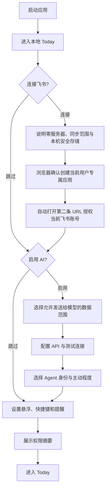

关键规则：飞书和 AI 均可跳过；用户在完成向导前已可创建本地任务。

#### 飞书连接子流程

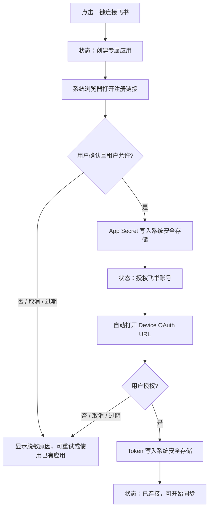

交互规则：两个阶段都显示当前阶段和“取消授权”，控制器持续提供到期时间；第一阶段完成后不能提前显示“已连接”。渲染层不显示或接收 App Secret、Device Code 和 Token。重新授权已有专属应用时直接进入第二阶段。选择“使用已有飞书应用（零服务器）”时显示 App ID、密码型 App Secret 输入框、系统安全存储说明和权限提示；首次配置必须输入 Secret，之后可复用安全凭据引用并直接进入 Device OAuth。Relay 不作为默认选项，仅在已有兼容配置或高级入口中出现。

### 5.2 全局快速捕获

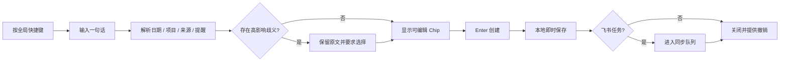

### 5.3 晨间简报与 Today 计划

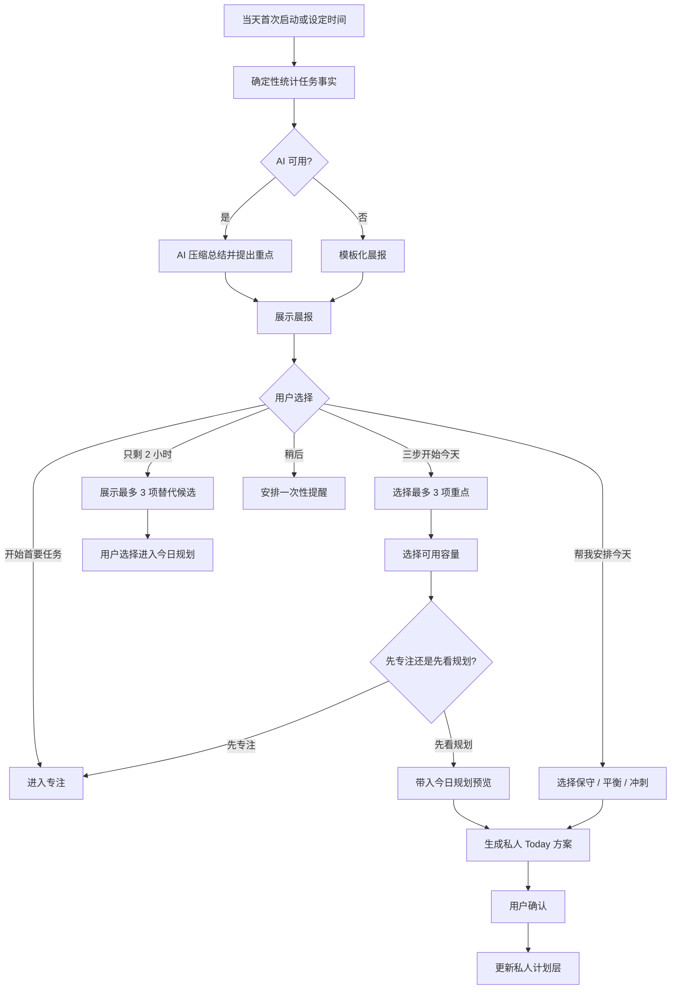

### 5.4 对话式批量修改

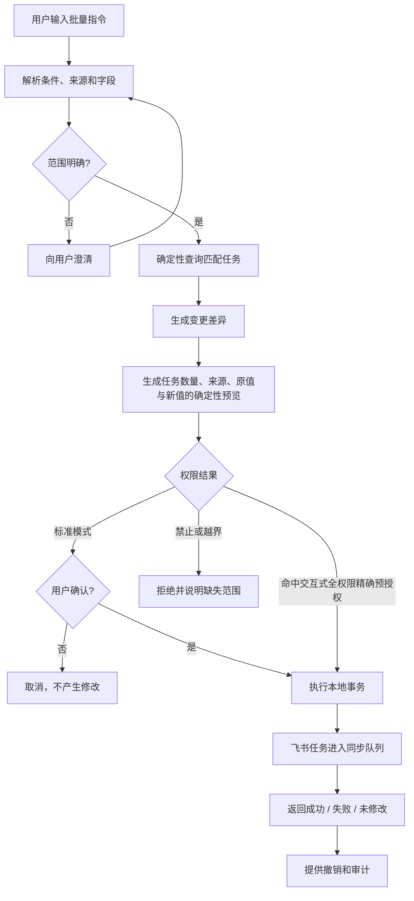

### 5.5 研究转任务

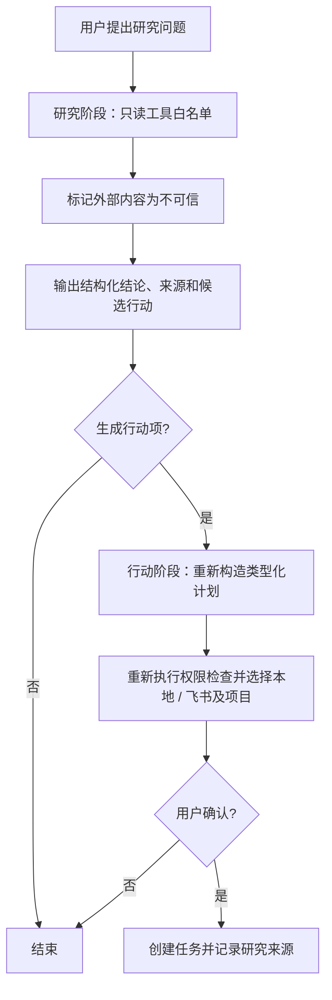

### 5.6 高风险工具调用

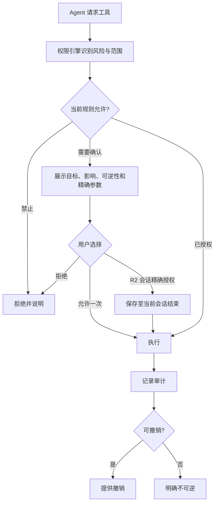

### 5.7 全权限模式

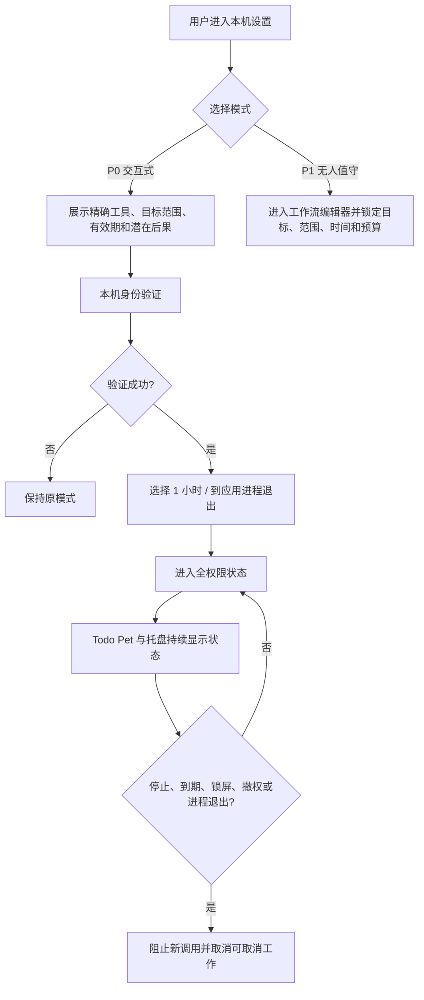

### 5.8 飞书同步与冲突

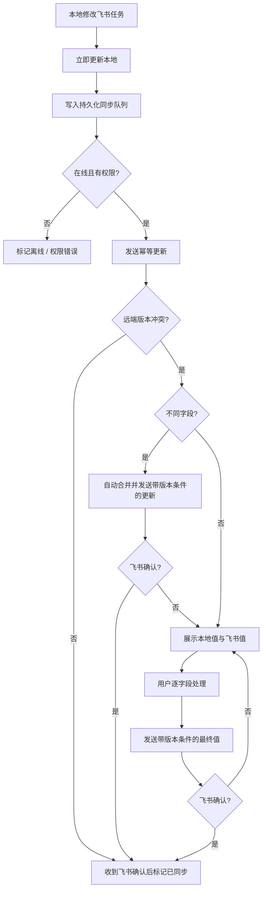

### 5.9 通用工具执行详情

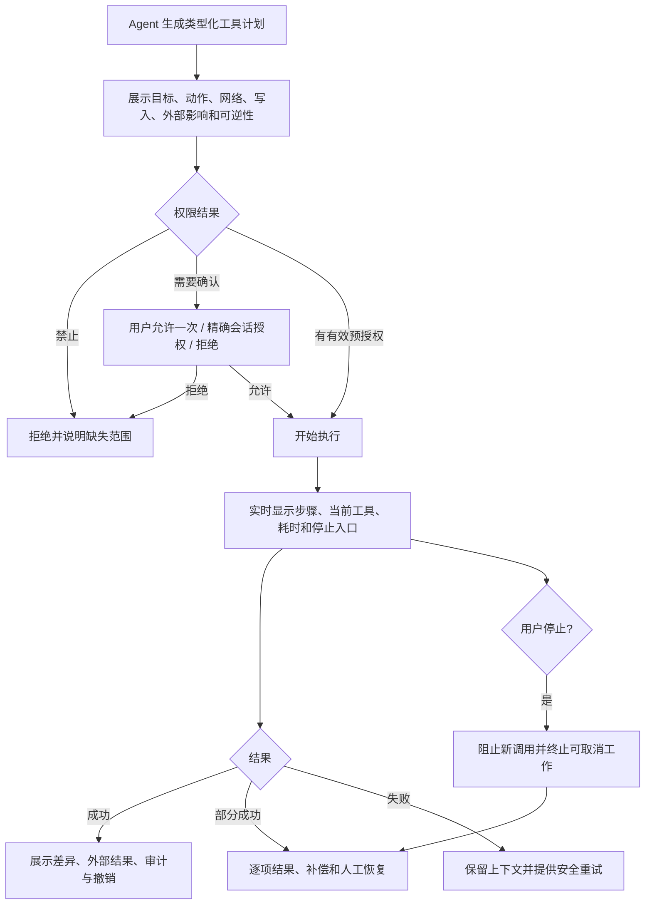

工具预览卡的必填字段：工具名称与版本、发起目标、精确对象、读取范围、写入范围、网络目标、外部影响、可逆性、运行位置、前后台、预计时长/费用，以及命中的授权规则。

## 6. 低保真线框图

### 6.1 Todo Pet 桌面入口

#### 紧凑宠物与当前任务

```text
      ╭──────╮   ┌────────────────────────┐
      │  ◕‿◕ │   │ 写版本说明 · 飞书 · 24:18 │
      ╰──────╯   └────────────────────────┘
       ↑宠物          ↑轮播任务 / 专注进度
```

任务轮播默认垂直向上，鼠标进入 Todo Pet 交互区域后暂停。任务、完成按钮和专注操作必须绑定同一任务 ID。

#### Agent 或风险提醒

```text
      ╭──────╮   ┌────────────────────────┐
      │  ◉‿◉ │   │ 今天有 2 个风险 · 查看   │
      ╰──────╯   └────────────────────────┘
```

#### 静态和减少动画状态

```text
      ╭──────╮
      │  ◕‿◕ │  ← 静态宠物 + 文本等价状态
      ╰──────╯
```

交互：单击展开，双击打开主应用，悬停预览，拖动移动，靠近边缘吸附，右键显示新增、专注、聊天、安静、隐藏、停止 Agent、设置和退出。旧悬浮球和胶囊不再提供入口。

### 6.2 全局快速录入窗

```text
┌─────────────────────────────────────────────────────────┐
│  +  明天下午3点提交周报 #工作 !高优先级 @飞书          │
├─────────────────────────────────────────────────────────┤
│  [明天 15:00] [预计45分钟] [每周一] [工作] [高优先级]   │
│                                                         │
│  保存到：飞书 / 产品项目                                │
├─────────────────────────────────────────────────────────┤
│  Esc 取消              Enter 创建    ⌘/Ctrl+Enter 详情  │
└─────────────────────────────────────────────────────────┘
```

若输入以问句或指令为主，底部提供“作为任务创建 / 发送给 Agent”切换；系统仅在意图明显时给出建议，不自动发送。

### 6.3 宠物小窗——全部与今天

```text
┌──────────────────────────────────────┐
│ [全部]  今天  专注  聊聊  小窝      │
├──────────────────────────────────────┤
│  + 写下要做的事…                     │
├──────────────────────────────────────┤
│  逾期 · 1                            │
│  ○ 回复客户问题      本地   昨天     │
│                                      │
│  今天 · 3                            │
│  ◉ 写版本说明        飞书   15:00    │
│  ○ 整理会议结论      飞书            │
│  ○ 预约体检          本地   18:00    │
├──────────────────────────────────────┤
│  2 项已完成             在主应用打开 → │
└──────────────────────────────────────┘
```

键盘：上下选择；Space 完成；Enter 打开；快捷键开始专注；Esc 收起。

### 6.4 宠物小窗——聊聊与操作卡

```text
┌──────────────────────────────────────┐
│  全部  今天  专注 [聊聊] 小窝       │
├──────────────────────────────────────┤
│  你：把逾期的飞书任务都改到周五     │
│                                      │
│  助手：将修改 7 项飞书任务           │
│  ┌────────────────────────────────┐  │
│  │ 截止日期：原日期 → 8 月 14 日 │  │
│  │ 不修改：本地任务、My Day      │  │
│  │                                │  │
│  │ [查看 7 项] [确认] [取消]      │  │
│  └────────────────────────────────┘  │
├──────────────────────────────────────┤
│  问助手或输入任务指令…          发送 │
└──────────────────────────────────────┘
```

### 6.5 晨间简报

```text
┌────────────────────────────────────────────────────┐
│  早上好，今天建议先处理 3 件事                     │
│                                                    │
│  • 版本说明今天 15:00 截止                         │
│  • 2 项任务已经逾期                                │
│  • 预计工作量约 5 小时                             │
│                                                    │
│  建议先完成“版本说明”，预计需要 45 分钟。          │
│                                                    │
│  [帮我安排今天] [开始首要任务] [只剩 2 小时？]       │
│  替代方案：版本说明 45 分钟 · 回复客户 30 分钟      │
│                                         今天不再提醒 │
└────────────────────────────────────────────────────┘
```

展开“三步开始今天”后，晨间简报在同一张卡片内逐步收集轻量选择：

```text
┌────────────────────────────────────────────────────┐
│ ✦ 和宠物一起开启今天                         1/3  │
│ 今天最想守住哪几件事？最多选择 3 项                 │
│ [✓ 版本说明] [✓ 回复客户] [  整理资料] [  运动]   │
│                                                    │
│                         [下一步 →]                 │
├────────────────────────────────────────────────────┤
│ 2/3  今天大约有多少可用时间？                       │
│ [1 小时] [2 小时] [4 小时] [6 小时]                │
│                         [← 返回] [下一步 →]        │
├────────────────────────────────────────────────────┤
│ 3/3  要不要先进入一段专注？                         │
│ [先专注] 从“版本说明”开始   [先看规划]             │
│ [开始第一项]                         [打开今日规划] │
└────────────────────────────────────────────────────┘
```

卡片关闭、返回或跳过都不改变任务事实；只有进入规划后，才复用规划弹窗的预览、确认和撤销闭环。

### 6.6 完整应用——Today

```text
┌────────────────────────────────────────────────────────────────────────────┐
│  应用名          搜索…                         离线 2  [＋]  [Agent 头像] │
├────────────────┬──────────────────────────────────────┬────────────────────┤
│ 暂存         4 │ 今天 · 8                             │ 任务详情           │
│ 今天           │                                      │                    │
│ 即将到来       │ 早间概览：2 项逾期 · 5 小时预计      │ 写版本说明         │
│ 全部任务       │ [查看晨报] [重新规划]                │ 飞书 · 产品项目    │
│ 已完成         │                                      │                    │
│                │ 逾期                                 │ 私人计划：今天     │
│ 来源           │ ○ 回复客户问题       本地   昨天     │ 开始：今天 14:00   │
│  本地          │                                      │ 截止：今天 15:00   │
│  飞书          │ 今天到期                             │ 提醒：提前 30 分钟 │
│                │ ◉ 写版本说明         飞书   15:00    │                    │
│ 项目           │ ○ 发布公告           飞书   17:00    │ 预计：45 分钟      │
│  产品          │                                      │ 标签：#发布        │
│  客户          │ 今天计划                             │                    │
│                │ ○ 整理会议结论       飞书            │ 同步：已同步       │
│ ─────────────  │ ○ 阅读技术方案       本地            │ [在飞书中打开]     │
│ Agent          │                                      │                    │
│ 动态           │ 已完成 · 2                           │ [删除]             │
│ 设置           │                                      │                    │
└────────────────┴──────────────────────────────────────┴────────────────────┘
```

任务行默认仅展示复选框、标题、来源和关键时间；悬停或键盘聚焦后显示加入 Today、开始专注、稍后和更多操作。

### 6.7 Agent 工作台

```text
┌────────────────────────────────────────────────────────────────────────────┐
│ Agent  [对话] [待确认 2] [后台 1] [自动化] [记忆] [权限]                 │
├───────────────────────────────────────────────┬────────────────────────────┤
│ 助手：今天需要我先帮你整理 Inbox 吗？         │ 本次会话                   │
│                                               │ 模型：用户模型             │
│ 你：先查一下 Tauri 的自动更新注意事项，       │ 模式：标准                 │
│     再生成开发任务。                          │ 已用工具：搜索、网页读取   │
│                                               │ Token：8.2k / 日预算 100k  │
│ 助手：[正在搜索 4 个来源…]                    │                            │
│                                               │ 可用范围                   │
│ 结论……                                        │ ✓ 任务                     │
│ [查看来源]                                    │ ✓ 公开网页                 │
│                                               │ △ 项目文件夹（需确认）     │
│ 拟创建 5 项任务                               │ × 宿主机终端               │
│ [查看并创建]                                  │                            │
├───────────────────────────────────────────────┴────────────────────────────┤
│ 向助手提问，或要求它执行任务…                                  [发送] │
└────────────────────────────────────────────────────────────────────────────┘
```

任务拆分卡沿用同一操作预览：先显示父任务标题、2–7 个有序步骤、优先级和估时，并明确“创建本地子任务，不写回飞书”；用户确认后再执行，结果卡逐项显示成功/失败和可撤销 operation。点击任一步骤可直接打开新子任务详情，父任务对话上下文保持不丢失。

### 6.8 权限确认

```text
┌───────────────────────────────────────────────────────┐
│  Agent 请求执行本机命令                              │
├───────────────────────────────────────────────────────┤
│  目的：检查项目依赖安全问题                          │
│  目录：~/Projects/task-agent                         │
│  命令：npm audit                                     │
│  网络：需要                                          │
│  风险：读取依赖并访问软件源；不计划修改项目文件      │
│                                                       │
│  [查看完整参数]                                      │
├───────────────────────────────────────────────────────┤
│ 精确授权：仅允许在该目录运行 npm audit；允许访问     │
│ 软件源；禁止写文件、安装依赖和执行其他命令。         │
│                                                       │
│ [拒绝]                              [仅允许本次]      │
└───────────────────────────────────────────────────────┘
```

### 6.9 全权限模式设置

```text
┌────────────────────────────────────────────────────────────┐
│ 全权限模式                                                │
├────────────────────────────────────────────────────────────┤
│ ○ 关闭                                                    │
│ ● 交互式全权限                                            │
│ ○ 无人值守全权限（P1 · 即将推出）                         │
│                                                            │
│ 有效期： [1 小时 / 到应用进程退出 ▾]                      │
│                                                            │
│ 当前可使用：                                              │
│ ✓ 任务和飞书    ✓ 浏览器    ✓ 文件    ✓ 沙箱终端          │
│ △ 消息发送      × 宿主机终端（尚未安装）                  │
│                                                            │
│ 预授权目标范围                                            │
│ 任务：本地 + 飞书账号 user@tenant-a；全部 P0 操作          │
│ 浏览器：公开网页只读；提交/下载仅 github.com               │
│ 文件：~/Projects/task-agent；符号链接不得越界              │
│ 终端：沙箱；仅挂载上述目录；网络仅 registry.npmjs.org:443  │
│ [逐项编辑范围]                                            │
│                                                            │
│ 关闭窗口并不退出应用；锁屏、重启、撤权或停止会暂停模式。   │
│ Agent 仍不能读取明文密钥、自行扩权或关闭审计。             │
│                                                            │
│ [查看完整风险]                       [验证身份并开启]      │
└────────────────────────────────────────────────────────────┘
```

开启后，主应用、托盘和 Todo Pet 持续显示“全权限”；提供始终可见的“停止 Agent”。

### 6.10 飞书冲突处理

```text
┌──────────────────────────────────────────────────────────────┐
│ 同步冲突 · 写版本说明                                       │
├───────────────────────┬──────────────────────────────────────┤
│ 本地                  │ 飞书                                 │
│ 截止：今天 15:00      │ 截止：明天 12:00                    │
│ 修改于 10:32          │ 修改于 10:35                         │
├───────────────────────┴──────────────────────────────────────┤
│ ○ 采用本地值                                                │
│ ○ 采用飞书值                                                │
│ ○ 逐字段处理                                                │
│                                                              │
│ 私人计划“今天 14:00”不会受本次处理影响。                    │
├──────────────────────────────────────────────────────────────┤
│ [稍后处理]                                      [确认同步]  │
└──────────────────────────────────────────────────────────────┘
```

### 6.11 首次使用向导

```text
┌──────────────────────────────────────────────────────────┐
│  1 基础设置  ──  2 飞书  ──  3 AI  ──  4 桌面体验       │
├──────────────────────────────────────────────────────────┤
│  先从本地任务开始                                       │
│                                                          │
│  你无需注册，也可以创建本地任务。                       │
│  连接飞书后，团队任务会显示来源并保持同步。             │
│  默认会分两步：创建你的专属应用，再授权当前账号。       │
│  无需 Todo Agent 服务器；凭据保存在本机系统安全存储。   │
│  AI 完全可选，可使用你自己的 API Key。                  │
│                                                          │
│  [跳过全部设置]                         [继续]           │
└──────────────────────────────────────────────────────────┘
```

### 6.12 工具执行详情

```text
┌──────────────────────────────────────────────────────────────────┐
│ 工具执行 · 检查依赖安全                                  [停止] │
├──────────────────────────────────────────────────────────────────┤
│ 1 ✓ 读取 package-lock.json                                      │
│ 2 ● 沙箱终端：npm audit                         已运行 00:12     │
│ 3 ○ 解析结果并生成建议                                          │
├──────────────────────────────────────────────────────────────────┤
│ 运行范围                                                         │
│ 工具：沙箱终端 v1      目录：~/Projects/task-agent               │
│ 网络：registry.npmjs.org  写入：无  外部影响：无  可逆：不适用   │
│ 授权依据：本会话 · 精确命令与目录                                │
├──────────────────────────────────────────────────────────────────┤
│ 实时输出 / 文件差异 / 浏览器步骤 / 逐项结果                      │
│                                                                  │
├──────────────────────────────────────────────────────────────────┤
│ [查看完整审计] [复制结果]                            [完成]      │
└──────────────────────────────────────────────────────────────────┘
```

同一详情框架按工具替换中部内容：文件工具显示修改前后差异；浏览器显示当前站点、将提交的字段和接管入口；截图显示捕获范围；批量任务显示逐项差异；部分成功显示补偿与人工恢复。

### 6.13 AI 数据范围同意

```text
┌──────────────────────────────────────────────────────────────┐
│ 启用 AI · 选择可发送给模型的数据                            │
├──────────────────────────────────────────────────────────────┤
│ ☑ 当前对话与用户主动选择的任务                              │
│ ☐ Today 任务标题、日期与来源                                │
│ ☐ 飞书任务描述                                              │
│ ☐ 附件内容                                                  │
│                                                              │
│ 凭据、权限规则和审计存储永不发送给模型。                    │
│ 可在“设置 → 模型与数据范围”随时缩小范围。                   │
├──────────────────────────────────────────────────────────────┤
│ [暂不启用 AI]                                    [继续配置] │
└──────────────────────────────────────────────────────────────┘
```

交互规则：未勾选 Today 数据时，晨报显示本地模板并提供“一次性允许本次总结”；任务问答和 CRUD 只把当前选择及允许字段返回给模型；需要备注、飞书描述或附件时逐项请求一次性授权。一次性授权不改变设置。交互式全权限不能勾选或扩大这些数据项。

## 7. 核心组件

| 组件 | 状态 |
|---|---|
| Task Row | 默认、悬停、键盘聚焦、完成、逾期、只读、同步失败、冲突 |
| Source Mark | 本地、飞书账号、其他来源 |
| Sync Indicator | 本地、待同步、同步中、已同步、离线、失败、冲突 |
| Agent Status | 就绪、思考、等待授权、执行、后台、暂停、全权限、错误 |
| Action Preview Card | 单条、批量、部分失败、不可逆 |
| Permission Prompt | 一次、会话、精确范围、拒绝 |
| Tool Run Detail | 计划、运行中、等待用户、成功、部分成功、失败、正在停止、需人工恢复 |
| AI Data Scope | 最小范围、可选任务元数据、飞书描述、附件、撤权 |
| Reminder | 到期、陪伴提醒、晨报、后台结果、待批准 |
| Empty State | 首次启动、Today 已清空、搜索无结果、未连接飞书、未启用 AI |

## 8. 关键交互规则

### 8.1 完成与撤销

- 点击完成后立即给予本地反馈。
- 提供至少 5 秒明显撤销入口。
- 飞书任务随后进入同步队列。
- 同步失败不恢复为未完成，而是显示失败状态并允许重试或撤销。

### 8.2 悬浮行为

- 鼠标持续悬停达到设置延迟后打开轻量预览；由悬停触发的预览在离开完整交互区域后自动关闭。
- 单击触发完整宠物小窗；该小窗不因鼠标离开自动关闭。
- 点击窗外或按 Esc 收起宠物小窗；点击触发的小窗不因普通鼠标离开自动关闭。
- 正在编辑时先保存草稿。
- 屏幕空间不足时向可见方向展开。
- 不遮挡任务栏、Dock、菜单栏和系统安全界面。

### 8.3 Agent 反馈

- 思考、搜索、等待授权、执行和后台运行使用不同文本状态。
- 工具调用过程可折叠，但关键外部影响不能隐藏。
- 长任务提供停止入口和最近进度。
- 部分失败不得使用笼统的“完成”状态。
- “停止 Agent”只停止模型、工具调用和 Agent 自动化；任务提醒、飞书同步和离线队列继续运行，并在停止结果中明确说明。

### 8.4 来源与颜色

- 来源由文字或图标标识，不只依靠颜色。
- 大面积卡片不按来源染色。
- 红色只用于错误、逾期或危险操作。
- 全权限状态同时使用文字、图标和持续入口。

## 9. 空状态与错误状态

- 首次启动：新建本地任务、连接飞书、查看快捷键。
- Today 为空：显示完成反馈和下一项即将到期任务。
- 搜索无结果：展示当前筛选并提供清除。
- 首次同步：展示进度和已获取数量，可关闭页面继续使用。
- 离线：非阻塞横幅，展示待同步数量。
- 单条失败：只标记受影响任务，不阻断全局列表。
- 加载失败：保留最近缓存并显示数据时间。
- 通知权限被拒绝：显示设置入口，不反复请求系统授权。
- AI 未配置：对话页展示配置或继续使用普通任务功能。
- Agent 被停止：明确显示后台工作已停止及未完成项。

## 10. Windows/macOS 适配

- Windows 使用系统托盘，macOS 使用菜单栏；功能保持一致。
- 快捷键语义一致，按平台显示 Ctrl/Alt 或 Command/Option。
- 关闭窗口默认行为遵循平台习惯，但两端均提供“关闭后驻留”和“退出应用”。
- 跟随系统深浅色、缩放、区域格式、时区和一周起始日。
- Windows 支持高 DPI 和混合缩放；macOS 支持 Retina、Spaces 和多显示器。
- 系统全屏、锁屏和演示模式遵守用户的悬浮与通知设置。

## 11. 低保真原型点击关系

| 起点 | 操作 | 结果 |
|---|---|---|
| Todo Pet | 单击 | 展开并恢复最后入口；首次为全部 |
| Todo Pet | 双击 | 打开主应用 |
| Todo Pet | 悬停达到延迟 | 打开预览，离开后自动关闭 |
| 宠物任务 | 完成 | 完成当前真实显示任务并出现撤销 |
| 宠物小窗 | 切换聊聊 | 在小窗中继续流式 Markdown 对话 |
| 操作卡 | 查看任务 | 展开受影响任务列表 |
| 操作卡 | 确认 | 执行并跳到动态结果 |
| Agent 工具计划 | 需要 R3 授权 | 打开运行时精确授权；P0 标准模式仅允许本次 |
| 快速录入 | Enter / Esc / Cmd或Ctrl+Enter | 创建、取消或创建后打开详情 |
| Today | 开始专注 | Todo Pet 进入专注紧凑状态 |
| 工具执行 | 切换页签 | 查看实时输出、文件差异或浏览器步骤 |
| 工具执行 | 停止 | 阻止新调用并显示已发生影响与恢复状态 |
| 同步失败标记 | 点击 | 打开任务同步详情 |
| 全权限标记 | 点击 | 打开权限状态与停止入口 |
| 首次启用 AI | 继续 | 先确认数据范围，再配置模型 |
| 主导航 Agent | 点击 | 打开 Agent 工作台 |
| 主导航动态 | 点击 | 查看同步、工具和撤销记录 |

## 12. 设计验收清单

- [ ] 核心流程仅用键盘可完成。
- [ ] Todo Pet、宠物小窗和主应用展示同一任务状态。
- [ ] 发布路径中不再提供旧悬浮球或胶囊切换。
- [ ] Todo Pet 首次进入全部，后续恢复最后焦点。
- [ ] 今日任务轮播、暂停和完成操作绑定同一任务 ID。
- [ ] 每条任务均显示来源。
- [ ] Today 私人计划与飞书截止日期在文案和布局中明确分离。
- [x] 批量操作预览展示数量、来源、目标标题和确认入口；主进程原子执行并提供单次撤销。
- [ ] 高风险工具确认展示精确目标与影响。
- [ ] 研究内容经过只读阶段，不能直接形成可执行工具参数。
- [ ] 工具执行详情展示范围、网络、写入、授权依据、进度和终态。
- [ ] 全权限状态持续可见，并能一键停止。
- [ ] P0 不展示可开启的无人值守全权限；交互式全权限经过数据范围说明与系统身份验证。
- [ ] 同步失败、冲突、只读和远端删除使用不同状态与文案。
- [ ] 空状态提供下一步行动，不出现纯空白页。
- [ ] 深浅色、高对比度、200% 字体和减少动画下仍可使用。
- [ ] 100%–200% 缩放和多显示器下悬浮入口始终可见。
- [ ] 所有文字、按钮和交互目标满足无障碍要求。
